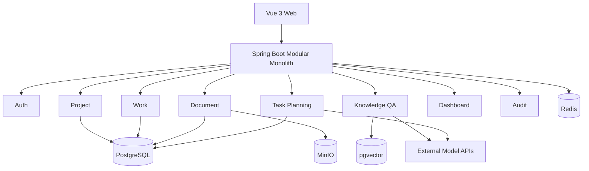

# 系统架构设计

## 1. 架构选择

第一版采用模块化单体。一个 Spring Boot 应用承载认证、项目、任务、文档、RAG 和任务规划；模块之间通过应用服务接口协作。未来仅在出现独立扩容需求时拆出文档处理与 AI 服务。

## 2. 总体结构



## 3. 运行时组件

| 组件          | 职责                           | 是否核心 |
| ----------- | ---------------------------- | ---- |
| Vue Web     | 页面、表单、看板、文档与 AI 交互           | 是    |
| Spring Boot | REST API、权限、业务事务、AI 编排       | 是    |
| PostgreSQL  | 业务数据、AI 草案、审计和向量             | 是    |
| pgvector    | 文档块向量与相似度检索                  | 是    |
| MinIO       | 原始上传文件                       | 是    |
| Redis       | AI 请求限流、短期缓存、幂等辅助            | 可降级  |
| 外部模型 API    | Chat Model 与 Embedding Model | 是    |

Redis 不可用时，核心协作功能仍应运行；AI 限流退化为进程内限制，项目统计直接查询数据库。

## 4. 后端层次

每个业务模块内部使用四层：

```text
api             Controller、Request、Response
application     Use Case、Facade、事务边界
 domain          Entity、Policy、Domain Service
infrastructure  Mapper、Repository、外部适配器
```

`common` 只放跨模块基础设施，不放业务实体。

## 5. 关键边界

### 5.1 Document 模块

负责文件生命周期、解析、分块和索引状态，不负责生成自然语言回答。

对外接口：

```java
public interface DocumentIndexingFacade {
    UUID upload(UploadDocumentCommand command);
    void retry(UUID projectId, UUID documentId, UUID operatorId);
    void delete(UUID projectId, UUID documentId, UUID operatorId);
    List<RetrievedChunk> search(UUID projectId, String query, int topK);
}
```

### 5.2 Knowledge 模块

负责会话、问题、检索上下文组装、模型调用和引用保存。

```java
public interface KnowledgeQaFacade {
    KnowledgeAnswer ask(AskKnowledgeQuestionCommand command);
}
```

### 5.3 Planning 模块

负责读取项目上下文、生成结构化草案、校验和确认写入。

```java
public interface TaskPlanningFacade {
    UUID generate(GenerateTaskPlanCommand command);
    TaskPlanView get(UUID projectId, UUID planId, UUID userId);
    void replaceDraft(ReplaceTaskPlanDraftCommand command);
    ApplyTaskPlanResult confirm(ConfirmTaskPlanCommand command);
}
```

## 6. 异步策略

第一版不引入消息队列。文档解析与 AI 任务规划使用 Spring `TaskExecutor` 异步执行，并将状态持久化到数据库。

- 进程重启后，启动恢复任务将停留在 PARSING、INDEXING、GENERATING 超过 10 分钟的记录标记为 FAILED。
- 用户可手动重试。
- 每个异步任务必须记录 `request_id` 和错误摘要。

## 7. 事务边界

- 创建项目与 OWNER 成员记录：一个事务
- 修改任务与依赖：一个事务
- 删除文档数据库记录与向量：一个事务；MinIO 删除失败记录补偿日志
- 确认 AI 任务规划：一个事务批量写入里程碑、任务和依赖
- 外部模型调用不放在数据库长事务内

## 8. 多模型适配

```text
KnowledgeQaService ----\
                        > AiModelGateway -> SpringAiModelGateway -> Provider
TaskPlanningService ---/
```

业务层不出现具体供应商 SDK 类型。配置按功能区分：

- `chat.default-provider`
- `planning.default-provider`
- `embedding.provider`

聊天模型可切换；同一个已建立索引的知识库不随意切换 Embedding 模型。

## 9. 本地网络

| 服务            | 默认端口 |
| ------------- | ----:|
| Vue           | 5173 |
| Spring Boot   | 8080 |
| PostgreSQL    | 5432 |
| Redis         | 6379 |
| MinIO API     | 9000 |
| MinIO Console | 9001 |

## 10. 架构决策记录

| 决策    | 选择                    | 原因                             |
| ----- | --------------------- | ------------------------------ |
| 架构    | 模块化单体                 | 独立开发、6～8 周、部署简单                |
| ORM   | MyBatis-Plus          | 便于掌握 SQL，适合 Java 求职展示          |
| 迁移    | Flyway                | 数据库结构可追踪和复现                    |
| 向量库   | PostgreSQL + pgvector | 业务与向量统一，减少组件                   |
| 文件    | MinIO                 | 本地对象存储与预签名 URL                 |
| 异步    | TaskExecutor + 状态表    | 不为低流量引入 MQ                     |
| AI 框架 | Spring AI             | 与 Spring Boot、pgvector 和工具调用整合 |
| 写操作   | 用户确认后应用               | 防止模型越权和误操作                     |
