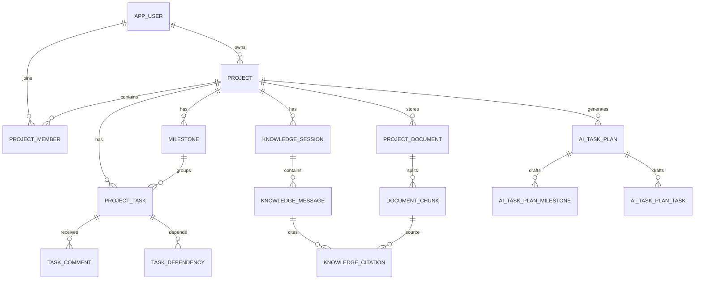

# 数据库设计

完整可执行 SQL 见 `database/V1__init_schema.sql`。

## 1. 设计原则

- 主键统一使用 UUID。
- 业务时间统一使用 `timestamptz`。
- 用户可见日期使用 `date`。
- 项目级数据均保存 `project_id`。
- 重要更新表增加 `version` 用于乐观锁。
- 第一版使用物理删除，删除前写入审计日志。
- 向量列使用不固定维度的 `vector`，以兼容不同 Embedding 维度；第一版数据量小，使用精确检索。

## 2. 核心表

| 表 | 说明 |
|---|---|
| app_user | 用户账号 |
| refresh_token | 刷新令牌哈希 |
| project | 项目 |
| project_member | 项目成员与角色 |
| project_invitation | 邀请码 |
| milestone | 里程碑 |
| project_task | 任务 |
| task_dependency | 前置依赖 |
| task_comment | 任务评论 |
| project_document | 原始文档元数据 |
| document_chunk | 文档块、元数据和向量 |
| knowledge_session | 问答会话 |
| knowledge_message | 问答消息 |
| knowledge_citation | 回答引用 |
| ai_task_plan | AI 规划主表 |
| ai_task_plan_milestone | 草案里程碑 |
| ai_task_plan_task | 草案任务 |
| ai_task_plan_dependency | 草案依赖 |
| audit_log | 审计日志 |
| ai_call_log | 模型调用指标 |

## 3. 关系说明



## 4. 关键约束

### 4.1 项目成员

- `(project_id, user_id)` 唯一。
- 一个项目必须且只能有一个 OWNER，由应用服务保证。
- OWNER 不能被移除，也不能直接降级；必须先执行所有权转移用例。

### 4.2 任务依赖

- `(task_id, depends_on_task_id)` 唯一。
- `task_id <> depends_on_task_id`。
- 两个任务必须属于同一项目。
- 更新依赖前使用 DFS 或 Kahn 算法检查环。

### 4.3 文档块

- `(document_id, chunk_no)` 唯一。
- `metadata` 至少包含 `projectId`、`documentId`、`chunkNo`、`filename`。
- 删除文档时先删除引用，再删除块和文档记录。

### 4.4 AI 规划

- `temp_key` 在同一 plan 内唯一。
- 草案依赖只引用同一 plan 的 task temp key。
- CONFIRMED 状态不可再次修改或确认。

## 5. 向量检索 SQL

```sql
SELECT
    id,
    document_id,
    heading,
    content,
    1 - (embedding <=> CAST(:queryEmbedding AS vector)) AS similarity
FROM document_chunk
WHERE project_id = :projectId
  AND embedding IS NOT NULL
ORDER BY embedding <=> CAST(:queryEmbedding AS vector)
LIMIT :topK;
```

应用层只接收相似度不低于 `0.55` 的结果，并按文档块内容哈希去重。

## 6. 索引策略

- `project_member(user_id, project_id)`：查询用户项目列表。
- `project_task(project_id, status)`：看板与统计。
- `project_task(project_id, assignee_id)`：个人任务。
- `project_task(project_id, due_date)`：逾期统计。
- `project_document(project_id, status)`：知识库列表。
- `document_chunk(project_id, document_id)`：项目过滤与删除。
- `audit_log(project_id, created_at desc)`：最近活动。

第一版不为向量列创建 HNSW/IVFFlat。文档块达到 100,000 以上再评估近似索引。

## 7. 数据保留

- Refresh Token 到期后可定时清理。
- AI 原始响应仅保存在 `ai_task_plan.raw_response`，知识问答不保存完整 Prompt。
- `ai_call_log` 不记录文档原文，只记录模型、Token、耗时与状态。
