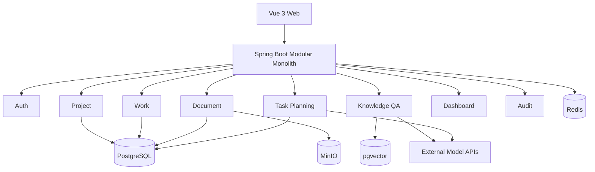

# AI Collab Platform Design Specification

# 项目需求规格

## 1. 产品名称

- 中文展示名：高校竞赛 AI 项目协作平台
- 英文仓库名：AI Collab
- 仓库目录：`ai-collab`

## 2. 产品定位

面向高校竞赛团队，同时兼容软件课程项目团队。系统先提供可独立使用的项目协作能力，再基于项目文档提供 RAG 问答和 AI 任务规划。

## 3. 目标用户

- 蓝桥杯、计算机设计大赛、创新创业比赛等竞赛团队
- 软件工程课程设计、实训和小型团队项目
- 第一版仅供开发者本人及邀请的测试用户使用

## 4. 核心问题

1. 竞赛规则、需求、会议记录和技术资料分散，难以统一检索。
2. 任务拆分依赖个人经验，容易遗漏评分点、前置依赖和里程碑。
3. 任务、文档、评论和进度分散在不同工具，缺少统一视图。
4. 普通知识库只回答问题，不能把规划转换为可执行任务。

## 5. 角色与权限

### 5.1 OWNER

- 修改、归档和删除项目
- 邀请、移除成员
- 设置 ADMIN 或 MEMBER
- 管理全部任务、里程碑和文档
- 发起并确认 AI 任务规划
- 查看审计日志

### 5.2 ADMIN

- 管理任务、里程碑和文档
- 发起并确认 AI 任务规划
- 查看项目统计和审计日志
- 不能删除项目或移除 OWNER

### 5.3 MEMBER

- 查看所属项目
- 更新自己负责的任务
- 发表评论
- 使用知识库问答
- 查看项目概览
- 不能管理成员和删除文档

## 6. 功能范围

### 6.1 认证与邀请

- 不开放公共注册
- OWNER 或 ADMIN 创建邀请链接
- 被邀请者通过邀请码设置用户名和密码
- JWT Access Token 有效期 2 小时
- Refresh Token 有效期 7 天，数据库只保存哈希

### 6.2 项目与成员

- 创建、查看、修改、归档和删除项目
- 邀请成员、修改角色、移除成员
- 每个项目恰好一个 OWNER

### 6.3 任务协作

- 任务状态：TODO、IN_PROGRESS、BLOCKED、DONE、CANCELED
- 优先级：LOW、MEDIUM、HIGH、URGENT
- 任务可归属里程碑、负责人和多个前置任务
- 依赖关系必须是有向无环图
- 看板按状态展示
- 评论采用单层结构，不做多级回复

### 6.4 里程碑

- 创建、修改、完成和取消里程碑
- 里程碑包含目标日期和排序号
- 统计里程碑下任务完成率

### 6.5 文档知识库

支持 PDF、DOCX、Markdown 和 TXT。原文件保存在 MinIO，文本和向量保存在 PostgreSQL + pgvector。

文档状态：UPLOADED、PARSING、INDEXING、READY、FAILED、DELETING。

### 6.6 RAG 问答

- 只能检索当前项目中 READY 状态的文档
- 回答必须返回引用文档、片段和相似度
- 资料不足时明确拒答
- 第一版使用精确余弦相似度，不创建 HNSW 索引
- 默认检索 Top 8，去重后最多向模型提供 5 个片段

### 6.7 AI 任务规划

- 用户输入目标、时间约束并选择参考文档
- AI 输出结构化里程碑、任务和依赖
- 用户可在前端修改草案
- 用户确认后才在一个数据库事务中批量创建
- 确认接口必须支持幂等键
- 写操作不直接暴露给模型

### 6.8 项目概览与审计

- 按状态统计任务数量
- 计算完成率、逾期任务和里程碑进度
- 展示最近操作
- 审计日志记录成员、任务、文档和 AI 规划的重要变更

## 7. 非功能需求

### 7.1 安全

- 所有项目查询都必须包含 `project_id` 条件
- 所有写接口必须经过角色校验
- AI API Key 仅从环境变量读取
- 文件下载先校验项目权限，再生成 5 分钟有效的预签名 URL
- 文档解析限制 20 MB、60 秒和 2,000,000 个提取字符

### 7.2 可复现

- PostgreSQL、Redis、MinIO 使用 Docker Compose 启动
- 后端和前端可本地启动
- 仓库提供 Flyway 迁移、示例配置和初始化测试账号说明

### 7.3 可维护

- 后端采用 package-by-feature
- AI 能力通过 `AiModelGateway` 隔离供应商
- 文档处理、知识问答和任务规划通过 Facade 暴露应用接口
- 不在 Controller 中编写业务规则

## 8. 成功标准

第一版完成时应满足：

1. 能从邀请、登录、创建项目走通完整协作流程。
2. 能上传四类文档并完成解析、分块和向量化。
3. 能基于当前项目文档回答问题并显示引用。
4. 能生成、编辑并确认一份包含依赖关系的任务规划。
5. 能通过 Docker Compose 与 README 在另一台电脑复现环境。
6. 默认测试套件不依赖真实大模型额度。

---

# 系统架构设计

## 1. 架构选择

第一版采用模块化单体。一个 Spring Boot 应用承载认证、项目、任务、文档、RAG 和任务规划；模块之间通过应用服务接口协作。未来仅在出现独立扩容需求时拆出文档处理与 AI 服务。

## 2. 总体结构



## 3. 运行时组件

| 组件 | 职责 | 是否核心 |
|---|---|---|
| Vue Web | 页面、表单、看板、文档与 AI 交互 | 是 |
| Spring Boot | REST API、权限、业务事务、AI 编排 | 是 |
| PostgreSQL | 业务数据、AI 草案、审计和向量 | 是 |
| pgvector | 文档块向量与相似度检索 | 是 |
| MinIO | 原始上传文件 | 是 |
| Redis | AI 请求限流、短期缓存、幂等辅助 | 可降级 |
| 外部模型 API | Chat Model 与 Embedding Model | 是 |

Redis 不可用时，核心协作功能仍应运行；AI 限流退化为进程内限制，项目统计直接查询数据库。

## 4. 后端层次

每个业务模块内部使用四层：

```text
api             Controller、Request、Response
application     Use Case、Facade、事务边界
 domain          Entity、Policy、Domain Service
infrastructure  Mapper、Repository、外部适配器
```

`common` 只放跨模块基础设施，不放业务实体。

## 5. 关键边界

### 5.1 Document 模块

负责文件生命周期、解析、分块和索引状态，不负责生成自然语言回答。

对外接口：

```java
public interface DocumentIndexingFacade {
    UUID upload(UploadDocumentCommand command);
    void retry(UUID projectId, UUID documentId, UUID operatorId);
    void delete(UUID projectId, UUID documentId, UUID operatorId);
    List<RetrievedChunk> search(UUID projectId, String query, int topK);
}
```

### 5.2 Knowledge 模块

负责会话、问题、检索上下文组装、模型调用和引用保存。

```java
public interface KnowledgeQaFacade {
    KnowledgeAnswer ask(AskKnowledgeQuestionCommand command);
}
```

### 5.3 Planning 模块

负责读取项目上下文、生成结构化草案、校验和确认写入。

```java
public interface TaskPlanningFacade {
    UUID generate(GenerateTaskPlanCommand command);
    TaskPlanView get(UUID projectId, UUID planId, UUID userId);
    void replaceDraft(ReplaceTaskPlanDraftCommand command);
    ApplyTaskPlanResult confirm(ConfirmTaskPlanCommand command);
}
```

## 6. 异步策略

第一版不引入消息队列。文档解析与 AI 任务规划使用 Spring `TaskExecutor` 异步执行，并将状态持久化到数据库。

- 进程重启后，启动恢复任务将停留在 PARSING、INDEXING、GENERATING 超过 10 分钟的记录标记为 FAILED。
- 用户可手动重试。
- 每个异步任务必须记录 `request_id` 和错误摘要。

## 7. 事务边界

- 创建项目与 OWNER 成员记录：一个事务
- 修改任务与依赖：一个事务
- 删除文档数据库记录与向量：一个事务；MinIO 删除失败记录补偿日志
- 确认 AI 任务规划：一个事务批量写入里程碑、任务和依赖
- 外部模型调用不放在数据库长事务内

## 8. 多模型适配

```text
KnowledgeQaService ----\
                        > AiModelGateway -> SpringAiModelGateway -> Provider
TaskPlanningService ---/
```

业务层不出现具体供应商 SDK 类型。配置按功能区分：

- `chat.default-provider`
- `planning.default-provider`
- `embedding.provider`

聊天模型可切换；同一个已建立索引的知识库不随意切换 Embedding 模型。

## 9. 本地网络

| 服务 | 默认端口 |
|---|---:|
| Vue | 5173 |
| Spring Boot | 8080 |
| PostgreSQL | 5432 |
| Redis | 6379 |
| MinIO API | 9000 |
| MinIO Console | 9001 |

## 10. 架构决策记录

| 决策 | 选择 | 原因 |
|---|---|---|
| 架构 | 模块化单体 | 独立开发、6～8 周、部署简单 |
| ORM | MyBatis-Plus | 便于掌握 SQL，适合 Java 求职展示 |
| 迁移 | Flyway | 数据库结构可追踪和复现 |
| 向量库 | PostgreSQL + pgvector | 业务与向量统一，减少组件 |
| 文件 | MinIO | 本地对象存储与预签名 URL |
| 异步 | TaskExecutor + 状态表 | 不为低流量引入 MQ |
| AI 框架 | Spring AI | 与 Spring Boot、pgvector 和工具调用整合 |
| 写操作 | 用户确认后应用 | 防止模型越权和误操作 |

---

# 模块与包结构设计

## 1. 仓库结构

```text
ai-collab/
├── backend/
│   ├── pom.xml
│   └── src/
│       ├── main/java/com/shitulelv/aicollab/
│       ├── main/resources/
│       └── test/java/com/shitulelv/aicollab/
├── frontend/
│   ├── package.json
│   └── src/
├── deploy/
├── docs/
├── .env.example
├── .gitignore
└── README.md
```

不得创建 `后端`、`前端`、`项目模块` 等中文目录，也不得使用中文 Java 包名。

## 2. Java 根包

```text
com.shitulelv.aicollab
```

## 3. 后端包结构

```text
com.shitulelv.aicollab
├── AiCollabApplication.java
├── common
│   ├── api
│   │   ├── ApiResponse.java
│   │   └── PageResponse.java
│   ├── audit
│   │   ├── AuditAction.java
│   │   └── AuditPublisher.java
│   ├── config
│   ├── error
│   │   ├── ErrorCode.java
│   │   ├── BusinessException.java
│   │   └── GlobalExceptionHandler.java
│   ├── idempotency
│   ├── security
│   │   ├── CurrentUser.java
│   │   ├── JwtAuthenticationFilter.java
│   │   ├── ProjectAccessGuard.java
│   │   └── SecurityConfig.java
│   └── time
├── auth
│   ├── api
│   ├── application
│   ├── domain
│   └── infrastructure
├── user
│   ├── application
│   ├── domain
│   └── infrastructure
├── project
│   ├── api
│   ├── application
│   ├── domain
│   └── infrastructure
├── work
│   ├── api
│   ├── application
│   ├── domain
│   └── infrastructure
├── document
│   ├── api
│   ├── application
│   ├── domain
│   └── infrastructure
├── knowledge
│   ├── api
│   ├── application
│   ├── domain
│   └── infrastructure
├── planning
│   ├── api
│   ├── application
│   ├── domain
│   └── infrastructure
├── dashboard
│   ├── api
│   └── application
├── audit
│   ├── api
│   ├── application
│   └── infrastructure
└── infrastructure
    ├── ai
    │   ├── AiModelGateway.java
    │   ├── SpringAiModelGateway.java
    │   ├── AiProviderProperties.java
    │   └── AiCallRecorder.java
    ├── storage
    │   ├── ObjectStorageGateway.java
    │   └── MinioObjectStorageGateway.java
    └── vector
        ├── VectorSearchGateway.java
        └── PgVectorSearchGateway.java
```

## 4. 模块职责

| 模块 | 负责 | 不负责 |
|---|---|---|
| auth | 登录、刷新、退出、邀请接受 | 项目角色判断 |
| user | 用户资料和状态 | 项目成员关系 |
| project | 项目、成员、邀请、角色 | 任务细节 |
| work | 里程碑、任务、依赖、评论 | AI 生成 |
| document | 上传、解析、分块、索引、删除 | 问答生成 |
| knowledge | 会话、检索、回答、引用 | 修改任务 |
| planning | AI 草案、校验、确认写入 | 直接文件解析 |
| dashboard | 聚合统计 | 写业务数据 |
| audit | 查询审计记录 | 决定业务权限 |
| infrastructure.ai | 模型供应商适配 | 业务规则 |

## 5. 核心接口

```java
public interface AiModelGateway {
    ChatResult chat(ChatCommand command);
    <T> T structured(StructuredChatCommand<T> command);
    float[] embed(EmbeddingCommand command);
}
```

```java
public interface ObjectStorageGateway {
    void put(String objectKey, InputStream input, long size, String contentType);
    InputStream get(String objectKey);
    URI presignGet(String objectKey, Duration ttl);
    void delete(String objectKey);
}
```

```java
public interface ProjectAccessGuard {
    ProjectRole requireMember(UUID projectId, UUID userId);
    void requireAdmin(UUID projectId, UUID userId);
    void requireOwner(UUID projectId, UUID userId);
}
```

```java
public interface TaskDependencyPolicy {
    void validateNoCycle(UUID projectId, UUID taskId, Set<UUID> dependencyIds);
}
```

## 6. DTO 约束

- Controller 只接收 Request DTO，不直接接收 Entity。
- Application Service 返回 View DTO。
- UUID 使用字符串的标准连字符格式。
- 时间点使用 ISO-8601 UTC，例如 `2026-07-18T08:30:00Z`。
- 日期使用 `yyyy-MM-dd`。
- 枚举在 JSON 中使用大写英文值。

## 7. Mapper 与 SQL

- 简单单表操作使用 MyBatis-Plus `BaseMapper`。
- 复杂统计、向量检索和项目范围过滤使用显式 SQL。
- Mapper XML 路径：`backend/src/main/resources/mapper/<module>/`。
- 禁止在 Service 中拼接 SQL。
- 所有项目级 SQL 必须显式包含 `project_id = #{projectId}`。

## 8. 前端模块结构

```text
frontend/src/
├── api/
├── components/
├── layouts/
├── router/
├── stores/
├── styles/
└── modules/
    ├── auth/
    ├── project/
    ├── work/
    ├── document/
    ├── knowledge/
    ├── planning/
    ├── dashboard/
    └── audit/
```

每个前端模块内部可包含 `pages`、`components`、`api.ts`、`types.ts` 和 `store.ts`，避免按全局 `views/services/models` 横向堆叠。
