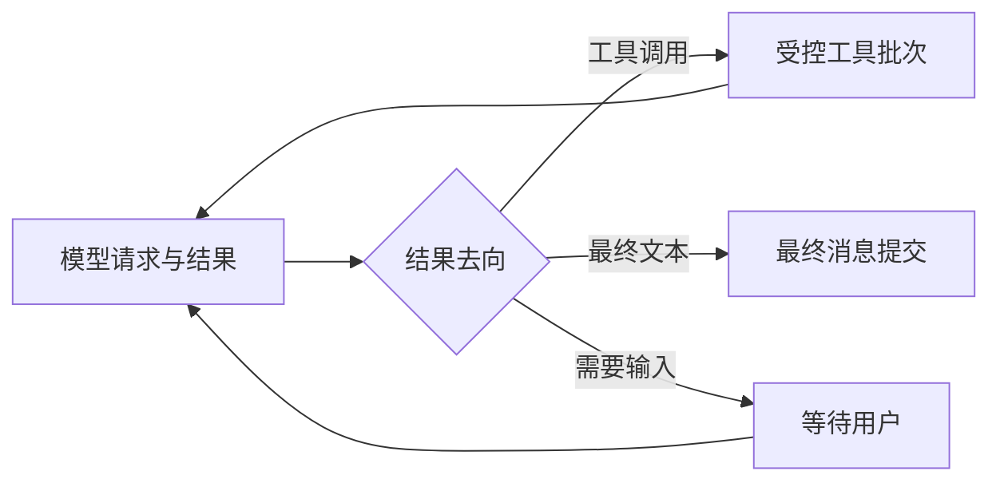

# 第 3 项深入调查：自编排的恢复缺口与框架替换判断

日期：2026-10-05。源码快照：`E:\project\ai-collab`，HEAD `d5f09ab`，包含当前未提交改动。本文补充 [前一轮综合调查](E:/project/ai-collab/docs/agent-framework-and-quality-research-20261005.md)，与 [第 1、2 项开发提示词](E:/project/ai-collab/docs/agent-stability-and-quality-handoff-20261005.md) 分开。

本轮只读源码、历史证据和框架官方文档/源码，新增设计文档。没有接着修改业务代码、执行暂停的测试、安装框架、启动服务、操作数据库、调用真实模型或提交。框架结论属于选型判断，尚未通过本项目的实现对照验证。

调查过程中工作区出现了其他开发改动，故本文的源码现状以各项读取时刻为准，行号也可能随开发移动。第 1、2 项的最新完成状态由新会话实际验收报告确定，本文不替其宣布修复通过。

## 1. 判断与优先级

当前自编排已经具备可工作的业务链路，权限、审批、业务幂等和原调用结果复用有实际实现及测试。它也有明确的基础能力缺口：生产路径的崩溃计时相互矛盾；恢复位置主要从“未处理工具清单”推断，未覆盖所有模型结果；同运行暂停尚未实现；单实例运行调度存在串行等待。

继续逐处分支补齐所有通用运行能力，会持续扩大我们自己的执行引擎。建议现在完成第 1、2 项形成可验收基线；在扩建暂停/恢复前，验证框架能接管通用运行职责。优先组合是 **Spring AI 2.x 模型接入 + LangGraph4j 持久执行**。验证达标才迁移，当前不直接推倒业务模块。

仅引 Spring AI 可以减少模型接入维护，不能由此宣称恢复问题解决。完整框架迁移是否降低项目总成本，需要比较留下的适配职责和能够退出的旧实现，当前没有百分比或工时收益的实测依据。

## 2. 当前运行机制究竟怎么工作

1. 定时任务领取一个运行，写入所有权、claim_version 和 6 分钟租约，在同一次 tick 中同步处理。
2. 协调器组装上下文、确保计划、检查待处理工具轮次，再选择是否继续取证或收尾。
3. 实际模型请求有持久调用身份；模型返回后保存完整 MODEL_TURN 与工具调用身份，随后执行工具或提交最终文本。
4. 已保存工具结果按 invocation 复用；规划受理和审批另有业务身份及幂等保护。
5. 工具批次完成后重新排队；暂时模型失败最多安排两次自动重试，间隔 30 秒。最终状态、步骤、用户消息与对应核心事件通过现有事务写入。
6. 进程退出后，另一 worker 等租约过期接管。恢复入口搜索未处理且含工具调用的 MODEL_TURN。

这是有持久记录的 Agent 执行器。完整聊天记录、执行恢复位置、业务效果分别承担不同职责，不能因其中一种存在，就认为其余两种也可靠。

## 3. 有依据的缺口，分别说明证据强度

### 3.1 高优先级：崩溃接管把离线等待计入运行时长

**源码事实**：运行任务的租约固定 6 分钟；接管过期 RUNNING 时，把旧 claim_started_at 到 lease_expires_at 的时长累计到 active_elapsed_ms。协调器允许的累计运行时长是 `min(300000, Skill.maxRunDuration)`，现有 Skill 为 2–5 分钟。

在正常时钟和当前 embedded worker 设置下，一次未正常结束的 claim 等到期接管，便会记入约 6 分钟；这个值超过所有现有 Skill 的时长上限。协调器的时长检查又在恢复待处理工具之前，因此先进入 BUDGET_EXCEEDED。

```text
执行一小段 → JVM 退出 → 等租约过期 → 接管记入约 6 分钟
                                         ↓
                             时长上限最多 5 分钟，恢复被挡住
```

这解释了“有恢复任务却继续不了”的实际体验。历史固定 24 轮验收第 9 轮记录了宿主退出后接续原运行、时长预算耗尽的结果；本轮没有再制造一次进程退出。

证据：[运行租约](E:/project/ai-collab/ai-collab-backend/src/main/java/com/shitulelv/aicollab/agent/application/AgentRuntimeJob.java:28)、[接管累计](E:/project/ai-collab/ai-collab-backend/src/main/java/com/shitulelv/aicollab/agent/infrastructure/repository/AgentRepository.java:345)、[恢复前时长检查](E:/project/ai-collab/ai-collab-backend/src/main/java/com/shitulelv/aicollab/agent/application/runtime/AgentRuntimeCoordinator.java:157)、[历史实际中断](E:/project/ai-collab/docs/acceptance-evidence/2026-10-04/agent-stability-remainder/report.md:18)。

**设计要求**：所有权租约与有效执行时间分开。正常调用使用单调时钟计量；运行中有限频率持久化有效时间，硬退出最多丢失一个计量间隔，离线/暂停/等待重试时间不入账。崩溃后不能凭墙钟精确重建未知消耗，应明确允许的小误差。周期可与 worker 存活更新共用，不新建计费引擎，也不能只缩短租约、取消全部上限或粗暴把已用时长清零。

框架可以管理执行位置，仍需应用定义有效时长与所有权策略。换框架不会自动纠正这项产品语义。

### 3.2 高优先级候选：已落库纯文本结果不在恢复选择范围

**源码推导，尚未故障注入**：协调器先提交 MODEL_TURN，再独立提交最终消息或等待澄清。`pendingModelTurn` 的 SQL 明确要求 toolCalls 长度大于 0。若进程恰在这两个提交之间退出，已保存的纯文本最终回答、`[QUESTIONS]` 或部分完成文本不会经该入口直接恢复。

因此，现有恢复路径可能先因上述时长问题停止；修正计时后，也可能再次请求模型，产生重复调用、改变已经得到的答案或丢失等待澄清意图。源码不能证明每次实际中断都会踩中这个窄窗口。

证据：[模型轮次提交](E:/project/ai-collab/ai-collab-backend/src/main/java/com/shitulelv/aicollab/agent/application/runtime/AgentRuntimeCoordinator.java:388)、[最终文本提交](E:/project/ai-collab/ai-collab-backend/src/main/java/com/shitulelv/aicollab/agent/application/runtime/AgentRuntimeCoordinator.java:458)、[恢复查询谓词](E:/project/ai-collab/ai-collab-backend/src/main/java/com/shitulelv/aicollab/agent/infrastructure/repository/AgentRepository.java:284)。

**设计要求**：恢复覆盖已完成模型请求的所有合法后续动作。保存过的结果能直接交给收尾/澄清阶段，不重新问模型。使用现有结果作为依据，或由框架明确保存下一执行位置；只保留一个运行推进者。

这项应成为后续执行基础验证的故障点，不临时塞进第 1、2 项收尾门槛。

### 3.3 多用户体验缺口：同实例同步处理，一个慢请求会挡住其他运行

**源码事实及条件推导，未压测**：一个 `AgentRuntimeJob.tick()` 同步处理一个 claim。工具线程池并行的是同一轮工具，不会让 tick 同时推进另一运行。领取按照 created_at 排序，旧运行重新排队后仍保留原创建时间，可能连续领取，使后提交的运行等待。

当前未找到自定义 TaskScheduler 或调度线程池配置。共享调度线程的其他任务还可能受影响；该部分具体延迟依赖实际启动配置，本文不声称已经测得。

证据：[同步任务](E:/project/ai-collab/ai-collab-backend/src/main/java/com/shitulelv/aicollab/agent/application/AgentRuntimeJob.java:25)、[领取排序](E:/project/ai-collab/ai-collab-backend/src/main/java/com/shitulelv/aicollab/agent/infrastructure/repository/AgentRepository.java:340)、[工具池职责](E:/project/ai-collab/ai-collab-backend/src/main/java/com/shitulelv/aicollab/agent/application/runtime/AgentToolScheduler.java:7)。

**设计要求**：在现有服务里有限并发地调度运行，同一运行一次一个执行者；资源额度仍有界，并保证不同用户有机会推进。不因此增加消息队列、调度平台或微服务。框架运行器也需要宿主调度，不能把一个阻塞 tick 换成一个阻塞 graph.invoke 就声称解决。

### 3.4 用户核心能力仍缺失，不把它们说成现有故障

- 当前没有 PAUSED 状态；取消会进入终态。“暂停后原地继续”尚未交付。
- 已有同运行自动重试，重试等待/用尽的用户反馈还需完善。应保留有界重试。
- 终态 retry 派生新运行已经实现；到限后携带原操作身份和剩余工作继续，尚未实现。重新执行与续接需在行为和文案上区分。
- 当前输入保护存在多处上限、层级投影、整请求后估算与一次重组。需要收敛入口及范围信息，不能删掉目标保护来换取请求成功。

第 1、2 项已安排修复的配置重读、分析提示、活动身份及分页问题，仍按合并提示词处理。历史已修正的规划竞态、重试迟到响应、结算问题不重新算作未完成。

## 4. 为什么会一直冒问题

### 实际维护面超出了普通工具循环

我们同时维护：原生/Legacy 协议、普通/Zen 的流式和非流式出口、动态配置请求快照、层级上下文组装与摘要、模型/格式/参数/工具的不同恢复、租约与取消、审批/规划操作、事件与页面恢复。新增“中途换模型”会交叉影响提示词、协议、待执行工具的来源与窗口，这正是当前中断修复涉及多层的原因。

这些组合带来真实成本。它不等于每个机制都多余：审批、当前权限、资源版本和业务幂等是项目协作产品必须承担的规则。

### 部分测试证明的范围曾被扩大解释

- 执行器单测证明出站沿用快照，不能证明 composer 没重读配置。
- 3 条任务的验收数据没有检验超过一页或投影后的覆盖范围。
- 脚本化假模型证明界面顺序，不能证明真实模型分析质量。
- 短租约/手工过期的恢复测试，不能替代生产 6 分钟租约与 2–5 分钟时长组合的中断验收。

后续应让关键用例串联实际链路并在提交窗口中断，而不是不断增加只检查局部字段的断言。通过数量要与覆盖边界同时报告。

### 减少维护面需要退出旧职责

已经没有调用者的兼容方法可以在确认后清理；仍用于 Legacy 回退、现有模型或安全边界的路径不能仅为精简删除。新旧 composer 的保留条件、提供商特例的范围应明确。框架迁移后如果所有旧分支照留，再新增检查点和回调，维护面会扩大。

## 5. 框架能接管的具体职责

| 方案 | 能减少的自维护内容 | 仍要自己做 | 当前判断 |
| --- | --- | --- | --- |
| 继续自编排，收敛现有类 | 不引依赖；复用已有恢复记录和业务事务 | 协议、阶段推进、暂停、崩溃边界、事件、业务规则 | 可作为验证失败后的务实方案；暂停恢复需求扩大时成本持续存在 |
| Spring AI 模型层 | 请求/响应统一接口、工具协议、流式聚合、常见兼容接入 | 自编排恢复与暂停；上下文范围；所有业务规则 | 替换边界较清晰，值得优先验证 |
| Spring AI + LangGraph4j | 上述接入职责，以及图执行位置、检查点、中断/恢复、节点钩子 | 业务幂等/权限、有效时长、宿主调度、产品事件、上下文质量 | 暂停与崩溃恢复的首选验证方向 |
| AgentScope Java ReActAgent | 普通 Agent 循环、事件、中间件、协作中断与会话状态 | 硬退出的具体检查点覆盖、业务事务、授权、宿主运行管理 | 完整 Agent 执行器备选；当前状态存储不能直接证明每个工具中途可恢复 |
| LangChain4j Agentic | Agent 组合及带持久 store 的逐步恢复 | SPI 存储对接、粒度验证、业务规则与事件 | 有实际恢复能力；Agentic 模块仍标 experimental，当前不作为第一迁移目标 |
| Spring AI Alibaba Agent/Graph | ReAct 循环、限次钩子、人工确认、Graph 检查点 | 业务边界及目标版本兼容 | 功能匹配；所查 main 的 Boot 3.5.8 / Spring AI 1.1.2 与项目需先验证，不为此降级应用 |

以上是职责映射，不是已验证的删除清单或承诺。Koog、Semantic Kernel Java、Google ADK Java 已在综合调查中比较，本轮不再同时推进更多候选。

### Spring AI：接入层收益清晰，但默认设置需受控

官方 2.0.x 支持本项目 Boot 4.1。工具循环可由 Advisor 管理，也可由应用控制；有外部审批、SSE 和取消等需求时，框架提供扩展入口。因此无需为了采用 SDK 改掉业务审批流程。[版本支持](https://docs.spring.io/spring-ai/reference/getting-started.html)、[工具调用](https://docs.spring.io/spring-ai/reference/api/tools.html)

所查 OpenAI 接入文档的默认 retry max-attempts 是 10，而当前应用最多三次逻辑尝试。直接叠加可显著放大网络调用及等待。迁移初期应把 SDK 尝试限制为一次，保留现有持久重试作为负责者；未来若将重试迁入框架，再退出旧重试分支。流式已发给用户的内容不能盲目从头重发。[重试配置](https://docs.spring.io/spring-ai/reference/api/chat/openai-chat.html)

普通兼容协议可交给库。Zen 的认证/session、保留工具以及真实提供商差异仍需验证，不能凭“OpenAI compatible”宣称全部可删。真实输出较短也不会因换 SDK 自行改善。

### LangGraph4j：能明确保存下一步，但检查点不包办业务事务

官方核心说明逐步保存状态和下一节点；PostgreSQL saver 提供跨 JVM 的检查点。所查执行源码是先执行节点、合并结果、决定下一节点，再写检查点。[核心能力](https://langgraph4j.github.io/langgraph4j/1.9/core/core-library/)、[PostgreSQL saver](https://langgraph4j.github.io/langgraph4j/1.9/core/postgres-saver/)、[实际执行源码](https://raw.githubusercontent.com/langgraph4j/langgraph4j/main/langgraph4j-core/src/main/java/org/bsc/langgraph4j/CompiledGraph.java)

由此推导：业务已经提交、图检查点尚未写入时硬退出，恢复仍可能重进该节点。本项目的 invocation / operation / proposal 身份及核对已有结果必须保留。把整个 Agent 从开始到完成放进一个节点，也无法获得轮次之间的恢复收益。

动态中断及有限节点拆分可以承载暂停。`cancel(false)` 的当前文档描述为在途节点完成后停止推进；产品的持久暂停意图仍需落库，不能只保存内存中的取消句柄。[取消执行说明](https://langgraph4j.github.io/langgraph4j/1.9/core/cancellation/)

Postgres V2 文档说明相同逻辑 thread 的并发执行共享同一活动行。因此不能把“有数据库 saver”直接当作“已有分布式单执行者隔离”。需要保留或验证宿主的所有权/隔离策略。[V2 约束](https://langgraph4j.github.io/langgraph4j/1.9/core/postgres-saver/SAVER_V2/)

当前源码有 Spring AI 集成，发布页有 1.9.x 正式版本。实际坐标、依赖树和 Boot 4.1 的组合仍须在小样编译验证；本轮没有做这项实装验证。[集成 POM](https://raw.githubusercontent.com/langgraph4j/langgraph4j/main/pom.xml)、[发布记录](https://github.com/langgraph4j/langgraph4j/releases)

### AgentScope / LangChain4j：避免把存储能力混为一谈

AgentScope Java 2.0 文档明确，会话 stateStore 在 call 开始加载、完成后保存，协作中断可走保存路径；中断信号本身不持久化，硬取消不保证同样的保存路径。因此目前证据足以支持普通循环和协作暂停的候选判断，尚不足以证明每个硬退出窗口有工具级恢复。[AgentScope 执行与存储](https://raw.githubusercontent.com/agentscope-ai/agentscope-java/main/docs/v2/en/docs/building-blocks/agent.md)

LangChain4j 当前 Agentic 文档确有逐 agent invocation 检查点和 planner 位置恢复，不能说没有。但一个 agent invocation 内含多个模型/工具回合时，所需粒度仍应实测；官方也标整个 Agentic 模块 experimental。[LangChain4j Agentic](https://docs.langchain4j.dev/tutorials/agents/)

Spring AI Alibaba 当前所查 main 的版本差异来自 POM，本轮没有证明全部发布版本都不兼容，故将其列为兼容性待验，而非永久排除。[所查 POM](https://raw.githubusercontent.com/alibaba/spring-ai-alibaba/main/pom.xml)

## 6. 满足需求的最小框架试验设计

只验证一个优先组合，不将所有候选装入业务项目。使用独立小样、隔离 PostgreSQL、可控制的假模型及现有工具服务；不开发新 UI、不调真实模型、不改业务数据库。

### 执行职责

逻辑阶段控制在当前需求以内：模型请求、受控工具批次、最终结果提交。澄清、用户暂停以及确需等待审批的动作作为持久中断条件；保留已有“提案已受理，Agent 返回待审批说明并完成”的语义，不把所有提案改成阻塞等待。不增加 supervisor、子 Agent、通用 planner 或复杂工作流 DSL。



模型节点每次请求解析当前配置，整请求共用快照；框架不固定首次模型。工具节点保留原 invocation/source_mode，执行时校验当前权限。规划已受理后返回 operationId；Agent 的暂停不传播成取消后台规划，恢复读取原 operation，保持用户已经选择的语义。

checkpoint 的逻辑执行 ID 绑定该运行，不把派生的新运行误接到旧耗尽执行。会话 ID 用于关联用户历史；权限仍经服务端检查。检查点只存恢复需要的数据或业务记录引用，不保存凭据和整套服务对象。

### 必做的行为对照

| 同一套场景 | 必须证明什么 |
| --- | --- |
| A 请求准备后切到 B | 本次 A、下次 B；工具来源正确；准备/出站一致 |
| 模型返回并持久后、收尾前硬退出 | 纯文本最终答案及澄清结果直接恢复；模型调用不重复 |
| 工具完成一半后硬退出 | 已完成结果复用，剩余调用继续，活动身份稳定 |
| 规划/提案已提交、框架检查点未提交时硬退出 | 核对原业务身份，业务效果恰一次 |
| 用户暂停在模型或工具在途期间 | 保存暂停意图，在允许边界停止；已受理规划继续；重启仍保持暂停 |
| 暂时失败及重试用尽 | 网络请求总次数有界，等待/失败状态准确，只有一处决定重试 |
| 两个 worker 接管同一运行 | 一次有效执行，旧执行者不能更新状态或重复写业务；异步线程中的隔离信息有效 |
| 一个慢运行与一个新用户运行 | 有界并发与公平推进，独立后台任务不被模型等待拖住 |
| 重放与恢复后事件落库 | 现有序号/身份可恢复，过程和最终回答不重复 |

用持久 PostgreSQL 和真实进程终止验证硬退出；用同步点控制具体窗口，避免只做正常结束后的加载演示。该验证任务数量固定，不发展成长对话测试平台。

### 防止迁移后更复杂的规则

- 框架唯一决定下一执行位置；旧 coordinator 的通用 advance/requeue/pending-turn 推断职责必须退出迁移链路。
- 应用唯一维护业务效果和授权；原 operation/proposal/invocation 记录继续存在。框架检查点负责执行位置，产品运行记录负责展示和审计，二者分工要明确。
- 框架 checkpoint 与业务落库不是同一事务时，节点重进先查已保存结果，不能再次执行业务。最终消息提交也要可重复进入。
- 计量、所有权、事件适配集中在少量边界，不为每个框架事件新增一张业务表或一个阶段枚举。
- 不套 Spring AI 的自动工具循环再套 Graph 循环。Graph 使用单次模型调用，由受控节点执行工具；重试也选一个负责者。
- 迁移验证先交付可审阅的对照与替换清单；实际新旧切换须按运行绑定，不能在途因为全局开关改动跳到另一个执行器。旧在途运行按原执行器收尾，不强制回填全部历史。

### 采用与结束条件

交付物限定为：目标版本/依赖兼容证明、上述场景对照、应保留的业务规则、可退出的旧职责和需要的适配代码。重点核算维护职责减少程度，不能仅用代码行数或 demo 成功作为收益证明。

若关键行为通过，并确实能退出自研通用执行位置/中断恢复实现，则推进分阶段替换。若适配又重新实现整套 coordinator、依赖兼容需改动整个应用或业务事务无法保住，则停止该方案，采用 Spring AI 模型层加收敛后的现有执行器。验证失败是选型结论，不继续追逐所有框架。

## 7. 后续落地顺序

1. 新会话完成已合并的第 1、2 项：中断四项修复、资料完整性及有限真实质量验收，形成可结束基线。
2. 针对生产时长矛盾先保留明确问题单，执行基础验证必须覆盖；不让旧问题藏在“框架以后会解决”的表述里。
3. 在扩建暂停前，完成一个持久执行框架试验，选择继续自编排或迁移。原预算/恢复设计的需求仍有效，通用执行实现随该结论调整。
4. 按选定基础交付崩溃有效计时、原运行暂停/继续、重试体验；跨运行到限续接另有小任务和停止边界。

用户需要的项目协作、动态配置、自然过程展示方向可以保留。接下来收敛通用执行基础、资料覆盖契约与验收边界，能减少反复跨层补漏；框架只有实际接管相应职责时才带来这项收益。
