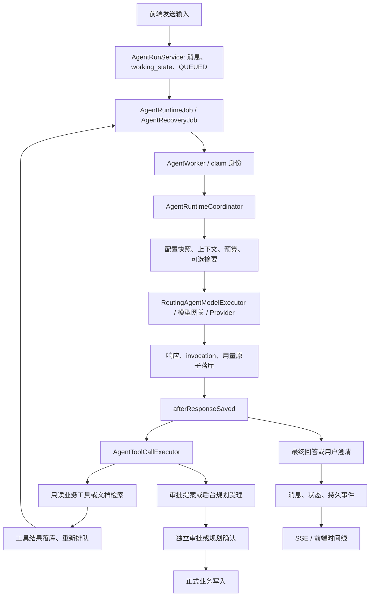

# Agent 系统现状、维护边界与后续方向

> 研究日期：2026-10-07。源码基线：`codex/context-foundation` / `00a85fe43ffed3b7fe6bdff4a5575b10472859c0`。
> 本文是源码研究与设计记录，不是新增功能验收报告。已实现事实、历史实测、源码风险及建议分别标注。
> 本文及后续补充仅编辑研究文档，没有修改生产代码，没有重跑测试、调用真实模型或进行浏览器验收。

继续研究补充：Skill/Tool 的真实字段使用、工具参数契约和下一轮具体范围已记录到 [Skill / Tool 边界设计与下一轮开发](agent-skill-tool-design-and-next-iteration-20261007.md)。后续开发优先按该文的两个有限交付物执行；本文第 13 节保留为较早的候选方向，不表示三项必须同时交付。

## 1. 阅读方式与结论

本文面向后续维护和开发，回答系统现在能做什么、调用如何衔接、事实落在哪里、失败如何处理、哪些保证有边界。源码路径以仓库根目录为基准；后续改变相关生产契约时，应同步更新本文对应章节的基线，而不是把本文当作永远有效的功能清单。

总体结论：项目已有可使用的受控 Agent、独立知识问答、文档索引/RAG 和后台任务规划。当前不需要重新建设执行循环或默认迁移框架。主要提升空间是回答质量与资料覆盖、整个对话工作区的阅读体验，以及范围有限的只读子 Agent 委派。

用户确认的取舍：

- 优先回答质量、资料完整性、可靠性和用户体验，不以减少代码行数或增加抽象为目标。
- 保留自动重试、崩溃恢复、已保存结果恢复和暂停/输入续跑。
- Agent 下一次请求准备读取当前模型配置，不能将整场运行锁死在启动模型。
- 暂停后通过明确输入恢复，不增加继续执行按钮；已受理的后台规划继续完成。
- 复用现有执行器、数据库事实及业务服务，不建设第二套编排或检查点。
- 借鉴本地 LangChain 课程的设计思路，不机械复制 Python 示例或教学 InMemorySaver。
- 精确费用统计低优先级；已收口 SSE L1/L2 不因可选建议重新变成必修任务。
- 前端优化范围已确认：整个 Agent 对话工作区，包括回答正文、过程活动和两侧栏，而非只加粗几处文字。
- 子 Agent 是用户提出的后续方向；本文给出有限试点设计，不表示已实现或已批准具体生产补丁。

## 2. Git 与证据基线

实际只读核对结果：

- 分支：`codex/context-foundation`；HEAD：`00a85fe43ffed3b7fe6bdff4a5575b10472859c0`。
- `git status` 相对本地 `origin/codex/context-foundation` 跟踪引用领先 24 个提交。未 fetch，不据此宣称远端实时状态、合并状态或部署状态。
- 生产代码没有未提交修改。
- 继承工作区内容：修改中的 `docs/agent-sse-lifecycle-review-20261006.md`，未跟踪的 `docs/acceptance-evidence/2026-10-07/`、`docs/agent-research-handoff-20261007.md` 和无关 `.freebuff/`。均不清理、不覆盖、不暂存。
- 最近生产补修 `8878ac3` 为 SSE L1/L2；`00a85fe` 为文档与证据提交。

历史证据和本轮检查必须区分：

| 证据 | 结论 | 范围限制 |
|---|---|---|
| `ai-collab-backend/target/full-test-lifecycle-fix.log` | 历史全量 1174 项，0 失败/错误，11 项跳过，BUILD SUCCESS；本轮已读取日志尾部核对 | 本轮未重跑；最终全量含实际执行的 PostgreSQL 集成，不沿用更早 Docker 未启动时的大量跳过结论 |
| 最新前端收口记录 | 历史 39 文件、218 项通过，vue-tsc 通过 | 本轮未重跑；之后 L1/L2 是后端改动 |
| SSE 审查第 7 节及 2026-10-07 证据 | 历史独立正式回归 25 项通过，另有 1 项受控 wakeup 探针通过 | 探针归档不是正式生产测试；该次没有重跑全量、真实模型、浏览器或 PG |
| 真实文档与流式报告 | 上传、Tika、真实 embedding、pgvector、Agent 检索回答已跑通；Zen 最终轮有 48 帧 | 真实 SSE 与合成 UI 渐进展示是不同证据；不是所有 provider 的逐字流式验收 |
| 29 轮摘要质量报告 | 旧原始消息退出近期窗口后，更正后的目标仍能延续 | 部分信息来自待审批记忆或近期消息，不能全部归功于摘要 |
| 本文 | 当前源码调用关系、持久事实、限制和待验证风险 | 没有新增运行验收，没有访问业务数据库或调用模型 |

优先资料：[运行时维护](agent-runtime-maintenance.md)、[SSE 最新独立复核](agent-sse-lifecycle-review-20261006.md)、[真实检索与流式](agent-real-use-and-streaming-report-20261006.md)、[回答与摘要质量](agent-baseline-quality-report-20261006.md)、[暂停与续跑](agent-pause-resume-report.md)、[恢复可靠性](agent-recovery-reliability-report.md)、[维护与课程对照](agent-maintainability-and-course-review-20261005.md)。

## 3. Tool、Skill 与子 Agent：不要混为一层

### 3.1 当前 Agent 确实有 Tool

生产工具位于 `ai-collab-backend/src/main/java/com/shitulelv/aicollab/agent/infrastructure/tool/`，实现 `AgentTool` 等受控接口，由 `AgentToolRegistry` 注册、按权限和 Skill 暴露，由 `AgentToolCallExecutor` 执行。

例如 `list_tasks`、`get_task`、`search_project_knowledge`、`list_project_documents`、正文读取、项目统计、成员/里程碑查询、`create_task_after_approval`、规划受理及澄清。这些才是模型可调用的实际能力接口。工具参数和结果有结构，服务器决定是否可以调用，模型不能授予自己权限。

当前六个 Skill 是 `PROJECT_HEALTH`、`WEEKLY_REPORT`、`MEETING_TO_TASKS`、`ITERATION_PLANNING`、`DELIVERY_READINESS` 和 `PROJECT_RESEARCH`。`AgentSkill` 定义指令、输出要求、工具白名单、是否允许写工具/外部工具和核心动作声明；相关运行限制由 `AgentRuntimeLimits.forSkill` 提供。Skill 本身没有执行业务动作的 `execute` 方法。

| 概念 | 本项目中的职责 | 示例 |
|---|---|---|
| Tool | 一次可调用能力；验证参数、访问资源、返回结果 | 查询任务、检索知识、提出任务创建审批 |
| 当前 Skill | 任务场景配置；约束如何做和能用哪些 Tool | 项目健康、周报、迭代规划 |
| 子 Agent | 带独立任务、上下文和工具范围的模型执行单元 | 受主 Agent 委派的文档研究者，当前尚未接入生产主链 |

当前 Skill 更接近“任务场景/执行配置”，所以用户觉得它像功能菜单有依据。这不说明原设计没有 Tool，也不要求把六个 Skill 重写成六个大 Tool。近期可先在展示与文档中明确叫“任务场景”，保留现有代码标识；不以术语整理为理由进行类名、数据库字段和 API 的全量重命名。

### 3.2 课程中的子 Agent 原理

本轮读取了 `E:/project/LangChain_Official_Course/lca-lc-foundations/notebooks/module-2/2.3_multi_agent.ipynb` 和中文导读。课程使用 `subagent-as-tool`：普通 `create_agent` 创建子 Agent，为它配置专用工具；包装工具把任务交给子 Agent，取最终输出返回主 Agent；主 Agent 将这个包装器当 Tool 调用。

核心调用原理简单，也能在当前 Java 系统实现，不依赖迁移 LangChain。子 Agent 的价值是隔离研究任务和上下文、限定工具、提炼证据，而不是替一个简单 SQL 查询多加一次模型调用。示例中的计算任务是教学演示，不宜据此把每个普通工具都拆成子 Agent。

当前数据库模型和旧代码已有 `parent_run_id`、role、depth、children 预算、`recordDelegation` 及父运行收口辅助逻辑，但当前 Native 工具主链没有有效的委派入口；Legacy 的决定转换也不等于启用子运行编排。旧代码使用的状态、记账和共享会话语义必须重新核对，不能通过打开一个遗留分支就宣称多 Agent 已交付。

## 4. 能力全景

| 模块 | 已实现 | 边界 |
|---|---|---|
| Agent | 六种任务场景、业务查询、文档研究、澄清、审批提案、后台规划受理、恢复与控制 | 选择为确定性规则；参考计划不代表实际执行；回答覆盖受资料选择、预算与模型行为影响 |
| 模型基础设施 | 用户连接、用途分配/默认、OpenAI 兼容/Anthropic/Gemini 适配、Zen 预置路径、请求快照 | 能力声明须与提供商真实支持一致；不自动择模；Native 协议失败不静默转 Legacy |
| 上下文 | 分层选择、工作状态、用户约束/更正、项目记忆、摘要、预算、防循环 | 不是无限记忆；Legacy 消息转换存在输入保真缺口 |
| 文档/RAG | MinIO 文件、Tika 解析、可读正文、embedding、pgvector、来源身份、候选索引切换 | 相关摘录不等于全文已读；服务不可用属运行环境问题；不扩大模型窗口 |
| 知识问答 | 普通/流式、自己的会话上下文、引用验证和持久化、证据不足回答 | 不共享 Agent 工作状态或执行恢复，不调用 Agent 业务写工具 |
| 任务规划 | 异步蓝图/详情、结构校验/有限修复、局部修复、版本、确认事务 | 受理、READY、CONFIRMED 不是同一状态；并非所有阶段自动断点接管 |
| 审批 | 权限、修订、nonce、版本、幂等键、正式业务事务 | 模型不能自批；批准不自动重新启动 Agent |
| MCP | 项目级发现、Schema 确认、白名单、只读工具、凭据及端点防护 | STDIO 默认禁用；HTTP 兼容接入有限，不等于通用完整 MCP 客户端；本轮未连接真实外部 MCP 服务 |
| 前端 | 持久活动、过渡说明、最终 Markdown、暂停/重试、来源查看、临时正文流 | 当前视觉和阅读体验仍需整体提升；Agent 增量仅 Zen 生产路径；广播为进程内 |

尚未作为现行产品交付：完整多 Agent 委派、定时 Agent 产品、跨终态运行只做未完成工作的续接、精确费用产品。遗留表或辅助函数不作为交付证据。

项目进度、风险、工作报告和仪表盘工具主要调用 SQL 查询和确定性规则。Agent 可再解释这些结果；独立统计页面不会因为标题包含 AI/洞察就自动调用模型。`ProjectQuestionAgentTool` 委托知识检索，不启动第二个问答循环。

## 5. 核心调用链与职责



下表中的 Java 路径前缀为 `ai-collab-backend/src/main/java/com/shitulelv/aicollab/`。

| 模块与入口 | 正常调用关系 | 持久事实 | 失败与实现边界 |
|---|---|---|---|
| `agent/application/AgentRunService` | 控制器受理、成员检查、创建会话/运行、暂停/取消/重试/澄清 | session、run、用户 message、working_state、事件 | HTTP 返回受理；版本冲突和控制输入不能误建新任务 |
| `AgentRuntimeJob` / `AgentRecoveryJob` / `AgentWorker` | 定时领取后进入协调器，注册取消和 claim 作用域 | run 状态、租约、claim_version、last_progress_at | SQL 领取隔离 worker；旧身份被拒绝；不是 Redis 队列或外部调度平台 |
| `runtime/AgentRuntimeCoordinator` | 选择 Skill、消费已保存结果或准备新模型请求，再分派工具/最终文本 | step、run、invocation、请求结算 | 顺序入口；恢复与正常响应共用消费逻辑；不替业务服务决定授权 |
| `runtime/AgentContextAssembler` / `AgentSkillRegistry` / `AgentPlanService` | 验证页面资源、角色和提案，按规则选场景、保存参考步骤 | page_context、approval、plan_json | 非本项目资源拒绝；参考步骤不是执行状态 |
| `runtime/AgentModelMessageComposer` / `AgentToolOutputProjector` | 分层选择消息、投影工具输出、保留当前请求 | recent messages、working_state、summary、tool steps | 必选层放不下明确停止；投影不访问数据库，不决定下一步 |
| `runtime/AgentModelConfigurationStore` / `RoutingAgentModelExecutor` | 当前用途配置解析，固定单次请求，经 Native/Legacy 出站 | 用户连接/用途分配、run 诊断快照 | 不自动选择另一模型；出站授权与模型身份选择不同 |
| `runtime/AgentToolCallExecutor` / `infrastructure/tool/AgentToolRegistry` | 校验批次、复用 invocation、只读并行、受控写/澄清分派 | tool invocation、step、approval/operation 关联 | 专用有界池、超时、Schema/权限检查；不普遍自动重放业务写 |
| `infrastructure/repository/AgentRunEventRecorder` | 原子写状态、用量、消费标记、消息和事件 | run、step、message、usage_settlement、run_event | 事务边界不能为缩短文件而拆散；不只是日志记录器 |
| `AgentWorkingState` / `AgentMemoryService` / `AgentContextSummarizer` | 用户约束、项目记忆和旧对话摘要分别维护 | session JSONB、memory、summary coverage/attempt | 用户更正有来源；摘要 CAS 防旧结果覆盖，失败保留旧摘要 |
| `document/application/service/*` | 文件登记、处理、索引提交和搜索 | project_document、body chunks、document_chunk、索引代次；MinIO 对象 | processing token 隔离旧处理；解析成功不等于向量 READY |
| `knowledge/application/service/*` | 检索、知识聊天、引用验证、保存问答 | knowledge_session/message/citation、调用日志 | 无证据不调模型；流式断开可取消，不是 Agent 式接管 |
| `AgentApprovalService` / `AgentPlanningOperationService` | 模型建议落成提案或后台操作，再通过正式业务入口 | approval、planning_operation/event、invocation 绑定 | 权限、revision、版本和幂等边界；受理不宣称业务完成 |
| `planning/application/*` | 异步生成、版本提交、修复和人工确认 | ai_task_plan、attempt、version、issue、confirmation | 迟到结果按原代次隔离；确认失败回滚，不留半批任务 |
| `runtime/AgentEventStreamService` / 前端 `use-agent-workspace.ts` | 持久游标追赶、临时正文快照、事件归并和消息收口 | run_event/message；预览仅内存 | 临时字流不重放；进程内广播；前端入口风险见第 11 节 |

请求具体过程：

1. 前端保存当前项目/会话/恢复代次，向服务器提交内容、可选 Skill 与页面上下文。
2. `AgentRunService.submit` 检查项目成员与控制状态；事务创建 QUEUED run、用户消息并推进 working_state，追加事件。
3. 启用的 `AgentRuntimeJob` 默认每秒领取一次工作，租约六分钟；`claimNext` 用 `FOR UPDATE SKIP LOCKED` 领取排队、到期重试和租约失效运行。
4. `AgentWorker` 建立取消和 claim 身份作用域。协调器验证上下文、加载 Skill 和参考步骤。
5. 有已保存未消费的模型轮次时先消费；没有时计算收敛状态，解析本次模型配置并组装消息，必要且可负担时生成摘要。
6. 出站前建立 modelCallId 和准入事实。响应与用量、工具调用身份、source_mode、finalizing 原子保存。
7. 工具批次先校验，复用既有结果，执行允许动作并保存结果；普通查询重新排队进入下一模型轮次。
8. 最终文本、澄清、预算部分完成或确定性受理说明在持久状态中收口。SSE 通知前端，最终回答以持久消息为准。

## 6. 模型配置、协议和单次快照

`AgentModelConfigurationStore.require` 每次请求准备读取请求者当前 AGENT 用途分配，否则默认连接。run 上的 model_configuration_id/updated_at/snapshot 用于诊断，不是整场运行的固定配置。禁用、删除或没有可用连接沿正式错误分类失败，不静默改用别的模型。

`RoutingAgentModelExecutor.ResolvedRequest` 固定本次 provider/config/providerType/modelName/legacyMode；能力判断、窗口预算、提示词、工具暴露、出站调用和响应校验使用同一事实。`AiConfigurationContext` 将快照传入网关。已准备或在途请求不混入新配置；下一次准备重新解析当前配置。出站前还检查配置归属、启用状态和凭据授权，这是安全检查，不是重新选择模型。

Native 用角色消息和工具 Schema，由 `NativeToolCallingExecutor -> RoutingModelTurnGateway -> ProviderAdapter` 返回统一 ModelTurnResult。支持原生能力但协议失败时不偷偷转 Legacy。

CHAT-only 用 `LegacyReadOnlyAgentExecutor -> RoutingChatModelGateway`，文本工具清单加 JSON 决策解析，只暴露只读工具。这是协议分支，不是第二套执行循环。恢复工具按已落库 source_mode 检查，不能拿用户后来换的模型协议重新否定旧响应。

当前 Legacy 只提取第一条 System、第一条 User，再追加工具调用和最多 500 字符的单个工具结果。Composer 输出的摘要、页面、提案和部分原始消息可能没有完整进入转换结果。不能把 Native 的多层输入保真保证套到 Legacy；具体影响需定向复现，见第 11 节。

`composer-v2` 是消息选择策略开关，与 Native/Legacy 协议轴不同。摘要辅助调用另行解析当次配置，目前只支持 Native；独立规划则按一次生成固定配置，详见第 9 节。

## 7. 上下文、工作状态、摘要和预算

### 7.1 上下文选择

`AgentContextAssembler` 获取真实项目角色，用正式业务服务验证页面资源，并读取数据库可信提案。它不把整个项目全量装入提示词。

默认 Composer v2 的必选内容是系统/Skill 要求、working_state、已有摘要、验证后的页面、可信提案和完整当前请求。近期历史候选默认 40 条，最近优先入选，再按时间顺序输出；工具观察来自持久成功结果，最新可见上限更大，旧结果投影和去重；项目记忆在剩余容量内参与。旧助手消息有 UNVERIFIED_ASSISTANT_HISTORY 标记，不自动成为当前事实。

`AgentToolOutputProjector` 只做确定性投影。资料是否过期在组装器/查询边界判断，不放进纯投影组件。任务与里程碑列表由 `ListPageContract` 对齐实际可见记录、returned、total、hasMore、nextCursor 和 taskFacts：游标是第一条未展示记录，续读 id>=cursor，不跳过被投影裁掉的记录。分页属于 LIVE_KEYSET，不承诺跨多页的数据快照完全不变；模型是否主动续读仍是行为边界。

### 7.2 用户状态与记忆

`AgentWorkingState` 与用户消息同事务推进 schemaVersion、stateRevision、goalRevision、当前/历史目标、latestRequest、任务数量/日期/负责人约束、澄清与更正。只接受用户来源的约束，不把助手推测升级为硬要求。更正保留原文 quote/sourceMessageId，所有有效更正按时序交给 Composer 和摘要；显式新目标使旧更正和约束退位。它不是完整自然语言语义引擎，不靠解析直接改写 activeGoal。

`AgentMemoryService` 是项目级记忆，管理权限、版本与审计，模型新增记忆需审批。相关性选择主要用关键词和中文片段评分，从有限活动记忆中挑选条目，不是 embedding；记忆也不授予权限。它与摘要、待审批提案和用户约束必须分别解释。

### 7.3 有界增量摘要

`AgentContextSummarizer` 在旧对话无法全部进入选择结果且存在新增覆盖时尝试摘要，默认每 run 最多一次尝试。输入上界约 6000 字符、输出上界 1200 字符；短消息最多 400 字符按完整消息覆盖，长消息按约 600 字符片段及 [from,to) 偏移覆盖。

旧摘要完整参加下一次摘要；当前有效目标、约束和更正单独提供。覆盖元数据表示源消息哪些片段曾提供给摘要请求，不表示模型一定完整保留其语义。摘要不删除原消息，不调用业务工具。

出站和重压缩都检查预算、时长、取消与暂停；输出过长最多重压缩一次。失败、不合格或 CAS 冲突保留旧摘要和旧覆盖，不假报成功；提交校验 stateRevision/goalRevision、消息归属等，生成期间不持有数据库行锁。主请求先组装，新摘要通常作用于后续请求，不承诺降低本次主请求体积或无额外延迟。

历史 29 轮证明旧目标更正可延续，但周会时间等部分信息来自待审批记忆或仍在近期窗口的用户消息，不能宣称摘要无损保留全部历史。

### 7.4 预算边界

| 约束 | 参数/来源 | 超限行为 |
|---|---|---|
| 单次输入 | min(已知窗口-输出预留-安全余量，运行剩余输入，应用单次上限)；默认上限 50000、预留 8000、余量 2000 | 缩减可选内容，完整当前请求仍装不下就明确停止 |
| 模型窗口 | 可选 window-overrides；未知时只用应用限额兜底并标记估算 | 不建设默认逐型号策略；RAG 不扩窗口 |
| 运行总输入/输出 | 持久 run 与显式 Skill 限额共同约束；普通 DB 默认 50000/20000 | 实际超额明确终止，不执行该响应中的新工具 |
| 步骤/调用 | 普通创建 12 步/8 工具；显式迭代规划 24/16；另有 Skill 的模型轮次和单轮限制 | 收敛策略尝试保留最后无工具回答，或部分完成/耗尽 |
| 时长/超时 | Skill 运行时长约 2-5 分钟；请求 deadline、内部工具默认 10 秒、MCP 默认 15 秒及具体配置 | 分类为超时/失败，原预算继续有效 |
| 循环 | 最近持久调用的 tool+args+output 重复签名 | 有界防无进展，不无限重试 |

通用 limits 的 16 步/12 工具不等于所有创建 run 的实际默认值。当前额度读取显式 skillCode；自动识别某 Skill 不应直接假定等价于显式选择的所有额度。

`AgentConvergencePolicy` 决定继续、FINALIZE 或耗尽，最后一轮禁工具；核心动作未发生时不能因模型返回一句话记成功。有成功工具证据可输出部分回答，当前证据兜底可能偏技术化。不是每个预算耗尽分支都能再生成漂亮总结。

token 以 provider usage 或字符/3 等估算记账，保存调用身份、依据和实际用量，避免重复结算。它服务限额与可靠性，不等于精确费用产品，本轮不继续围绕计费边角扩张。

## 8. 文档/RAG 与独立知识问答

### 8.1 文档处理与检索

`DocumentApplicationService` 检查管理权限及文件策略，将文件写 MinIO、注册 project_document，提交后触发处理；登记失败补偿对象。`DocumentProcessingService` 用 processing token 和心跳领取处理，读取文件，经 Tika 解析和 DocumentChunker 分块，保存可读正文，再 embedding。`DocumentIndexWriter` 校验处理身份后原子替换索引与标记 READY；旧处理结果不能覆盖新处理。失败保存 FAILED 和安全错误，正文解析成功不等于向量索引可用。

`ProjectEmbeddingGateway` 现在读取系统级 embedding 配置，projectId 是业务上下文，旧 project_embedding_config 不参与路由。校验返回数量、顺序、维度和有限值，对部分网络/服务器失败有限重试，鉴权/配额等错误明确失败。

`DocumentSearchService` 校验当前项目、指定 READY 文档和查询大小，将查询 embedding 后调用 pgvector cosine 检索；provider/model/dimension/fingerprint/generation 必须匹配，防止跨向量空间混用。换 Agent 聊天模型不会自动换 embedding。`EmbeddingIndexService` 为候选配置构建独立代次，显式激活前核对文档覆盖/版本和活动配置，失败不替换现用索引。

Agent `search_project_knowledge` 返回来源身份、相似度和摘录，显式标记 RELEVANT_EXCERPTS_ONLY/fullDocumentRead=false；阅读全文使用正文分段工具和续读位置。最终来源卡由本 run 成功工具的当前有效来源收集，不接受模型编造 ID；来源集合不等于逐句语义引用验证。

历史真实上传 -> Tika -> embedding -> pgvector -> Agent 回答已跑通；Ollama 曾未启动导致失败，属于环境原因。历史使用 `qwen3-embedding:0.6b`、1024 维，是验收配置，不是产品固定模型。

### 8.2 独立知识问答

`KnowledgeQuestionApplicationService` / `KnowledgeStreamQuestionService` 使用自己的 knowledge_session/message/citation，检查成员与本人会话归属，Redis 限流；KnowledgeConversationContext 用近期对话形成检索问题，KnowledgeContextBuilder 做阈值、去重与容量选择。

没有合格证据时不调聊天模型，保存证据不足回答；有证据时以 KNOWLEDGE_CHAT 用途调用共享 ChatModelGateway，KnowledgeCitationValidator 校验允许的 [S#] 来源并处理无效引用，KnowledgePersistenceService 原子保存问答与引用。

流式问答有独立有界线程池，断开可取消未完成请求，完成后保存最终答案并发送引用/done。它不执行 Agent 工具、不继承 working_state，不具备 Agent 式租约接管和持久运行恢复。

## 9. 重试、恢复、暂停与业务写入

### 9.1 必须区分的恢复类型

| 类型 | 身份与处理 | 保证范围 |
|---|---|---|
| 自动重试 | AI_MODEL_TIMEOUT/AI_PROVIDER_ERROR 等临时失败；FAILED_RETRYABLE，默认 30 秒后领取，最多两次自动重试 | 同 run，不重置额度；格式修复另计有界次数，不能无限重试鉴权或写操作 |
| 崩溃接管 | QUEUED、到期重试或租约失效 RUNNING 由 SQL 领取，推进 claim_version | 旧 worker 写入被 fencing/版本校验拒绝；失联未保存模型响应可能未知 |
| 已保存结果恢复 | pendingModelTurn 先于新模型请求准入，经统一 afterResponseSaved 消费 | finalizing/source_mode 保持原事实，实际超额、时长、权限不绕过 |
| 暂停/输入续跑 | RUNNING 登记 pause_requested_at；边界 PAUSED，保留响应/PENDING 调用并释放租约；明确输入恢复原 run | 不强杀在途请求，不清零预算；已受理规划继续完成，不增加继续按钮 |
| 用户澄清 | [QUESTIONS] 或澄清工具，WAITING_FOR_USER_INPUT，追加真实补充消息后重新排队 | 与暂停控制口令不同 |
| 取消 | 持久取消意图/状态，提交后发送中断信号，后续准入拒绝 | 不回滚已完成业务副作用 |
| 终态手动重试 | FAILED/CANCELED/BUDGET_EXCEEDED 派生新 run，复制目标/Skill/页面，恢复默认额度 | 唯一 retried_from 关系防重复点击，保留旧记录；不是只续剩余工作 |

崩溃计时以 V60 last_progress_at 的持久确认段为准，不计离线、排队或租约等待，未确认尾段不宣称精确。接管收口失联未结算的调用为 UNKNOWN，不虚构用量。

工具恢复按调用身份、名称和参数一致性复用已保存结果，只计算未执行项的新额度。文本结果消费、消息、终态与事件同事务收口。缺失 finalizing/source_mode 的旧数据只有保守回退，不宣称可还原当时所有上下文。

V61 暂停意图不 bump 在途 run 的业务 version，避免合法响应无法落库；模型、摘要、工具和业务受理均有准入检查。绑定 pausedRunId 的输入保持控制作用域，终态/等待状态也不能误建新任务。ResumeIntentRecognizer 是保守确定性分流，不接受任意含糊自然语言。

### 9.2 审批与普通业务写

`AgentApprovalService.proposeOrRevise` 规范化参数、保存提案与差异；明确可信 approvalId 才修订，同 session/项目/requester/工具族及 PENDING 状态须匹配。invocation 与 proposal 绑定防崩溃间隙重复创建；多个候选不猜测。

批准需 OWNER/ADMIN，锁提案并检查 expectedRevision、nonce、期限、幂等身份和当前可执行 run；再校验目标资源版本和真实业务条件，调用正式业务服务。业务写、批准结果和事件同事务，失败整体回滚。新流程通常是 Agent SUCCEEDED、approval PENDING；批准不重新启动模型，WAITING_FOR_APPROVAL 留作兼容。

这些是受控范围内的幂等，不是任意外部副作用普遍恰好一次。MCP 只读和端点限制不能被 Skill、子 Agent 或模型文本绕过。

### 9.3 后台规划

`AgentPlanningOperationService` 要求管理权限、根运行、非 scheduled，锁 invocation 和当前 run，核对暂停/取消/状态；首次受理创建规划和 attempt，并保存 operation 与 run/目标版本、generationSeq/attempt 的关联，重复调用返回原操作。状态卡按该操作所属代次同步，不借用后来生成结果。Agent 可以完成受理职责，后台在独立有界执行器继续。

`TaskPlanCommandService` 校验日期、任务数、成员和所选文档并限流/额度检查；`TaskPlanContextAssembler` 读取项目事实与有限相关文档。`TaskPlanGenerationOrchestrator` 蓝图 -> 详情，做结构和业务校验、有限修复；可用但有问题的候选可 READY_WITH_ISSUES，详情失败保留蓝图。

`TaskPlanVersionCommitService` 提交生成结果时携带原 generationSeq、attemptId、阶段，防取消/重生成后的迟到结果借新身份提交；手工编辑用 baseVersion/expectedVersion，恢复历史产生新版本。`PlanningModelConfigurationStore` 按一次生成固定模型快照，跨阶段一致；恢复时不兼容配置变化需重新生成，不套用 Agent 每次请求切换语义。

`TaskPlanConfirmationService` 通过幂等键/请求身份领取确认，再锁规划、最新版本与相关业务资源，校验无阻塞问题、有效成员和当前业务条件；事务创建里程碑、任务、依赖映射和成功结果。失败不留下半批任务，补偿恢复可重试状态；模型没有直接确认工具。持久事实包括 ai_task_plan、attempt、version、issue 和 confirmation。

`AgentPlanningRecoveryJob` 可补派发 Agent 受理的 QUEUED attempt，markRunning 隔离重复派发；TaskPlanRecoveryJob 将长期失联 RUNNING 标记阶段失败并保留可用版本。规划不是所有阶段自动断点接管，更不能把 READY 说成业务已落地。字段级修复能力存在，但真实触发受错误发生在哪个校验边界限制。

## 10. 前端与 SSE：现有机制和重排方向

### 10.1 已有机制

前端位于 `ai-collab-frontend/src/modules/agent/`。`useAgentWorkspace` 以 timeline 中的 run 为主要展示来源，`agent-run-store` 按 runId/sequence 接受事件，`agent-activity` 把事实转中文活动与自动重试展示；`conversation-blocks` 排列用户问题、活动、最终消息。工具轮正文非空才有过渡说明，纯文本完成不重复生成说明。旧 run 主要保留消息，不等于同时展示所有历史活动。

AgentView 使用共享 marked + DOMPurify 渲染最终 Markdown，去掉 [QUESTIONS] 控制标记，支持标题、加粗、列表、表格、代码和引用。来源可查看原文，诊断细节折叠；用户在底部时跟随新内容，上翻时不强制滚回。项目/会话/restoreSeq/事件序号防迟到响应污染，包括 A -> B -> A。

`AgentEventRepository` 在同事务递增 run 序号并写事件。SSE replay、持久事件、临时正文、heartbeat 的网络写全部进入共享 4 worker + 128 队列，每订阅单飞；业务事务/模型读流/afterCommit/scheduler 只唤醒。持久游标按 DB 追赶，接入取 afterSequence 与 Last-Event-ID 较大值。L1 读取异常不自旋、L2 订阅登记/摘除原子化已独立复核，保持收口。

临时正文经 ModelContentPreview 显式跨线程捕获观察者、累计文本、AgentContentPreviewPublisher、MODEL_CONTENT 和前端预览传递。modelCallId/revision/text/final 自包含，允许合并丢帧，展示上限 8000 字符，不落库、不占持久序号、不更新 Last-Event-ID、不重放。最终消息收口；临时预览不是最终事实。Agent 实时增量当前只覆盖 Zen 的 OpenAI 兼容生产路径，Custom/Anthropic/Gemini/Legacy 保持一次完成展示。

### 10.2 视觉依据和用户范围

用户明确认为现有 Agent 对话页面很丑，并确认优化整个对话工作区。本轮读取当前 AgentView 源码，并查看了以下历史截图；没有将其冒充当前浏览器实测：

- [2026-10-06 桌面最终状态](acceptance-evidence/2026-10-06/real-use-streaming/shots/14-fixed-final.png)。
- [2026-10-06 窄屏暂停状态](acceptance-evidence/2026-10-06/pause-resume/shots/08-narrow-paused.png)。

源码中仍有可定位的阅读问题：工作区桌面会话栏/检查栏为 232px/328px，中间回答又受 article max-width:78% 限制；所有 h1-h4 均设为 15px，标题层级较弱；最终回答沿用气泡边框/背景，较长分析容易像挤在卡片中的文档；参考步骤、状态和空区占用侧栏空间，信息主次需要重排。这些是布局/层级判断，不是模型回答事实错误，也不是宣布当前页面完全不支持 Markdown。

### 10.3 建议的最小工作区改版

目标：让项目用户容易读出结论、依据、风险和待执行动作，过程与诊断退到合适层级，保留所有现有控制能力。

- 中央回答是阅读主区，助手长回答不用 78% 气泡约束，采用稳定可读行宽；用户消息可保持紧凑区分，不把每一段答案做成小卡片。
- 标题、正文、列表、重点、表格、引用和代码建立清楚层级；默认先结论，按需要分资料、分析和建议，不强迫所有答案套同一长模板。
- 真实工具活动是一条紧凑过程区，可折叠展开；默认不与最终结论争抢注意，不显示赤裸工具名，也不编造过程说明。
- 两侧栏服务导航和操作：会话栏可收起，右栏优先待审批、规划和当前需处理事项；诊断和参考模板不默认占据主要阅读空间。
- 输入区保持稳定、清楚的发送/暂停/取消/重试状态；PAUSED 通过明确输入恢复，不增加继续按钮；规划卡仍展示真实后台状态。
- 移动端优先对话阅读与输入，导航/详情按需打开；短回答、长报告、表格、错误、审批和流式预览都验证不溢出、不重叠。
- 不建设新 UI 框架、不默认重做全站设计系统、不增加答案二次模型美化调用。模型可有轻量输出结构提示，但优先用既有 Markdown 渲染与样式解决阅读问题，不正则猜测哪些原句应加粗。

这轮仅保存方向，没有选定新的视觉稿或执行前端改版。后续实施须通过 browser-skill/bsk 对当前页面采集并完成桌面/窄屏验收；必要样例可合成，但须标注，不以漂亮占位回答冒充真实回答质量。

## 11. 本轮源码风险与问题分类

| 项目 | 当前证据 | 分类与处理 |
|---|---|---|
| 部分真实 Tool 的参数定义不完整 | get_task、知识检索等继承默认开放对象 Schema，但 execute 要求具体参数；部分审批工具也只有 approvalId 补充定义 | 源码确认的调用契约缺口，本轮未测失败率；下一轮补真实定义及正反参数测试，保留审批补丁合并语义，详见后续边界设计 |
| Legacy 多层上下文转换 | LegacyReadOnlyAgentExecutor 只取第一条 System/User；Composer 有多层输入 | 源码可见输入完整性缺口，运行影响未复现；先做参数捕获契约测试，再局部修转换，不迁移编排 |
| 自动重试等待期刷新 | use-agent-workspace.ts 的 restoreSession 仅为 RUNNING/QUEUED 重新订阅，FAILED_RETRYABLE 不在分支内，未找到等价持续恢复入口 | 源码推断的前端恢复风险；复现刷新/切回时的重试等待，确认后只补入口，不重开已收口的 SSE sender L1/L2 |
| 模型不主动续页 | 历史真实问题中有少续页但诚实说明投影范围的模型行为 | 模型行为/资料覆盖问题，不据此说分页工具损坏；用明确全量问题评估 |
| 摘要不无损 | 长度/结构校验与覆盖元数据不验证全部语义保留 | 设计限制；用具体丢失样例判断，不默认替换摘要组件 |
| embedding 连接失败 | 历史 Ollama 未启动 | 环境问题，不算 RAG 链路设计缺陷 |
| 当前对话不好看 | 用户明确反馈、当前 CSS 和历史截图 | 体验问题；已确认整个对话工作区范围，尚未改版验收 |

## 12. 子 Agent 的有限试点设计

建议先做一个 `document_research` 只读子 Agent。主 Agent 继续直接使用简单查询工具；只有需要多次检索、正文续读和资料对照时才委派，拿到结论后汇总、提问或提出审批。

```text
主 Agent
  -> 直接 Tool：查任务、查里程碑、读取简单事实
  -> 委派 Tool：文档研究
       -> 子 Agent：检索 + 分段读取 + 整理证据与覆盖缺口
       -> 返回：发现、来源身份、已读范围、未确认问题
  -> 主 Agent：综合回答；必要时走既有审批/规划入口
```

最小边界，不增加通用多 Agent 平台：

1. 一个角色、最多一层，不递归生成专家；首期一个子任务，不承诺并行加速，也不让模型为每个普通工具创建子 Agent。
2. 子运行复用现有持久执行引擎、请求快照、工具验证、恢复及事件事实；不直接复用未审查的旧 delegation 事务，不嵌入第二套框架循环。
3. 显式传子任务及必要项目事实；子指令不伪装成用户消息、不推进主目标版本，内部结果不自动插成主会话的第二份最终回答。避免同 session 的消息/working_state 造成目标污染。
4. 子工具白名单取受限只读集合，继承项目与请求者身份，不能新增权限、审批、业务写或规划确认能力。
5. 子任务有较小上限，且计入父任务总体资源约束；不能每派一个子任务就无限新增预算。用量事实复用既有身份，不另建精确计费系统。
6. 明确父等待/子完成的持久唤醒和重复提交幂等。暂停父任务时不启动新委派，已执行只读子任务遵守动作边界；根输入续跑与子运行恢复如何联动必须在接入前定清楚。已受理独立规划继续完成的语义不变。
7. 返回有界的发现/来源/覆盖缺口，而非只交一段无证据摘要；主 Agent 能分清子任务成功、失败、部分完成和未确认事实。

收益验收：同一组需要多文档研究的任务，对比现有单 Agent 的资料覆盖、引用准确性和最终可读性；同时观察时长及额外请求。若没有明确质量收益，不继续扩角色、并行调度或框架；这不影响普通 Tool 和现有 Skill 的保留。

## 13. 维护判断与下一步顺序

M1-M4 已完成，不重复当作待办：生产装配唯一、请求快照贯穿、投影纯函数化、原子记录边界保留、依赖整理。协调器决定顺序，Composer 决定模型视图，Executor 决定工具批次，Recorder 决定事务事实，正式业务服务决定权限与业务写入。维护成本主要在跨模块契约：working_state/摘要 CAS，正常/恢复/暂停一致性，Legacy 与旧 Composer 兼容，规划结果所属身份。

新增只读工具通常改变工具定义和相应测试；改变上下文选择主要影响 Composer/投影；改变审批写入必须同时理解业务服务、审批和幂等；改变暂停/恢复必须验证准入和结果消费。不能凭文件长短判断低耦合，也不应为拆文件破坏事务。

推荐只排三件事：

| 顺序 | 事项 | 用户收益、最小范围与结束条件 |
|---|---|---|
| 1 | 整个 Agent 对话工作区重排 | 用户已明确最不满意处；限于 Agent 页面及必要子组件、Markdown 样式和轻量输出约定，保留控制/审批/来源/SSE。桌面与窄屏真实长短回答、表格、过程、失败和暂停状态可读且无重叠后结束，不扩为全站重构 |
| 2 | 资料质量与两个窄入口验证 | 复用已有样例做 3-5 个跨分页、文档事实/不足证据、更正连续对话问题；定向验证 Legacy 输入和 FAILED_RETRYABLE 刷新。具体问题复现、分类清楚、局部修复及相应测试通过后结束，不新建评估平台、不全量强读每次请求 |
| 3 | 一个只读研究子 Agent 试点 | 借课程 subagent-as-tool 思路提升复杂资料研究；先确认第 12 节边界，复用现有运行引擎，不迁移框架。以真实质量对照证明收益；无收益则保持有限，不继续扩角色 |

跨运行到限续接仅在实际长任务频繁耗尽时再研究，精确费用和默认框架迁移不入当前前三项。前三项是研究建议和用户已确认的方向，不表示全部自动升级为生产验收门槛。

## 14. 后续开发检查清单

- 开工重新核对 HEAD/worktree；本文的历史测试数量不得用作新改动已通过的证明。
- 标注本轮证据属于源码、合成、真实模型、浏览器还是数据库集成。
- 前端任何浏览器操作/验收使用 browser-skill/bsk，项目验收结束前不关闭会话。
- 不以视觉改版顺带改状态机，不以子 Agent 试点绕过权限、审批、版本或防重复。
- 自动重试和恢复保留；暂停输入续跑、已受理规划继续完成、下一请求配置切换必须继续成立。
- 新风险先复现和分类；已收口 SSE 不追加可选建议为必做工作。
- 生产实现完成后，仅更新本文发生变化的事实、边界和证据，不复制一整套旧报告。

## 15. 2026-10-07 实现轮更新（交付 A/B/C 已落地）

本文第 5/6/12/13 节描述的三项后续工作已于同日实现批次完成；变化的事实以 [交付报告](agent-tool-contract-workspace-delegation-report-20261007.md) 为准，要点：

- **交付 A**：第 11 节所列"部分 Tool 参数定义不完整"已修复（get_task、知识检索及别名、审计、周报、里程碑/任务审批提案等 13 个工具补齐契约）；新增跨场景基础只读集合，暴露与执行复核共用同一规则；审批提案修订（x-approval-patch）语义保留并有契约测试。Skill.inputSchema 仍为场景元数据。
- **交付 B**：对话工作区已按第 10.3 节方向改版（正文行宽、标题分级、过程折叠、侧栏可收起、右栏聚焦审批、移动端三视图），桌面/窄屏浏览器验收完成；流式预览改走同一 Markdown 渲染管线（修复源码闪现）；[QUESTIONS] 中间标记泄漏已修复。
- **交付 C**：document_research 只读委派已接入生产主链（受控工具 + depth=1 子运行复用现有引擎 + resumeParent 唤醒 + CHILD_RESEARCH 数据回收），4 项真实 PostgreSQL 集成测试通过；第 12 节边界逐条落实（最多一层、预算切出上限、暂停拒绝受理、不伪装用户消息、白名单只读）。
- 测试：后端 Agent 全量 525 项零失败；前端 40 文件 223 项通过、vue-tsc 通过。本文历史数量不再代表当前状态。
- 未完成：子 Agent 真实模型质量对照与委派浏览器端到端演示（依赖本地 embedding 服务）；FAILED_RETRYABLE 刷新恢复入口仍为待验证项。
- 环境：Zen 预置模型 mimo-v2.5-free 已被提供商下线（410），本地已切 mimo-v2.6-flash-free。

## 16. 2026-10-07 第二轮更新（审查 R1–R11 已修复）

第 15 节的交付 A/B/C 经独立代码审查发现 R1–R11 实际缺陷（见 [审查文档](agent-tool-workspace-delegation-review-20261007.md)）；同日第二轮已完成修复、正式回归测试与浏览器验收，细节见 [修复交付记录](agent-delegation-and-prose-fix-20261007.md)。变化的事实：

- 委派子运行的隔离（R1）、主运行恢复身份（R2）、受限白名单（R3）、混合批次（R4）、暂停用量回收（R5）、引用移交（R7）、配额（R8）、上下文隔离（R9）已修复并有 14 项真实 PostgreSQL 回归证明。
- 电脑端中等窗口遮挡（R6）、正文转义改写（R10）、章节/步骤/追问层级混淆（R11）已修复；输出约定改为 Markdown 小标题分节、步骤与追问独立编号；浏览器验收含 1100px 中等窗口与审查固定样本。
- 委派真实模型质量对照仍未做（需 embedding 配置与有效项目资料）；FAILED_RETRYABLE 刷新恢复入口仍待验证。
- 本节历史测试数量不再代表当前状态。

## 17. 2026-10-07 第三轮更新（预算语义分离）

第 7.4 节的"步骤/调用"预算与第 15/16 节委派链路的遗留问题（并行工具逐项消耗推进步、批次超额度直接硬停）已于同日第三轮完成修复，细节见 [预算语义交付记录](agent-budget-semantics-acceptance-20261007.md)。变化的事实：

- `agent_run.budget_semantics`（V63）区分 `COMBINED`（旧语义，历史运行保持）与 `SEPARATED`（新运行）：模型轮 +1 推进、最终回答落库 +1 收口，工具结果只计 `tool_calls_used`，持久化步骤与事件不减；子运行继承父语义，旧运行恢复/暂停续跑不重算历史。
- 委派切分为子总结与父综合分别预留（父收尾 2 步、子输入/输出取父剩余一半），剩余不足时明确拒绝受理；批次超额度且有可信证据时进入无工具总结而非硬停。
- 真实模型验收：单文档委派父子双 SUCCEEDED（8 条真实引用，129s）；四文档委派以诚实降级 SUCCEEDED（提纲级 + 无工具总结路径生产首验，136s）；直接研究对照 SUCCEEDED（11 引用，146s）。四文档全库对照仍更适合直接研究。
- 测试：全量后端 1207 项（1200 通过 + 7 处迁移清单断言更新后复验通过，0 错误，11 显式跳过）。
- 本节历史测试数量不再代表当前状态。
