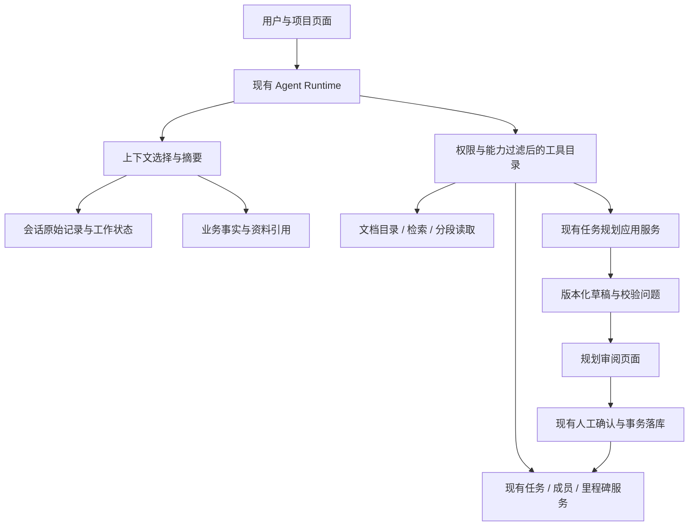

# AI Collab 下一阶段总设计：上下文、文档与规划协作

日期：2026-10-03。状态：设计蓝图，尚未实施。本文依据当前工作区源码、已有验收报告和用户认可的方向制定；本轮只读检查并编写文档，没有运行模型、启动服务、迁移数据库或修改产品代码。

## 1. 目标与已确定的边界

目标是让用户在同一项目中完成“理解资料 → 制定计划 → 调整草稿 → 人工确认 → 执行任务 → 查询进度”，并在长对话、换模型、资料更新和服务中断时保持可解释的状态。

- 保留 Java 编排、Spring Boot 模块化单体、现有模型网关和 Agent Runtime。
- 保留 PostgreSQL/pgvector、MinIO、已有 Redis 用途；本阶段没有新增框架、Python 服务、消息队列或向量库的必要。
- 任务规划继续拥有生成、校验、版本、局部修复与批量落库；Agent 负责理解请求、选择受控工具和说明结果。
- 项目权限、成员身份、审批、事务、版本和幂等由业务服务决定，摘要和模型输出不能赋予权限。
- 保留已通过验收的数值校验、提案修订、版本冲突、审批、幂等、防重入、模型兼容、Ollama 和索引代际成果。
- 已有业务库及未提交修改保持原状。开发与真实写入验证继续使用隔离副本，正式发布不属于本蓝图的自动授权范围。
- 后续执行 AI 按本文分段交付；本会话只负责设计与审查，不执行产品开发。

原 [能力审查](ai-capability-review.md)、[全局重构设计](backend-agent-redesign.md) 和 [开发交接](development-handoff.md) 包含上一阶段的历史问题及演进意见，不是当前未完成事项清单。当前完成状态以最新 [太空兔验收报告](space-bunny-acceptance-report.md) 为准；下一阶段范围以本文为准。不得据旧文档重新引入框架或重复实施已完成修复。

## 2. 当前状态与具体缺口

以下区分静态代码事实、由代码推导的风险和待评测的优化，避免把所有建议都称为已发生故障。

| 范围 | 已有能力与源码依据 | 本阶段需要处理的缺口 |
| --- | --- | --- |
| Agent 工作状态 | `agent/infrastructure/repository/AgentWorkingState.java` 保存 goal、最近约 8 条 constraints、latestRequest、pendingQuestion | 静态确认：主要保存原始请求片段；目标替换仅识别 `/replace ` 和“新目标：”。没有有效约束的结构化合并、覆盖关系和历史语义摘要 |
| 每轮上下文 | `agent/application/runtime/AgentModelMessageComposer.java` 读取最近 10 条、选末 6 条对话，历史预算 12000 字符；末 12 个步骤共享 16000 字符 | 静态确认：超预算整条跳过；没有按相关性分配的统一预算。风险：早期有效约束遗失、大结果不可读取、近期关键消息被排除 |
| 最新需求注入 | 同上，是否补入 run.goal 按取回的 recentMessages 判断，而不是实际入选消息 | 静态风险：完整当前请求若因预算未入选，可能因“历史中存在”而不再补入；working state 的截断片段不等价于完整原请求。实现前补对应回归 |
| Token 管理 | `AgentRuntimeCoordinator.java` 已累计输入/输出消耗、限制时长，按消息及工具 Schema 字符数估算输入 | 已有运行费用限制应保留；需另建单次模型上下文窗口与输出预留，不把累计预算当成模型窗口，不把字符数当精确 token |
| 项目记忆 | `AgentMemoryService` / `AgentMemoryRepository` 取最近更新的 10 条作为上下文，支持管理、来源和停用 | 静态确认：最近不等于相关；需区分长期偏好、临时目标、业务事实，明确更新、失效和引用依据 |
| Skill 路由 | `AgentSkillRegistry` 关键词首命中；`AgentToolRegistry` 按 Skill 白名单提供工具 | 静态确认：复合需求受限。迭代规划没有文档检索与规划服务工具；不靠不断新增关键词解决 |
| 任务读取 | `TaskListAgentTool` 返回最多 50 项并标记 truncated | 静态确认：没有标题搜索或继续分页参数。需要提供查完整结果的途径，而非不断提高上限 |
| 文档处理 | Tika、结构启发式分块、PDF 页码元数据、原件存储、处理恢复、重建索引及代际隔离 | 基础可复用；Agent 缺文档目录、处理状态、提纲、分段读取工具，语义 top-K 不能承担“通读全文” |
| 来源定位 | `TikaDocumentParser` 清洗文本，`DocumentChunker` 移除标题并 trim 后按内容长度累计偏移 | 静态风险：页边界和最终文本偏移可能不在同一坐标系；先用多页/多标题样本验证，不能直接声称已有全部页码错误 |
| 文档身份 | 当前 `DocumentView.version` 与记录更新有关；现有 generation 用于索引 | 不能把记录乐观锁版本、用户文档内容版本、解析版本和 embedding 代际混为一谈；增加来源身份需兼容已有数据 |
| 检索与追问 | 向量检索；`KnowledgeContextBuilder` 固定来源数量、相似度阈值、字符预算；`KnowledgeConversationContext` 最近 6 条与关键词指代拼接 | 固定策略是当前基线；需用问题集评测多段证据、中文术语和追问，不直接承诺加入混合检索必然更好 |
| 规划业务 | `TaskPlanCommandService`、`TaskPlanQueryService`、`TaskPlanConfirmationService` 已有成熟流程 | Agent 仅校验 selectedPlanId，没有调用规划生成/修复的工具。生成、修改与确认当前要求管理员权限，接入后保持 |
| 规划上下文 | `TaskPlanContextAssembler` 给文档来源设置预算，但整体拼入成员、里程碑与未完成任务 | 静态确认：业务事实集合没有相应裁剪；资料选择也需要明确，当前不选文档就不检索文档 |

上述审查聚焦 AI 主流程与关联业务边界，不等于对认证、全部业务模块和部署安全完成了全面审计。

## 3. 目标结构与责任划分

知识问答、Agent、规划共享“预算计算、资料定位、检索结果契约”等小型组件，保留各自的提示词、事务与运行流程。不创建管理所有 AI 业务的巨型服务，也不引入第二个 Agent 循环。

新增组件名称可由实施者按包结构调整。只有存在独立责任和测试边界才提取类，不为了设计图预先创建大量接口。

## 4. 上下文设计：保留记录，按需组装

### 4.1 六类数据必须分开

| 类别 | 保存内容 | 模型使用方式 |
| --- | --- | --- |
| 当前任务状态 | 目标、有效约束、锁定字段、目标对象、待澄清点、当前活动 | 每轮优先保留；目标/约束关联用户消息 ID，不按“最后 N 条”淘汰仍有效的约束 |
| 最新业务状态 | 提案 revision、任务 version、规划 version/status、成员资格 | 从业务系统按需读取；业务状态不由摘要生成。执行前再次校验 |
| 成功工具观察 | 结果引用、对象 ID/版本、查询范围、观察时间、是否截断、完整性 | 每轮提供必要字段；旧状态只作为历史，不冒充当前事实 |
| 失败与执行状态 | 失败码、已尝试动作、重试限制、运行中的操作 | 保留必要诊断与防重复信息，不总结成成功事实；未决工具协议完整保留 |
| 对话摘要 | 历史意图、决定、否定、未解决问题、来源消息范围 | 低于当前用户要求与最新业务事实，不能作为权限或引用原文 |
| 长期项目记忆 | 经允许保存的偏好、约定和经验，附来源、版本、失效信息 | 按相关性选择；对话压缩不自动把私人聊天提升为项目共享记忆 |

原始消息和工具事件继续作为可追溯记录，按既有访问控制、脱敏和保留策略保存。摘要不覆盖原文，删除和权限撤销也必须使派生摘要与缓存失效。

### 4.2 单次输入预算与整个运行预算分开

一次模型请求的可用输入预算：

`min(已知模型上下文窗口 - 本次输出预留 - 安全余量, 剩余运行输入预算, 应用单次输入上限)`。

- 计入系统提示、Skill、工具定义、协议包装、当前需求、历史、记忆、资料和工具结果；不能只统计聊天正文。
- 模型窗口信息存入可配置能力资料，未知时采用保守应用上限并标记“估算”，不猜免费模型的窗口。
- 能使用匹配 tokenizer 时使用；否则按中文、英文、代码等保守估算并用实际 usage 校准。不可承诺估算绝不超限。
- 先预留当前请求、未解决约束、最新必需状态和未完成工具交互；再给检索证据、相关历史和记忆分配剩余空间。
- 去重同一需求和同一工具结果；从最新和最相关材料中选择，再按协议顺序发送。不能让旧的大结果先用完预算。
- 若当前请求本身超过窗口，不默默截掉尾部约束：保存完整请求，返回明确超限原因，引导拆分或转为资料；只有可验证的结构化提取能无损保留约束时才继续。
- 预算不足时先缩小只读结果或压缩可丢弃历史；仍不足就可恢复地停止，不能删掉审批边界或继续冒险调用。
- 原有最大轮数、费用、工具并发和时间预算继续生效，摘要调用也计费、计时，不借“压缩”绕开预算。

### 4.3 结构化工作状态与目标连续性

在现有 working_state 基础上演进，第一版不另建通用记忆库。建议含 schemaVersion、goalRevision、activeGoal、constraints、selectedEntities、pendingQuestions、activeOperations、lastProcessedMessageId。

约束条目保存 value、来源 messageId、状态 active/superseded、所约束对象及明确的覆盖关系。状态更新走后端校验与版本比较，不接受模型整块覆盖 working_state。

- “改成表格”“再详细些”“负责人改成小王”延续当前目标。
- “取消这个，改做周报”替换目标；保留旧目标历史与其操作关联。
- 新问题可作为独立目标，不永久把第一次聊天当所有后续请求的目标。
- 存在多个目标或对象且无法确定时，澄清具体对象；能从页面和可信操作结果确定时不重复追问。
- 意图识别可借助模型输出类型化建议，但资源 ID、状态、权限、版本由服务端核验。
- 切换目标不等于撤销已提交事务，也不自动取消所有关联任务；运行中操作的取消遵循第 6 节。

### 4.4 摘要与压缩

先用确定性投影压缩工具数据，再在历史超出预算时生成有界增量摘要，不每轮全量总结。

摘要保存 sourceFrom/sourceThrough 消息范围、来源 ID、schemaVersion、创建所用模型/策略版本和 state revision。建议字段为：目标沿革、仍有效约束、已确认决定、对象引用、未解决问题、失败尝试摘要。

1. 最近必要的用户原话保留；旧寒暄、重复解释和过时展示内容可被摘要替代。
2. UUID、日期、数量、否定约束、审批版本和锁定字段不让模型自由改写；结构化字段由原始数据提供并校验。
3. 摘要中不能出现没有来源支持的“已创建”“已批准”。操作结果以业务记录为准。
4. 生成期间新消息到来时，只提交摘要覆盖范围对应的版本；用 CAS 或等效事务规则防止旧摘要覆盖新状态。
5. 摘要失败或输出无效时使用前一个有效摘要及近期原文，并重新预算；放不下则说明原因，不无限修复。
6. 保留完整工具调用组及其结果的协议配对；未决调用不随意压缩。已结束且无恢复依赖的旧组可转为有来源的历史摘要。
7. 历史摘要仅供理解意图；依据文档作答要重新读取可用来源，依据任务状态作答要按时效与版本刷新事实。

优先验收“早期限制在长对话后仍有效”，而不是只看摘要更短。摘要不能保证无限长对话无损。

## 5. 文档设计：从上传与向量化，完善为可核验的资料能力

### 5.1 先补按需读取，不先扩张解析种类

保留 PDF/DOCX/Markdown/TXT 和现有文件、大小、解析并发限制。扫描 PDF 的 OCR、复杂表格/图像理解单列后续范围，不把文字提取成功说成完整理解文档。

向 Agent 暴露受项目权限约束的：

- `list_project_documents`：可搜索、分页的名称、类型、处理状态与可用来源身份。
- `get_document_outline`：文档标题/章节与可读取范围；没有可靠结构时明确说明。
- `read_document_section`：指定章节、页范围或连续块范围，受长度限制，有 continuation cursor。
- 现有 `search_project_knowledge`：按文档范围检索相关证据，返回完整性与来源信息。

模型不得传原始 MinIO 对象键、任意 URL 或 SQL。普通文档目录/已解析正文读取不依赖 embedding 服务可用；向量检索失败与文件不可读是不同状态。

“查某个问题”走检索；“总结整份文档”走提纲和受预算控制的分段读取。若只读了部分内容，明确覆盖范围；超过预算时分批产生摘要，不能把前五个相似块称为全文总结。

### 5.2 来源身份、定位与版本

至少区分：文档逻辑 ID、原件内容 hash/内容版本、解析/分块策略版本、embedding generation，以及用于并发控制的记录 version。

- 第一个切片不强制开发完整文档版本管理界面。先确保原件 hash、处理身份和引用能追溯，兼容旧文档；未知来源字段不能编造。
- 新的章节/分块带原文定位信息。PDF 优先按页形成稳定文本，再清洗和分块；跨页保留起止页，避免用清洗前的 offset 定位清洗后文本。
- 针对当前偏移风险先写多页、多标题、空白清洗样本；若复现，再最小修复。旧引用页码不能在无依据时自动重算成“正确”。
- 新旧处理版本可区分；重建不能让旧 chunk ID 被当成新内容。历史引用显示来源快照或明确“来源已更新/已不可用”，禁止静默指向另一段。
- 后续如支持“同一文档上传新版”，再引入显式文档版本及选择策略；原件不可被无痕覆盖。
- 保留现有 embedding 候选代际、构建和显式激活；内容版本与 embedding 代际独立演进。新增正文/章节存储优先复用现有表或派生存储能力，DDL 由实现阶段盘点后确定。

### 5.3 检索质量与引用

- 先建立真实问题集，覆盖精确名词、中文缩写、跨章节约束、相互矛盾的文档、缺失资料和连续追问。
- 向量检索保留为基线；若精确术语召回不足，再验证 PostgreSQL 内的词面/关键词检索与向量结果融合。中文分词效果必须实测，不直接套英文全文检索设置。
- 需要邻段才能理解时有界补读相邻章节/块，并保留实际读取范围。
- 相似度阈值与来源数量按检索模式、embedding 代际及评测调整，不把固定分数当所有模型通用标准。
- 不先引入独立重排模型；只有评测表明排序确实是主要瓶颈时才加入。
- 引用校验继续做项目、来源存在性、版本与编号校验；“编号合法”不等于“原文支持结论”，语义支持通过人工标注样本与评测检查。
- 文档更新/删除、成员被移除时，对旧会话的资料引用和缓存重新鉴权。摘要不能让已撤销资料继续成为可访问事实。
- 资料内容、文件名、摘要均为不可信数据，不因位于系统提示中的包装块就获得指令权限。

### 5.4 用户界面

文档页优先告诉用户：文件能否下载、正文是否可读、检索是否可用、失败发生在哪一阶段、何时可重试。来源点击应能看到对应原文片段及可用定位。

项目 Agent 显示所选资料、检索/读取事件和规划卡片；不给普通用户展示 token 切片、工作状态 JSON 或内部类名。诊断详情放在可展开区域，并按权限脱敏。

## 6. Agent 调用规划：异步、可追踪、复用业务边界

### 6.1 工具与服务映射

| 建议工具 | 复用的现有能力 | 副作用 |
| --- | --- | --- |
| list_task_plans / get_task_plan | TaskPlanQueryService | 只读，分页/按版本读取 |
| start_task_plan | TaskPlanCommandService.create | 写草稿与生成任务、消耗额度 |
| get_task_plan_progress | 现有状态与事件查询 | 只读；生成中不高频唤醒模型 |
| repair_task_plan | 现有 partialRegenerate / repair 服务 | 指定版本和范围的草稿修复 |
| cancel_task_plan_generation | 现有 cancel | 取消对应 attempt，保留已有草稿 |

一期不提供模型可自行执行的正式规划确认工具。Agent 返回计划卡片和规划页入口，用户在原规划页审阅并确认指定版本，继续调用 TaskPlanConfirmationService。

不得把规划拆成 N 次 create_task_after_approval 来绕过批量依赖校验和事务，也不得新写一套规划引擎。

### 6.2 异步操作关联

工具发起后返回 `operationId, planId, attemptId, status, versionId（如已有）`，语义为“已受理”。一次调用不能等待整个规划生成而占满工具超时。

- 持久关联 projectId、requesterId、sessionId、goalRevision、originRunId、tool invocation ID 与 plan/attempt。
- 重放同一 invocation 返回原 operation；生成请求摘要与幂等身份绑定。同一键不同参数拒绝，用户明确“再生成一份”才创建新操作。
- 数据库事务保证操作关联与草稿提交的一致性；提交后 dispatch。服务在提交后、dispatch 前崩溃时，由现有恢复机制或轻量补偿扫描接续，不依赖一次内存通知。
- 第一版 Agent 当前短运行以“已启动，等待生成”的事实结束，由后台跟踪关联操作；状态更新推送前端，不让模型循环 sleep/轮询。
- 生成完成后发布持久结果事件，幂等更新计划卡片；如需自动解释结果，创建有去重键的后续短运行，并且仅在当前 goalRevision 仍匹配时生成建议。
- 用户中途换目标时，旧操作仍可结束，但只能更新对应历史卡片，不能覆盖当前对话目标。
- 事件重复、乱序或重启恢复后，以业务计划和 attempt 的持久状态为准。监听与轮询只是传播机制。

### 6.3 权限、预算、模型与取消

- 身份来自宿主；沿用现有规划管理员权限。普通成员不能借 Agent 生成管理员级规划；没有权限时提供真实原因和可用只读入口。
- 调用应用服务时补齐原来 HTTP DTO 层承担的参数校验，不能因绕过 Controller 丢掉 Bean Validation。
- 工具副作用至少区分 READ_ONLY、DRAFT_MUTATION、APPROVAL_PROPOSAL、OPERATION_CONTROL。新增分类以本轮工具为限，不抽象成工作流平台。
- Legacy 仍保持既有只读边界，不把草稿生成标成只读来绕过限制。
- 规划使用既有 PLANNING 模型配置与配置快照，Agent 使用 AGENT 配置；界面和日志说明实际执行模型，不能暗示必须同一模型。
- 规划预算继续归规划服务，Agent 预算继续归 Runtime；建立父操作总调用/重试上限与费用关联，不能通过多次启动规划绕过限流。
- 关闭网页不等于取消生成。“停止回答”和“取消这份规划生成”是明确不同的动作；用户明确取消关联生成时调用拥有该 attempt 的服务。
- 超时或响应丢失先查原 operation 状态，不能直接重新生成。已提交的正式任务不因取消 Agent 运行而删除。
- 429、不可用、结构错误、约束不满足、版本冲突分别展示。基础设施不可用时记录待验证项，不修改业务数据制造通过。

### 6.4 资料与约束传递

start/repair 收到目标、日期、任务数上限、用户约束、锁定字段和已核验的文档引用。缺少必需日期等字段时一次性澄清；页面/用户明确提供的信息直接复用。

当前规划在 documentIds 为空时不检索文档：新入口必须明确“使用所选资料”还是“仅按描述规划”。按文件名寻找资料要先查目录、确认唯一身份，不猜 UUID；未就绪资料的等待、排除或停止要明确呈现。

规划服务继续从可信数据加载成员和来源。若引用版本已变或文档被移除，重新验证/检索或报告冲突；不能把 Agent 的历史摘要冒充本次规划的原始来源。

## 7. 工具与 Skill 的调整

保留六种场景及用户显式选择，Skill 提供操作建议和默认输出风格，不代替业务权限。第一版通过受控能力组支持复合需求，不开发自由安装插件或自动无限扩展工具的机制。

- 规划场景：任务查询、成员/里程碑、文档目录/检索/分段读取、规划工具。
- 研究场景：项目事实、文档读取与检索；不自动开放业务写入。
- 会议转任务：文档读取和现有提案；大批量且含依赖的规划请求可转到规划能力组。
- 简单“创建一项任务”继续走已验收的提案流程，不强迫所有请求进入规划模块。
- 目录依据用户权限、场景、模型能力和当前目标构建；执行时再次校验，不单靠模型看到什么工具。
- 改善关键词首命中：先识别明确操作、对象与复合需求，再选择能力组；歧义时澄清。不能把安全性建立在模型分类一定正确上。
- 工具结果增加总量/分页、截断、来源与状态语义；任务标题检索、同名消歧、稳定游标优先于扩大默认返回数。
- 提示词中的共用规则应有单一维护来源，由原生和 Legacy 各自渲染，避免再次在三个位置手改相同文案；协议差异保留。

## 8. 维护成本与兼容方案

### 8.1 小步替换，保留事实存储

- 不把旧聊天、工具事件和已批准提案批量改写成新格式。working_state/summary 使用 schemaVersion，读取兼容旧数据，按会话渐进升级。
- 摘要是派生数据，可失效后重建；操作关联和正式确认记录是业务数据，必须事务化、幂等和保留审计。
- 文档来源升级优先新增可空元数据和兼容读取。历史内容无法确定版本时明确标为旧格式，不填虚假版本或页码。
- 新迁移编号由实施时扫描 Flyway 确定，不预占编号，不修改已发布迁移。
- 上下文策略、文档读取工具和规划接入可分别关闭；停止新调用后仍能查看已有操作及结果。关闭功能不能清空草稿或让进行中任务失联。
- 回退先关闭新入口/策略，继续用兼容读取和旧业务页面；数据库采用向前修复，不承诺直接降级旧二进制即可兼容所有新增状态。

### 8.2 避免重复实现

继续复用 `AgentModelMessageComposer`、`AgentWorkingState`、`TaskPlan*Service`、`Document*Service`。需要提取时优先按预算计算、工作状态更新、摘要、来源定位和操作关联拆分，不按“一个功能一个新服务层”复制整条链路。

业务事实由 DTO/投影提供，结果摘要与分页可测试；模型负责语言理解和解释。不要把所有正确性要求堆入越来越长的系统提示词。

### 8.3 工程文档也要收口

- 本文作为下一阶段唯一蓝图；历史审查和验收报告保留日期及结果，不混列成当前待办。
- 维护一张能力矩阵：功能、工具、角色、模型要求、当前状态、验证层级、证据链接。
- 每阶段更新实际改变的配置与运行步骤，不复制多份大而相似的实施报告。
- 部署说明区分正式环境、验收副本和 mock；日志只保留可诊断的脱敏信息，不把凭据、签名 URL 或完整私人资料加入公开证据。

## 9. 分阶段交付及验收门槛

每阶段是一个独立开发任务，可持续到完成；不要把整个蓝图当作必须在一次巨大改动中全部完成的清单。

| 阶段 | 交付范围 | 完成条件 |
| --- | --- | --- |
| P0：基线与用例 | 记录当前 checkout/已有修改、能力矩阵、代表性场景和当前证据 | 明确已通过/缺口/待评测；不重跑所有真实模型作为开工条件 |
| P1：上下文基础 | 全请求预算、最新请求保护、工作状态约束合并、可追溯有界摘要、降级与兼容 | 长对话早期约束保留；改目标不串任务；超预算不静默丢当前需求；摘要失败可恢复；工具消息协议合法 |
| P2：按需读取与来源 | 任务搜索/分页、文档目录/状态/分段读取、来源身份、页码偏移回归及必要修复 | 超过 50 个任务可找到目标；能读指定文档范围；多页引用定位有证据；资料越权/失效不被复用 |
| P3：规划互联 | 规划读/生成/修复/取消工具、操作关联与恢复、能力组、计划卡片、原规划页确认 | 文档→草稿→局部修订→确认→任务完整闭环；重复发起不重复草稿；失败保留草稿；旧版本不可落库 |
| P4：质量收敛 | 固定评测集、追问与多来源改进、必要时混合检索、相关记忆选择、运维指标与文档收口 | 对比基线有证据；解释每个未通过项；有开关和恢复步骤；不以测试总数替代业务质量 |

P1 与 P2 不要求完成“完美记忆”和“完整文档平台”才能进入 P3：只实现支撑最小真实链路的接口、来源与预算。OCR、复杂表格、多模态、完整文档协同编辑、自动排程优化、多 Agent 平台均为后续选项。

### 最小评测场景

1. 20–30 轮对话后仍遵守最早的“最多十项、不改日期”；其中包含后续覆盖约束与无关问答。
2. 当前请求较长且关键否定条件在尾部，不能被静默截断；低窗口模型与缺失 usage 均可诊断。
3. 工具大结果、失败结果和未完成调用并存时，压缩不伪造成功、不破坏调用配对、不重复写入。
4. 对话途中更换目标，旧规划稍后完成：只更新其所属卡片，不能修改新目标。
5. 项目至少 100 个任务，查询第 51 项之后的目标与同名任务；分页没有重复或漏项的隐含承诺，按所用一致性策略验证。
6. 多页 PDF、多标题 Markdown、无文字 PDF、含表格 DOCX：记录实际可支持范围，不一概算通过。
7. 查询与总结使用不同读取策略；资料不足、文档矛盾、引用失效、同名不同项目文档均有明确处理。
8. 真正的原生工具路径完成“根据选中文档生成十项以内规划，调整负责人且不改日期，打开规划页确认”，检查任务、里程碑和依赖。
9. 规划受理后服务中断、事件重复/乱序、用户取消与完成竞争：关联操作可恢复，失败不会再次生成一份草稿。
10. 普通成员、管理员、运行中撤销成员权限分别验证读取和修改边界；摘要与缓存不能保留越权可读内容。
11. 规划和 Agent 使用不同模型配置；切换模型后的工具可用性、预算和错误说明与实际能力相符。
12. 浏览器只验产品界面实际展示；API、组件、模拟提供商、真实模型结果在报告中分开记录。

评测记录：业务事实正确性、用户约束满足、资料覆盖与引用支持、任务完成结果、重复副作用数、调用数、耗时、token 实际/估算值和失败分类。权限/版本/重复写入为硬性门槛；生成质量按用例逐项报告，不宣称少数成功代表普遍可靠。

最终检查按改动范围执行必要测试、类型检查、生产构建和后端打包；真实服务测试在配置可用且授权的副本上进行，不凭历史 429 断言当前状态。实际遇到错误保留脱敏证据，按有限重试策略处理，不无界消耗请求。

## 10. 给执行 AI 的边界说明

先阅读本蓝图、最新验收报告、当前仓库指令及对应源码，确认已有工作区修改。严格按所分配阶段完成实现、必要测试与证据，不顺带迁移框架或重做已完成模块。

第一项开发任务建议选择 P0 + P1。P2、P3、P4 分别交付；阶段设计必须对后续留出接口，但不预建未使用的平台。发现关键代码事实与本文不一致时，先记录差异，再以当前代码和用户需求调整细节。

交付说明必须写清：改了什么、保护了哪些已有行为、实际执行了哪些验证、没有验证什么、如何关闭新功能及恢复。业务写入只限隔离副本，正式发布单独安排。

## 11. 实施进度（2026-10-04）

本轮由用户授权连续完成 P1 剩余修复与 P2/P3/P4。本蓝图范围和架构边界继续有效；实际状态、测试层级及限制统一记录在 [连续交付报告](next-stage-delivery-report.md) 和 [能力矩阵](capability-matrix.md)，不将本文初始静态缺口视为仍未修复。

P1 剩余覆盖修复已提交 5f8d7fa。P2 已实施任务搜索分页、文档按需正文读取、来源身份和页边界/偏移修复，见交付报告。

P2 提交 5f53b54；P3 提交 9f1874d，Agent 复用规划服务完成生成/修订/取消和持久操作恢复。P4 已实施小型业务评测与实际链路修复，真实模型、API 确认及隔离数据库断言通过。最终能力与未验证层级以连续交付报告为准；浏览器扩展未连接，未将组件测试计为浏览器验收，未扩展为检索融合或独立评测平台。

P4 代码与证据提交 45ce1b9。阶段实现已完成；真实浏览器与报告列出的扩展验收仍未验证，不以本地测试替代。原业务服务未启动，本轮临时服务已恢复停止。
