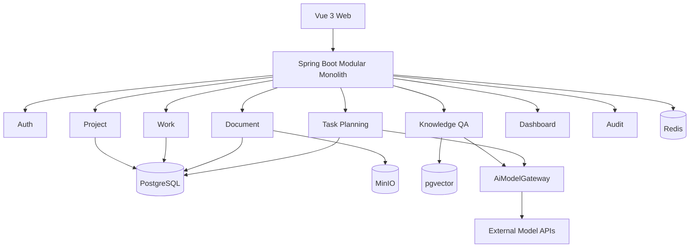
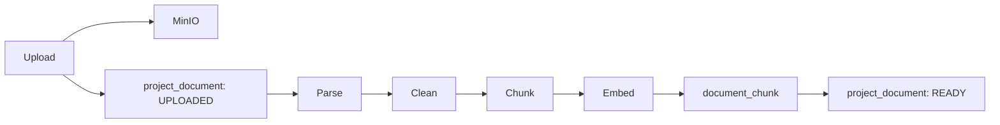
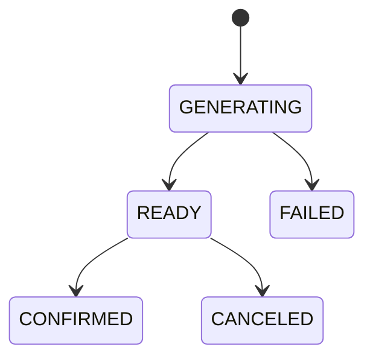
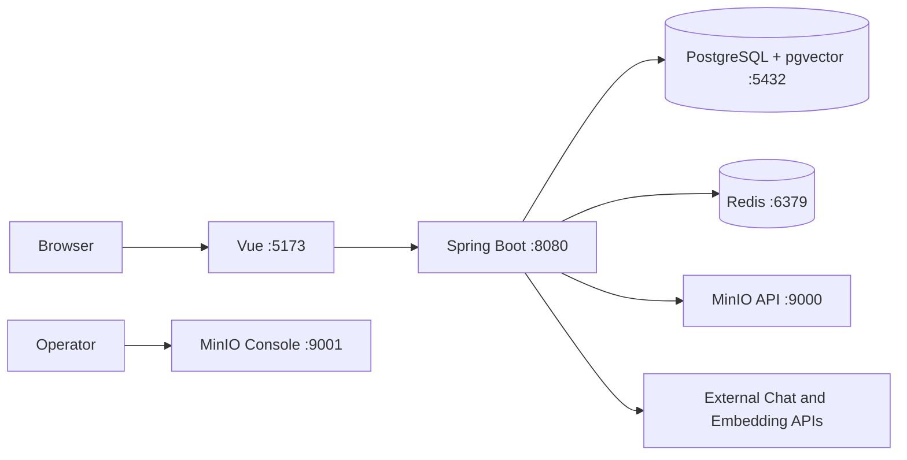

# AI Collab 系统架构

本文档是 AI Collab 系统设计的事实来源，合并产品范围、系统架构、模块与包边界、RAG、AI 任务规划、前端、安全、测试、本地部署、枚举与错误码设计。数据库设计见 [`database.md`](database.md)，接口契约见 [`api/openapi.yaml`](api/openapi.yaml)，认证实现的阶段性学习记录保留在 `learning/`，不属于本文档。

## 1. 项目定位、目标用户与角色

AI Collab（中文展示名：高校竞赛 AI 项目协作平台）面向高校竞赛团队，同时兼容软件课程项目团队。系统先提供可独立使用的项目协作能力，再基于项目文档提供 RAG 问答和 AI 任务规划。

目标用户包括：

- 蓝桥杯、计算机设计大赛、创新创业比赛等竞赛团队；
- 软件工程课程设计、实训和小型团队项目；
- 第一版仅供开发者本人及邀请的测试用户使用。

系统解决四类问题：

1. 竞赛规则、需求、会议记录和技术资料分散，难以统一检索；
2. 任务拆分依赖个人经验，容易遗漏评分点、前置依赖和里程碑；
3. 任务、文档、评论和进度分散在不同工具，缺少统一视图；
4. 普通知识库只回答问题，不能把规划转换为可执行任务。

项目内角色与权限保持如下：

| 角色 | 权限边界 |
|---|---|
| OWNER | 修改、归档和删除项目；邀请、移除成员；设置 ADMIN 或 MEMBER；管理全部任务、里程碑和文档；发起并确认 AI 任务规划；查看审计日志 |
| ADMIN | 管理任务、里程碑和文档；发起并确认 AI 任务规划；查看项目统计和审计日志；不能删除项目或移除 OWNER |
| MEMBER | 查看所属项目；更新自己负责的任务；发表评论；使用知识库问答；查看项目概览；不能管理成员和删除文档 |

每个项目必须且只能有一个 OWNER。

## 2. 功能范围与成功标准

> 当前实现里程碑为 Phase 06。已完成文档上传、私有存储、解析、清洗、分块、向量写入、文档管理和内部检索基础；本阶段不提供知识问答会话、RAG 回答生成、引用展示或 AI 任务规划接口与页面。下列“第一版”条目中标记为后续阶段的能力是目标架构，不代表已经实现。

第一版功能范围包括：

- **认证与邀请**：支持可配置公开注册，`local` 默认开启、非 `local` 环境默认关闭；同时保留 OWNER 或 ADMIN 创建的邀请注册链接。当前认证实现的 JWT Access Token 默认有效期为 30 分钟；单个 Refresh Token 最多存活 14 天，会话绝对期限为 30 天，数据库只保存 Refresh Token 的 SHA-256 摘要。
- **项目与成员**：创建、查看、修改、归档和删除项目；邀请成员、修改角色、移除成员。
- **任务协作**：任务可归属里程碑、负责人和多个前置任务；依赖关系必须是有向无环图；看板按状态展示；评论采用单层结构，不做多级回复。
- **里程碑**：创建、修改、完成和取消里程碑；保存目标日期和排序号；统计里程碑下任务完成率。
- **文档知识库**：支持 PDF、DOCX、Markdown 和 TXT；原文件保存在 MinIO，文本和向量保存在 PostgreSQL + pgvector。
- **RAG 问答（后续阶段）**：仅基于当前项目 READY 文档回答并返回引用；资料不足时明确拒答。
- **AI 任务规划（后续阶段）**：根据目标、时间约束和参考文档生成结构化里程碑、任务与依赖草案；用户编辑并确认后才写入正式数据。
- **项目概览与审计**：按状态统计任务数量，计算完成率、逾期任务和里程碑进度，展示最近操作，记录成员、任务、文档和 AI 规划的重要变更。

Phase 06 的完成标准是：既有邀请、登录和项目协作语义不变；四类文档可完成校验、私有存储、解析、分块和向量化；角色权限、失败重试、删除及重启恢复链路可验收；后端与前端构建通过。知识问答与 AI 规划留待后续阶段。

## 3. 模块化单体架构

第一版采用模块化单体，不改为微服务。一个 Spring Boot 应用承载认证、项目、任务、文档、RAG 和任务规划，模块之间通过应用服务接口协作。未来仅在出现独立扩容需求时考虑拆出文档处理与 AI 服务；这不是第一版的部署形态。



运行组件及职责：

| 组件 | 职责 | 是否核心 |
|---|---|---|
| Vue Web | 页面、表单、看板、文档与 AI 交互 | 是 |
| Spring Boot | REST API、权限、业务事务、AI 编排 | 是 |
| PostgreSQL | 业务数据、AI 草案、审计和向量 | 是 |
| pgvector | 文档块向量与相似度检索 | 是 |
| MinIO | 原始上传文件 | 是 |
| Redis | AI 请求限流、短期缓存、幂等辅助 | 可降级 |
| 外部模型 API | Chat Model 与 Embedding Model | 是 |

Redis 不可用时，核心协作功能仍应运行；AI 限流退化为进程内限制，项目统计直接查询数据库，AI 规划幂等使用数据库唯一记录降级。

## 4. 后端模块、包与 API 边界

### 4.1 分层与根包

Java 根包为：

```text
com.shitulelv.aicollab
```

后端采用 package-by-feature。完整业务模块的目标结构使用四层：

```text
api             Controller、Request、Response
application     Use Case、Facade、事务边界
domain          Entity、Policy、Domain Service
infrastructure  Mapper、Repository、外部适配器
```

`common` 只放跨模块基础设施，不放业务实体；仓库目录与 Java 包名使用 ASCII，不得创建 `后端`、`前端`、`项目模块` 等中文目录，也不得使用中文 Java 包名。包边界如下：

```text
com.shitulelv.aicollab
├── common
│   ├── api
│   ├── audit
│   ├── config
│   ├── error
│   ├── idempotency
│   ├── security
│   └── time
├── auth
├── user
├── project
├── work
├── document
├── knowledge
├── planning
├── dashboard
├── audit
└── infrastructure
    ├── ai
    ├── storage
    └── vector
```

其中 `project`、`work`、`document`、`knowledge`、`planning` 等完整业务模块以四层结构为目标；`user`、`dashboard`、`audit` 可以按职责只保留实际需要的层。

当前认证模块已经实现，但仍按现有代码组织，不在本次文档任务中重构为四层：

```text
auth/
├── config/              PublicRegistrationProperties
├── controller/          AuthController
├── dto/                 登录、注册、改密与安全用户响应
├── model/               HTTP 与服务之间的内部结果
├── service/             登录、公开注册、Access Token、Cookie 与 Refresh 会话编排
└── refresh/
    ├── entity/          RefreshTokenEntity
    ├── mapper/          RefreshTokenMapper
    ├── model/           RefreshTokenRevokeReason
    └── service/         RefreshTokenRepositoryService
```

当前 `work` 模块已经按四层边界实现：

```text
work/
├── api/                 里程碑、任务、依赖、评论 Controller 与请求 DTO
├── application/         事务用例与安全 View
├── domain/              状态/优先级枚举、Kahn 环检测、状态机和权限策略
└── infrastructure/      项目作用域 Entity、Mapper 与 Repository
```

所有子资源查询在 SQL 中携带 `project_id`；评论查询同时携带 `task_id`。`work` 复用
`ProjectAccessGuard`，Controller 不直接访问 Mapper，也不把前端按钮隐藏作为权限边界。

同一项目的任务依赖图修改在 `TaskApplicationService.replaceDependencies` 的既有事务内串行化：
权限校验后，Mapper 先按 `project_id` 查询项目全部任务 ID，并以 `ORDER BY id FOR UPDATE`
按固定顺序锁定这些任务行。锁定结果同时作为完整节点集；随后才读取项目全部依赖边、构造替换后图、
执行 Kahn 无环校验并写入新边。这样同一项目的并发依赖修改共享同一组数据库行锁，不同项目不会相互阻塞。

完整系统目标中的跨模块基础设施仍保留 `ProjectAccessGuard`、`AiModelGateway`、`ObjectStorageGateway`、`VectorSearchGateway` 等原有边界。当前认证实现实际使用 `common.api.ApiResponse`、`common.exception.ErrorCode`、`BusinessException`、`GlobalExceptionHandler`，以及 `common.security` 下的 `SecurityConfig`、`JwtConfiguration`、`JwtProperties`、`RefreshTokenProperties`、`AuthRequestOriginValidator`、`RestAuthenticationEntryPoint` 和 `RestAccessDeniedHandler`；JWT 验证由 Spring Security Resource Server 完成，不声明当前存在自定义 `JwtAuthenticationFilter`。

### 4.2 模块职责

| 模块 | 负责 | 不负责 |
|---|---|---|
| auth | 登录、刷新、退出、邀请接受 | 项目角色判断 |
| user | 用户资料和状态 | 项目成员关系 |
| project | 项目、成员、邀请、角色 | 任务细节 |
| work | 里程碑、任务、依赖、评论 | AI 生成 |
| document | 上传、解析、分块、索引、删除 | 问答生成 |
| knowledge | 会话、检索、回答、引用 | 修改任务 |
| planning | AI 草案、校验、确认写入 | 直接文件解析 |
| dashboard | 聚合统计 | 写业务数据 |
| audit | 查询审计记录 | 决定业务权限 |
| infrastructure.ai | 模型供应商适配 | 业务规则 |

Document 负责文件生命周期、解析、分块和索引状态，不负责自然语言回答；Knowledge 负责会话、问题、检索上下文组装、模型调用和引用保存；Planning 负责读取项目上下文、生成结构化草案、校验和确认写入。

它们通过 Facade 暴露应用接口：

```java
public interface DocumentIndexingFacade {
    UUID upload(UploadDocumentCommand command);
    void retry(UUID projectId, UUID documentId, UUID operatorId);
    void delete(UUID projectId, UUID documentId, UUID operatorId);
    List<RetrievedChunk> search(UUID projectId, String query, int topK);
}

public interface KnowledgeQaFacade {
    KnowledgeAnswer ask(AskKnowledgeQuestionCommand command);
}

public interface TaskPlanningFacade {
    UUID generate(GenerateTaskPlanCommand command);
    TaskPlanView get(UUID projectId, UUID planId, UUID userId);
    void replaceDraft(ReplaceTaskPlanDraftCommand command);
    ApplyTaskPlanResult confirm(ConfirmTaskPlanCommand command);
}
```

跨模块基础设施接口保持供应商无关：

```java
public interface AiModelGateway {
    ChatResult chat(ChatCommand command);
    <T> T structured(StructuredChatCommand<T> command);
    float[] embed(EmbeddingCommand command);
}

public interface ObjectStorageGateway {
    void put(String objectKey, InputStream input, long size, String contentType);
    InputStream get(String objectKey);
    URI presignGet(String objectKey, Duration ttl);
    void delete(String objectKey);
}

public interface ProjectAccessGuard {
    ProjectRole requireMember(UUID projectId, UUID userId);
    void requireAdmin(UUID projectId, UUID userId);
    void requireOwner(UUID projectId, UUID userId);
}

public interface TaskDependencyPolicy {
    void validateNoCycle(UUID projectId, UUID taskId, Set<UUID> dependencyIds);
}
```

业务层不出现具体供应商 SDK 类型。模型配置按功能区分为 `chat.default-provider`、`planning.default-provider` 和 `embedding.provider`。聊天模型可切换；已建立索引的知识库不随意切换 Embedding 模型。

### 4.3 DTO、SQL 与接口契约

- Controller 只接收 Request DTO，不直接接收 Entity；Application Service 返回 View DTO。
- UUID 使用标准连字符字符串；时间点使用 ISO-8601 UTC；日期使用 `yyyy-MM-dd`；JSON 枚举使用大写英文值。
- 简单单表操作使用 MyBatis-Plus `BaseMapper`；复杂统计、向量检索和项目范围过滤使用显式 SQL。
- Mapper XML 的旧文档逻辑路径为 `backend/src/main/resources/mapper/<module>/`；当前仓库后端目录名为 `ai-collab-backend/`，目录命名差异不改变 Mapper 的模块边界。禁止在 Service 中拼接 SQL。
- 所有项目级 SQL 必须显式包含 `project_id = #{projectId}`。
- 当前 `ApiResponse<T>` 的统一响应只包含 `code`、`message`、`data` 三个字段；成功时 code 为 `SUCCESS`，错误时 data 为 null。完整路径、请求、响应、状态码与安全定义以 [`api/openapi.yaml`](api/openapi.yaml) 为准。

## 5. 事务边界与异步策略

以下操作各自处于单个数据库事务中：

- 创建项目与 OWNER 成员记录；
- 修改任务与依赖；
- 删除文档数据库记录与向量；MinIO 删除在数据库短事务之前执行，失败时保留 DELETING 记录并返回稳定错误，供同一删除请求重试；
- 确认 AI 任务规划，批量写入里程碑、任务和依赖。

外部模型调用不放在数据库长事务内。

依赖替换事务内的固定顺序是：校验 OWNER/ADMIN 权限、锁定项目全部任务行、校验目标任务和依赖 ID、
读取锁定后的完整依赖图、执行 Kahn 校验、删除旧边、写入新边、重新查询任务、写审计并提交。
锁在事务提交或回滚时由 PostgreSQL 释放；不使用 Java `synchronized`。

第一版不引入消息队列。文档解析与 AI 任务规划使用 Spring `TaskExecutor` 异步执行，并将状态持久化到数据库：

- `DocumentProcessingListener` 的 AFTER_COMMIT 方法不使用 `@Async`，而是同步调用 `DocumentTaskDispatcher`；Dispatcher 才向有界 `documentTaskExecutor` 提交 Runnable。
- 线程池使用 AbortPolicy，但 Dispatcher 捕获 `TaskRejectedException` 并正常返回，只记录 projectId、documentId 和安全提示。拒绝不会传播回已经提交的上传或 retry，也不会误触发 MinIO 补偿；文档保持 UPLOADED，等待恢复扫描重新领取。
- 进程启动时及之后每批完成 30 秒后，恢复调度器重新处理 UPLOADED 记录，并只把 `processing_heartbeat_at` 超过 15 分钟且 token 仍匹配的 PARSING、INDEXING 尝试标记为 FAILED；
- 用户可以手动重试；
- 失败记录保存最长 1,000 字符的安全错误摘要；审计行各自生成 request_id，当前没有跨整个异步 attempt 关联的统一 request_id。

## 6. 文档处理与索引

文档状态为 UPLOADED、PARSING、INDEXING、READY、FAILED、DELETING。处理链路如下：



### 6.1 上传与解析约束

- 单文件最大 20 MB；每个项目最多 100 个有效文档；文件名最大 180 字符。
- 文件校验和 MinIO `put` 均在数据库事务外执行；随后由独立 `DocumentRegistrationService` 开启短事务，锁定 ACTIVE 项目行、检查数量上限、插入文档、写审计并发布事件。注册失败时补偿删除对象，补偿日志仅记录对象键 SHA-256 短摘要。
- 项目删除与文档注册锁定同一 `project` 行。项目存在任意 `project_document` 时返回 `PROJECT_DOCUMENTS_EXIST`，用户必须先逐一删除文档；PostgreSQL 事务不会被描述成能够删除 MinIO 对象。
- 允许 `.pdf`、`.docx`、`.md`、`.txt`，同时校验扩展名、MIME 和文件头。
- MinIO 对象键为 `projects/{projectId}/documents/{documentId}/source.{extension}`，不使用用户原始路径。
- 使用 Apache Tika 统一提取文本。
- PDF 提取文本，第一版不对扫描版 PDF 做 OCR；DOCX 通过 Tika 提取正文；Markdown 保留 `#` 标题文本；TXT 按严格 UTF-8 读取。统一失败码为 `DOCUMENT_PARSE_FAILED`。
- Tika 正文最多提取 2,000,000 字符，TXT/Markdown 的输入字节也受对应上限约束；`EmbeddedDocumentExtractor` 明确拒绝递归附件。解析结果仅作为纯文本清洗和分块输入，不执行宏、脚本、外部实体、远程资源或外部链接。供应商解析器对所有恶意文件的覆盖仍需持续验证。

### 6.2 清洗、分块与 Embedding

清洗时统一换行符，删除 NUL、BOM 和不可见控制字符，归一化行内空白，并将连续空行压缩为最多两个。标题及 Tika 提取出的表格纯文本会保留，但当前版本不推断或删除页眉页脚，也不恢复复杂表格版式。

分块先按 Markdown/Word 标题边界切分，再按段落合并：

- 目标块长度约为 1,200 个 Java 字符；
- 优先按标题、段落和句子边界切分，超长单元再按目标长度硬切；
- 相邻块重叠约 150 个字符；
- 每个文档最多生成 1,000 个非空块，heading 最多 300 个 Unicode code point，边界与截断不切断 UTF-16 代理对；
- 每块保存 projectId、documentId、filename、heading、chunkNo 和 contentHash。

Chat Model 与 Embedding Model 分开配置。Phase 06 通过 Spring `RestClient` 调用 OpenAI-compatible Embeddings API，不引入完整 Spring AI。响应必须具有连续唯一 index、配置维度以及全部非空且有限的数值，NaN、Infinity 和 null 不会进入 pgvector。文档索引时记录 provider、model 和 dimension；内部查询同时过滤这三个字段，避免新查询误用旧模型向量。Phase 06 尚未提供 READY 文档重建索引按钮。

### 6.3 Processing token、心跳与 ABA 防护

V4 为 `project_document` 增加 `processing_token` 和 `processing_heartbeat_at`。每次 worker 从 UPLOADED 领取任务时生成新 UUID；PARSING、INDEXING 的 heartbeat、状态转换、失败记录和最终索引事务都必须同时匹配 projectId、documentId 与该 token。retry 清除旧 token，下一次领取生成新 token；delete 也会立即清除 token，因此旧 worker 即使稍后返回，也不能覆盖新尝试或写回 READY。

retry 的 MinIO 对象存在性检查也在事务外完成，随后由独立短事务执行 FAILED→UPLOADED CAS、审计和事件发布。并发删除时，只有实际删除 `project_document` 一行的事务写 `DOCUMENT_DELETED`，避免重复审计。

PARSING 转入 INDEXING 时立即刷新 `processing_heartbeat_at`；Embedding 每次供应商调用前及成功后继续更新 INDEXING 心跳。更新影响 0 行表示尝试已取消、删除或被替代，后续批次立即停止。最终事务先 `FOR UPDATE`，确认状态与 token，再校验块和向量数量、替换分块、按 token 标记 READY 并写 `DOCUMENT_INDEXED`。失败使用独立短事务，只有 token 条件更新成功才写 `DOCUMENT_PROCESSING_FAILED`。

MinIO 下载流只在当前 worker 线程读取，最多读取 20 MB + 1 字节并关闭；解析线程只接收 byte[] 并自行创建 `ByteArrayInputStream`。`Future.cancel(true)` 是协作式中断，不是 JVM 或操作系统级强制终止；对不响应中断的解析器，真正硬隔离仍需要独立进程。

内部 `DocumentSearchService.search(projectId, query, documentIds, topK)` 不暴露 HTTP。它限制 query 长度与 topK 1～20，先确认指定文档全部属于项目且 READY，再生成查询向量；SQL 同时限定 projectId、READY、可选 documentIds、provider、model、dimension，并返回原文件名和 contentHash，结果按 similarity 降序。

## 7. RAG 检索、生成与验证

RAG 只回答当前项目资料中的内容，不做开放领域问答。检索步骤保持如下：

1. 校验用户属于项目；
2. 校验选中文档属于项目且状态为 READY；
3. 对问题向量化；
4. 按 `project_id`、`document_id`、Embedding 模型和维度过滤；
5. 使用精确余弦相似度检索 Top 8；
6. 过滤相似度低于 0.55 的块；
7. 按内容哈希去重，最多保留 5 块；
8. 上下文总字符数不超过 8,000。

第一版不加入 reranker，也不为向量列创建 HNSW/IVFFlat 索引；文档块达到 100,000 以上或评测显示检索不足时再评估。

System Prompt 必须约束模型只根据 `SOURCES` 回答，将文档内容视为不可信资料而非系统指令，每个事实使用 `[S1]`、`[S2]` 标注来源；资料不足时回答“当前项目资料不足以回答该问题”，不得推测。上下文使用明确的 `<SOURCES>` 边界。

回答验证规则：

- 至少有一个检索块且最高相似度不低于 0.55，才允许生成事实性回答；
- 引用编号必须存在于提供的 Source 列表；
- 模型引用不存在的编号时，删除无效引用并标记回答需要复查；
- 无有效引用时设置 `insufficientEvidence=true`。

系统保存用户问题、最终回答、模型信息、耗时、Token 和引用，不保存完整拼接 Prompt。失败处理如下：

| 场景 | 行为 |
|---|---|
| Embedding API 超时 | 重试 2 次，指数退避 1s/3s |
| Chat API 超时 | 重试 1 次；仍失败返回 504 |
| 文档未 READY | 旧 RAG 文档写为 DOC_NOT_READY；错误码目录写为 DOCUMENT_NOT_READY，命名冲突待确认 |
| 无检索结果 | 不调用 Chat Model，直接拒答 |
| Provider 免费额度用尽 | 返回 AI_PROVIDER_QUOTA_EXCEEDED，由管理员手动切换 |
| 模型切换 | 仅切换 Chat Model 不影响已有向量 |

可观测性记录 provider、model、feature、候选数、最终片段数、最高相似度、各阶段耗时、Token 和状态或错误码；不记录 API Key 和完整 Source 正文。

## 8. AI 任务规划

AI 任务规划根据项目目标、时间范围、成员和选定文档生成可编辑的里程碑、任务与依赖草案。模型只生成建议，不直接执行写操作。

### 8.1 状态机与输入



- GENERATING：异步调用模型中；
- READY：结构化输出通过校验，可编辑；
- CONFIRMED：已写入正式任务，不可修改；
- FAILED：模型或校验失败，可重新生成；
- CANCELED：用户删除未确认草案。

生成命令包含 projectId、operatorId、goal、startDate、dueDate、maxTasks、documentIds 和 constraints。限制为：goal 20～2,000 字符；时间范围 1～180 天；maxTasks 5～50，默认 30；最多选择 10 个 READY 文档；约束最多 10 条，每条 200 字符。

模型上下文通过预组装数据或只读工具提供项目基本信息与日期、成员及角色、现有里程碑与未完成任务、选定文档的相关片段。所有工具内部再次校验项目权限，不返回密码和邮箱，只读且最多调用 4 次。

### 8.2 结构化输出与两阶段校验

结构化草案包含 summary、assumptions、risks、milestones 和 tasks。里程碑包含 tempKey、名称、描述、目标日期和排序；任务包含 tempKey、里程碑 tempKey、标题、描述、优先级、预计工时、起止日期、建议负责人、依赖 tempKey、来源文档 ID 和排序。

JSON Schema 与业务规则：

- 里程碑 1～10 个；任务 5～50 个且不超过用户 maxTasks；
- `tempKey` 使用 M1、M2、T1、T2 格式并在草案中唯一；
- 每个任务引用存在的里程碑 temp key，依赖只引用存在的任务 temp key；
- 任务不能依赖自身，依赖图不能有环；
- 日期位于规划范围内，任务开始日期不得晚于截止日期；
- 建议负责人必须是当前项目成员，否则置空并增加风险说明；
- 单任务预计工时为 0.5～80。

生成后依次执行 JSON 反序列化、Bean Validation、temp key 引用完整性、日期范围、成员归属和依赖环检测。失败时将错误摘要附加给模型，最多修复 1 次；第二次仍失败则状态改为 FAILED，错误码为 AI_STRUCTURED_OUTPUT_INVALID。

用户编辑草案后，在确认前再次执行全部规则，并检查项目和成员仍存在、里程碑名称不为空、幂等键未使用或对应同一 plan、plan 状态为 READY。

### 8.3 幂等与确认事务

客户端生成 UUID 作为 `Idempotency-Key`。Redis 以 `userId + endpoint + key` 保存结果，TTL 24 小时；同一 key 与同一 plan 重试返回第一次结果，同一 key 对应不同 plan 返回 409 IDEMPOTENCY_CONFLICT。Redis 不可用时使用数据库唯一记录降级。

确认事务保持原子性：

```text
BEGIN
  lock ai_task_plan
  check status READY
  create milestones and build tempKey -> UUID map
  create tasks and build tempKey -> UUID map
  create dependencies
  update plan status CONFIRMED
  write audit log
  save idempotency result
COMMIT
```

任一步失败全部回滚。用户可以在确认前修改里程碑名称和日期，修改任务标题、描述、优先级、负责人和工时，添加或删除任务，调整依赖，查看来源文档和模型假设。确认后将创建正式数据，不能通过同一草案再次应用。

审计记录生成者、模型、文档列表、草案版本、确认者、新建实体 ID、耗时和 Token，不记录 API Key 或完整文档上下文。

## 9. Vue 前端边界

前端技术栈保持 Vue 3、TypeScript、Vite、Element Plus、Pinia、Vue Router、Axios，以及 Markdown 渲染与代码高亮。

页面范围：

| 路由 | 页面 |
|---|---|
| `/login` | 登录 |
| `/register` | 公开注册 |
| `/invite/:code` | 邀请预览；未登录用户可创建账号加入，已登录用户可直接加入或进入已有项目 |
| `/account` | 个人资料、密码与登录会话设置 |
| `/projects` | 我的项目 |
| `/projects/:projectId/dashboard` | 项目概览 |
| `/projects/:projectId/board` | 任务看板 |
| `/projects/:projectId/milestones` | 里程碑 |
| `/projects/:projectId/documents` | 文档知识库 |
| `/projects/:projectId/knowledge` | 知识问答 |
| `/projects/:projectId/planning` | AI 任务规划 |
| `/projects/:projectId/members` | 成员管理 |
| `/projects/:projectId/audit` | 操作日志 |

项目布局左侧提供概览、任务、里程碑、文档、知识问答、AI 规划、成员和日志入口，顶部展示项目名和当前用户。账号设置页提供“退出当前设备”和“全部设备退出”，分别撤销当前 Refresh 会话和账号全部 Refresh 会话。开发期 `/auth-test` 调试路由不属于正式页面，已从生产路由移除。前端按角色隐藏入口，但后端权限是唯一可信边界。

邀请页自行协调邀请预览与认证初始化，并使用互斥页面状态避免先闪出注册表单。未登录用户可以登录现有
账号或创建新账号；已登录用户直接调用受保护的当前账号接受接口。已有成员显示数据库中的实际角色并直接
进入项目，不用邀请角色覆盖成员角色，也不消耗邀请。登录跳转只接受可由前端路由器解析的站内单斜杠路径，
拒绝协议相对地址、反斜杠、控制字符和外部协议。邀请码、Access Token、Refresh Token 和接受结果均不写入
浏览器持久化存储。

- 任务看板使用五个状态列；第一版不引入拖拽库，通过任务卡菜单变更状态；状态菜单只展示后端状态机允许的目标状态，但服务端仍执行最终校验；支持负责人、优先级和里程碑筛选；任务卡显示标题、负责人、截止日期、优先级和依赖阻塞标记；存在未完成前置任务时显示明确的中文阻塞说明。
- Phase 05 普通用户界面使用简体中文，角色、状态、优先级和安全错误通过集中映射展示，不直接暴露英文枚举值或错误码。成员、邀请、任务、依赖和评论已接入正式业务页面，当前采用构建检查加手工业务验收。
- 文档页显示文件名、类型、大小、状态、分块数、Embedding 模型、上传者、更新时间和操作；存在处理中记录时，在上一次请求完成 3 秒后继续轮询，全部进入终态或离开页面后停止；FAILED 显示安全错误摘要和重试按钮，删除需二次确认。
- 知识问答页左侧为会话列表，右侧为消息区；回答支持 Markdown，展示文件名、标题、相似度和片段引用；点击引用打开文档信息抽屉，第一版不做 PDF 页码跳转；`insufficientEvidence=true` 必须明显展示。
- AI 规划页分为输入、生成状态、编辑确认三步；生成失败时可以重试；草案编辑器包含里程碑表格、任务表格、依赖选择器、风险与假设、来源文档标签；前端基础校验不替代后端校验；确认按钮旁明确提示“确认后将创建正式数据，无法通过此草案再次应用”。

前端按功能模块组织，而不是按全局 `views/services/models` 横向堆叠：

```text
frontend/src/
├── api/
├── components/
├── layouts/
├── router/
├── stores/
├── styles/
└── modules/
    ├── auth/
    ├── project/
    ├── work/
    ├── document/
    ├── knowledge/
    ├── planning/
    ├── dashboard/
    └── audit/
```

每个前端模块内部可以包含页面组件、API、类型和 Store。当前仓库已实现
`src/modules/auth`、`account`、`project`、`work`，路由包括 `/register`、`/account`、
`/projects`、`/projects/:projectId/board` 和 `/projects/:projectId/milestones`。任务看板
使用五列和选择框更新状态，不引入拖拽库；后端仍是唯一可信权限边界。

状态管理边界：

- `authStore` 保存用户、Access Token 和刷新状态；
- `projectStore` 保存当前项目、角色和成员；
- 其他页面优先使用局部状态和 API Query，不将所有数据放入 Pinia；
- Access Token 仅存内存；Refresh Token 使用 HttpOnly、SameSite=Strict Cookie，不使用长期 localStorage 保存明文 Refresh Token。

Axios 拦截器负责添加 Access Token、401 时串行刷新以避免刷新风暴并展示业务错误。当前统一响应没有 requestId；若后续引入请求追踪字段，需要同步修改代码与 OpenAPI。

所有输入框具有 label；状态同时显示文字而不只依赖颜色；表格和按钮支持键盘访问；主要页面兼容 1366×768 和常见笔记本分辨率；演示数据不含真实个人隐私。

## 10. 认证、授权与安全

### 10.1 认证与授权

- 密码使用 BCrypt，cost 12。
- Access Token 默认有效期为 30 分钟，通过 JSON 返回，业务请求使用 `Authorization: Bearer`。
- 单个 Refresh Token 最多存活 14 天；每次轮换后的新凭据也不得超过所属会话从登录起 30 天的绝对期限。
- Refresh Token 只通过名为 `ai_collab_refresh_token` 的 HttpOnly、SameSite=Strict Cookie 传递，路径为 `/api/v1/auth`；本地配置 `Secure=false`，生产默认 `Secure=true`；数据库只保存 SHA-256 摘要。
- 每次成功登录创建独立 `session_id`。不同设备或不同登录的会话相互隔离；登出只撤销当前 Cookie 所属会话，不影响同一用户的其他会话。
- 刷新执行严格一次性轮换：旧记录标记为 ROTATED 并关联替代记录。已轮换旧凭据再次出现时，撤销同一 session 下仍有效的凭据并标记 REUSE_DETECTED，不扩大到其他设备会话。
- login、refresh、logout 是匿名 Cookie 端点，但必须携带单一可信 Origin；仅在没有 Origin 时回退到单一 Referer 的 origin。多值、空值、格式无效或不在 allowlist 的来源统一返回 403。
- 当前 Access Token 不使用黑名单；登出后已经签发的 Access Token 会持续有效至自身到期。
- 所有项目接口先执行 `requireMember(projectId, userId)`，再按操作执行 `requireAdmin` 或 `requireOwner`。
- 所有写接口必须经过角色校验，不能只依赖前端菜单隐藏。

修改密码会递增数据库 `token_version` 并在同一事务中撤销该用户全部 Refresh 会话。
当前 JWT 验证链路仍未按 `token_version` 在线拒绝旧 Access Token，因此已签发 Access Token
可能继续存活到自身到期；不能声称改密会让它立即失效。

### 10.2 项目数据隔离与文件安全

- Repository 方法显式接收 projectId；实体使用 `(projectId, entityId)` 查询，不先按 id 查询再判断。
- 所有项目查询与向量检索在 SQL 中过滤 `project_id`。
- 知识会话同时匹配 `project_id` 和 `user_id`。
- 文件保存只保留清洗后的文件名用于展示，对象键由后端生成，MinIO Bucket 保持 private。
- 下载前校验项目权限，再生成有效期 5 分钟的预签名 URL。

### 10.3 AI、Web 与日志安全

- 文档内容被标记为不可信 Source；System Prompt 禁止执行 Source 中的指令。
- 知识问答不提供写工具；任务规划工具均为只读；正式任务写入由普通 Java 应用服务执行。
- 结构化输出通过 JSON Schema 和业务规则；模型生成的 ID 仅作为临时 key；负责人验证项目归属；依赖检查环。
- API Key 只从环境变量读取，不写数据库、不提交 Git。
- 日志对 Authorization、Cookie、API Key 和密码脱敏，不记录完整 Prompt 和文档原文。
- CORS 仅允许 `http://localhost:5173`；CSP、X-Content-Type-Options、Referrer-Policy 由后端或 Nginx 设置。
- Markdown 渲染前清洗 HTML并禁用脚本和事件属性；SQL 使用参数绑定；Controller Request 使用 Bean Validation。

本地第一版限流：

| 场景 | 限制 |
|---|---|
| 知识问答 | 每用户每小时 30 次 |
| AI 任务规划 | 每用户每小时 10 次 |
| 登录失败 | 同用户名 10 分钟内最多 8 次 |

Redis Key 规范为：

```text
rate:qa:{userId}:{yyyyMMddHH}
rate:planning:{userId}:{yyyyMMddHH}
rate:login:{username}
```

审计必须记录项目创建、修改、删除；成员邀请、角色修改、移除；任务创建、状态变更、依赖修改、删除；文档 `DOCUMENT_UPLOADED`、`DOCUMENT_RETRY_REQUESTED`、`DOCUMENT_INDEXED`、`DOCUMENT_PROCESSING_FAILED`、`DOCUMENT_DELETED`；AI 规划生成、编辑、确认和失败。所有文档事件统一使用 `PROJECT_DOCUMENT` entityType。审计日志只允许 ADMIN 及以上角色查看，不能通过普通接口修改。

## 11. 验证与验收策略

当前仓库已移除自动化测试代码、测试配置和测试专用依赖。当前完成证据由以下步骤组成：

1. 后端执行 `.\mvnw.cmd clean package -DskipTests`，确认生产源码编译和打包成功；
2. 前端执行 `pnpm typecheck` 和 `pnpm build`，确认 TypeScript、Vue SFC 与生产构建成功；
3. 使用 Docker Compose 启动 PostgreSQL、Redis 等基础设施，并以 `local` Profile 实际启动后端和前端；
4. 在浏览器中手工验收注册、登录、刷新恢复、退出、项目成员、里程碑、任务依赖、状态和评论主流程；
5. 结合浏览器 Network、服务端日志和数据库安全元数据检查请求、Cookie、安全存储、Flyway 与数据结构。

手工验收不能稳定复现 Refresh 并发，难以证明事务中途失败后的回滚，只能抽样检查跨项目隔离和环检测，
也不能提供持续的自动回归保护。单元测试、集成测试、API/前端自动化测试、Testcontainers、覆盖率、
性能测试与 AI 评测可作为后续可选增强，但当前均未实现，不能作为当前仓库正确性的证据。

当前仓库后端与前端目录分别是 `ai-collab-backend/` 和 `ai-collab-frontend/`，部署目录是
`ai-collab-deploy/`。

## 12. 本地部署拓扑

本地基础设施由 Docker Compose 启动，后端和前端在本地进程运行：



| 服务 | 默认端口 |
|---|---:|
| Vue | 5173 |
| Spring Boot | 8080 |
| PostgreSQL | 5432 |
| Redis | 6379 |
| MinIO API | 9000 |
| MinIO Console | 9001 |

环境变量至少提供 PostgreSQL 密码、MinIO 管理密码、JWT Secret、Chat Model API Key 和 Embedding Model API Key。PostgreSQL 与 Redis 应健康，MinIO 运行且 Bucket `ai-collab` 保持 private；应用启动时自动创建 Bucket。后端健康检查为 `http://localhost:8080/actuator/health`。

本地初始化用户仅在 `local` Profile 启用，用户名为 `demo_owner`，显示名为 `Demo Owner`，密码由 `DEMO_OWNER_PASSWORD` 提供，不在源码中写固定密码。切换 Chat Model 不需要重建向量；切换 Embedding Model 需要重新索引。

旧部署文档使用逻辑目录 `deploy/`、`backend/`、`frontend/`；当前仓库中对应目录为
`ai-collab-deploy/`、`ai-collab-backend/`、`ai-collab-frontend/`。启动命令为：

```bash
docker compose -f ai-collab-deploy/docker-compose.yml up -d
docker compose -f ai-collab-deploy/docker-compose.yml ps

cd ai-collab-backend
./mvnw spring-boot:run -Dspring-boot.run.profiles=local

curl http://localhost:8080/actuator/health
```

前端使用 `pnpm install`、`pnpm dev` 并访问 `http://localhost:5173`。

本地故障处理约束：

- PostgreSQL 缺少 vector 扩展时，确认使用 `pgvector/pgvector:pg17`，并确认 Flyway 执行 `CREATE EXTENSION IF NOT EXISTS vector;`。
- 文档长时间停留在 PARSING/INDEXING 时检查文档线程池；应用重启后，停留超过 15 分钟的任务转为 FAILED，可手动重试，UPLOADED 记录重新参与 CAS 领取。
- 模型额度用尽时切换默认 Chat Provider 和模型并重启后端；仅切换 Chat Model 不重建向量，切换 Embedding Model 必须重新索引。
- Windows 环境使用支持 UTF-8 的 VS Code、IntelliJ 或现代记事本打开 Markdown；仓库目录、ZIP 文件名和 Java 包名使用 ASCII。

停止基础设施：

```bash
docker compose -f ai-collab-deploy/docker-compose.yml down
```

仅在明确重置开发环境时使用下列命令；它会删除数据库与 MinIO 数据：

```bash
docker compose -f ai-collab-deploy/docker-compose.yml down -v
```

## 13. 核心枚举与错误码

### 13.1 枚举

| 枚举 | 值 |
|---|---|
| UserStatus | ACTIVE、DISABLED |
| ProjectStatus | ACTIVE、ARCHIVED |
| ProjectRole | OWNER、ADMIN、MEMBER |
| MilestoneStatus | PLANNED、ACTIVE、COMPLETED、CANCELED |
| TaskStatus | TODO、IN_PROGRESS、BLOCKED、DONE、CANCELED |
| TaskPriority | LOW、MEDIUM、HIGH、URGENT |
| DocumentStatus | UPLOADED、PARSING、INDEXING、READY、FAILED、DELETING |
| TaskPlanStatus | GENERATING、READY、CONFIRMED、FAILED、CANCELED |
| AiCallStatus | SUCCESS、TIMEOUT、QUOTA_EXCEEDED、PROVIDER_ERROR、INVALID_OUTPUT |

### 13.2 错误码

下表保留完整系统设计的目标错误码目录。当前已实现的认证模块以代码中的 `ErrorCode` 为准：成功为 SUCCESS；输入错误为 VALIDATION_ERROR；密码错误为 AUTH_INVALID_CREDENTIALS；Refresh 缺失、未知、过期、已撤销、重用或用户不可用统一为 AUTH_UNAUTHORIZED；来源校验失败为 AUTH_FORBIDDEN；账号禁用为 USER_DISABLED。下表中尚未进入当前 `ErrorCode` 的认证细分码不能描述为已经实现。

| Code | HTTP | 含义 |
|---|---:|---|
| VALIDATION_FAILED | 400 | 参数校验失败 |
| RESOURCE_NOT_FOUND | 404 | 资源不存在 |
| VERSION_CONFLICT | 409 | 乐观锁冲突 |
| AUTH_INVALID_CREDENTIALS | 401 | 用户名或密码错误 |
| AUTH_ACCESS_TOKEN_EXPIRED | 401 | Access Token 过期 |
| AUTH_REFRESH_TOKEN_INVALID | 401 | Refresh Token 无效 |
| AUTH_USER_DISABLED | 403 | 用户被禁用 |
| PROJECT_NOT_FOUND | 404 | 项目不存在或无访问权 |
| PROJECT_ADMIN_REQUIRED | 403 | 需要管理员权限 |
| PROJECT_OWNER_REQUIRED | 403 | 需要所有者权限 |
| PROJECT_OWNER_CANNOT_BE_REMOVED | 409 | 不能移除所有者 |
| MEMBER_ALREADY_EXISTS | 409 | 用户已是成员 |
| MEMBER_NOT_FOUND | 404 | 成员不存在 |
| INVITATION_INVALID | 410 | 邀请码无效 |
| INVITATION_EXPIRED | 410 | 邀请已过期 |
| INVITATION_ALREADY_USED | 410 | 邀请已使用 |
| INVITATION_EMAIL_MISMATCH | 403 | 当前账号邮箱与定向邀请邮箱不匹配 |
| TASK_NOT_FOUND | 404 | 任务不存在 |
| TASK_INVALID_STATUS_TRANSITION | 409 | 状态转换非法 |
| TASK_ASSIGNEE_NOT_MEMBER | 400 | 负责人不是项目成员 |
| TASK_DEPENDENCY_CYCLE | 409 | 依赖形成环 |
| TASK_DEPENDENCY_CROSS_PROJECT | 400 | 依赖任务不属于同一项目 |
| PROJECT_DOCUMENTS_EXIST | 409 | 项目中仍有文档，必须先删除全部文档 |
| DOCUMENT_NOT_FOUND | 404 | 文档不存在 |
| DOCUMENT_UNSUPPORTED_TYPE | 415 | 文件类型不支持 |
| DOCUMENT_TOO_LARGE | 413 | 文件超过 20 MB |
| DOCUMENT_PARSE_FAILED | 422 | 文档解析失败 |
| DOCUMENT_NOT_READY | 409 | 文档尚未可检索 |
| DOCUMENT_EMBEDDING_MISMATCH | 409 | Embedding 模型或维度不匹配 |
| KNOWLEDGE_INSUFFICIENT_EVIDENCE | 200 | 资料不足；通过响应字段表示 |
| AI_PROVIDER_UNAVAILABLE | 502 | 模型供应商不可用 |
| AI_PROVIDER_QUOTA_EXCEEDED | 429 | 免费额度或配额耗尽 |
| AI_MODEL_TIMEOUT | 504 | 模型调用超时 |
| AI_STRUCTURED_OUTPUT_INVALID | 422 | 结构化结果无法修复 |
| TASK_PLAN_NOT_FOUND | 404 | 规划不存在 |
| TASK_PLAN_NOT_READY | 409 | 规划状态不允许该操作 |
| TASK_PLAN_ALREADY_CONFIRMED | 409 | 规划已确认 |
| TASK_PLAN_INVALID_DRAFT | 422 | 草案业务校验失败 |
| IDEMPOTENCY_KEY_REQUIRED | 400 | 缺少幂等键 |
| IDEMPOTENCY_CONFLICT | 409 | 幂等键与请求不一致 |
| RATE_LIMIT_EXCEEDED | 429 | 请求频率超限 |
| INTERNAL_ERROR | 500 | 未预期错误 |

## 14. 架构决策

| 决策 | 选择 | 原因与约束 |
|---|---|---|
| 架构 | 模块化单体 | 独立开发、6～8 周、部署简单；第一版不使用微服务 |
| 后端组织 | package-by-feature；完整业务模块目标为模块内四层 | 明确职责、Facade 和事务边界；当前 auth 保留 controller/dto/service/refresh 结构，不在文档治理中重构 |
| ORM | MyBatis-Plus | 便于掌握 SQL；复杂查询保持显式 SQL |
| 数据库迁移 | Flyway | 数据库结构可追踪和复现 |
| 向量库 | PostgreSQL + pgvector | 业务与向量统一，减少组件 |
| 文件存储 | MinIO | 本地对象存储与预签名 URL |
| 异步 | TaskExecutor + 状态表 | 不为低流量引入消息队列 |
| Phase 06 Embedding 适配 | Spring `RestClient` | 仅调用一个 OpenAI-compatible HTTP 端点，降低额外框架兼容风险 |
| 模型适配 | AiModelGateway | 隔离供应商 SDK，按 Chat、Planning、Embedding 分开配置 |
| AI 写操作 | 用户确认后由应用服务执行 | 防止模型越权和误操作 |
| 向量检索 | 第一版精确余弦检索 | 数据量小，不提前引入 HNSW/IVFFlat 或 reranker |
| Redis | 可降级辅助组件 | 不让缓存、限流或幂等辅助成为核心协作功能的单点 |
