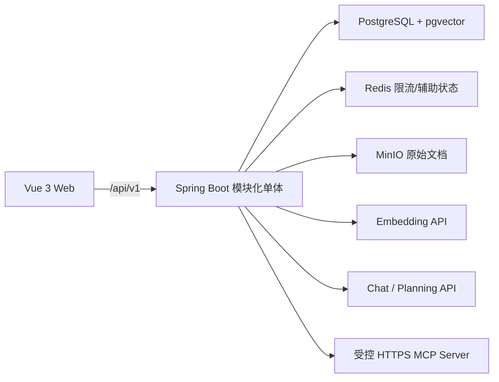
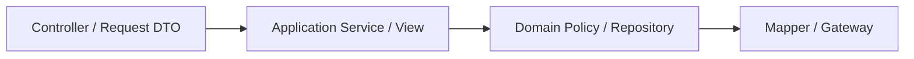
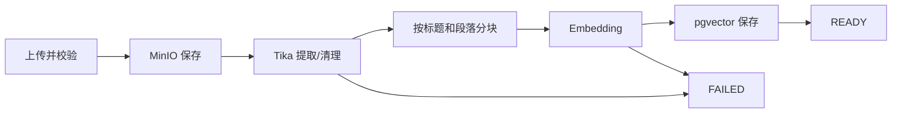
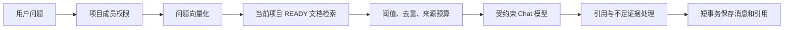

# AI Collab 系统架构

本文档说明当前系统边界和实现原则。当前功能完成度见 `feature-matrix.md`，数据库执行事实见 `database.md` 与 Flyway，HTTP 契约见 `api/openapi.yaml`。

## 1. 产品与系统边界

AI Collab 面向高校竞赛团队，并兼容课程设计、软件实训和小型软件项目。第一版由三类能力组成：

1. 项目、成员、里程碑、任务、评论、通知、审计和多种项目视图；
2. 项目文档上传、解析、向量检索、流式引用问答、反馈和检索评测；
3. AI 任务规划、人工预览、版本管理、事务确认和规划对比；
4. 受控的项目协作 Agent、原生工具调用、事件流、人工审批写入、定时 Skill、项目记忆、MCP 和模型管理。

## 2. 部署架构



本地通过 Docker Compose 运行 PostgreSQL、Redis 和 MinIO；后端、前端作为本地进程启动。Redis 不可用时部分限流降级为进程内实现；PostgreSQL 是业务事实来源；MinIO 故障时文档存储能力不可用，但不应阻止无关协作功能启动。

## 3. 后端模块

| 模块 | 职责 |
|---|---|
| `auth` | 登录、JWT、Refresh Token、来源校验、注册策略 |
| `user` | 当前用户资料、密码与会话撤销 |
| `project` | 项目、成员、邀请、角色、Dashboard、Audit |
| `work` | 里程碑、任务、状态、依赖、评论 |
| `document` | 上传、MinIO、解析、分块、向量化、删除 |
| `knowledge` | 私人问答会话、检索、回答、引用 |
| `planning` | 两阶段规划、校验、版本、修复、幂等确认 |
| `agent` | 会话、执行计划、原生工具调用、事件/SSE、预算、审批、Skill、记忆、定时运行和 MCP |
| `notification` | 站内通知、未读状态和提醒任务 |
| `common` | 响应、异常、认证、项目 Guard、审计基础设施 |
| `infrastructure` | 跨模块外部服务适配 |

调用方向：



Controller 不直接访问 Mapper。Application Service 是权限、事务和业务用例边界；纯规则进入 Domain Policy；基础设施只实现端口。

## 4. 认证与权限

登录返回短期 JWT Access Token，并通过 HttpOnly Cookie 设置轮换式 Refresh Token。Cookie 端点强制校验可信 Origin/Referer，Access Token 接口由 Spring Resource Server 验证 JWT。

角色：

| 角色 | 当前权限 |
|---|---|
| OWNER | 修改、归档、删除项目；管理成员；管理协作数据与 AI 规划；查看 Audit |
| ADMIN | 管理成员邀请、任务、里程碑、文档和 AI 规划；查看 Audit；不能删除项目 |
| MEMBER | 查看项目和 Dashboard；维护自己负责任务的状态；评论；使用知识问答；查看规划 |

所有项目资源从后端校验 `projectId + userId`。不属于项目时不返回可用于探测资源存在性的详情。Audit 只允许 OWNER/ADMIN；Dashboard 允许全部成员。

公开注册由配置策略控制，默认关闭。邀请接受是独立受控流程。

## 5. 协作数据流

### 项目和成员

创建项目与 OWNER 成员在同一事务写入。项目更新、任务和里程碑写入使用乐观锁版本。项目删除仅限 OWNER，并在存在文档或已确认规划等受保护资源时返回稳定业务错误。

### 任务和依赖

任务状态为 `TODO / IN_PROGRESS / BLOCKED / DONE / CANCELED`，优先级为 `LOW / MEDIUM / HIGH / URGENT`。依赖替换在项目内加锁，读取完整图后通过 Kahn 拓扑排序拒绝自依赖、跨项目依赖和环。

### Dashboard

Dashboard 在数据库中按项目聚合，不加载全量数据后在前端计算：

- 完成率：`DONE / 非 CANCELED 任务数`，零分母为 0；
- 逾期：截止日期早于数据库 `CURRENT_DATE` 且未完成/取消；
- 里程碑使用相同的非取消分母；
- 最近任务、文档和动态使用稳定排序和固定上限。

### Audit

写操作记录 action、entity、操作人、requestId 和时间。高价值事件保存有限、脱敏的 JSON detail；应用层生成中文摘要。Dashboard 只返回脱敏摘要，完整分页 Audit 只对 OWNER/ADMIN 开放。

## 6. 文档处理



状态为 `UPLOADED → PARSING → INDEXING → READY / FAILED`，删除中使用 `DELETING`。文件类型由扩展名、MIME 和内容共同校验。处理 worker 使用 `processing_token + heartbeat + CAS` 防止删除、重试和旧 worker 回写形成 ABA 竞态。

删除顺序由业务服务协调 MinIO 与数据库；数据库外键清理文档块和引用。MinIO 网络调用不放进数据库长事务。

## 7. RAG 问答

知识会话按 `projectId + creatorUserId` 隔离，即使 OWNER 也不能读取其他成员的私人问答历史。



Embedding 和 Chat 网络调用发生在事务外。最终 USER/ASSISTANT 消息和实际引用在短事务中原子保存。前端 Markdown 经 DOMPurify 清洗。

问答通过 SSE 逐段返回 token、引用和完成事件；前端支持取消回答。助手消息可提交“有用/无用”反馈，项目管理员可通过中文表单运行检索质量评测。

## 8. AI 任务规划

规划是受控 AI 工作流：

1. 验证 OWNER/ADMIN 和输入文档项目归属；
2. 检索并裁剪来源；
3. 生成骨架；
4. 生成任务细节；
5. 解析结构化输出并执行业务校验；
6. 保存不可变版本和 attempt；
7. 前端人工编辑、修复或恢复版本；
8. 用户确认后，以幂等键在事务中批量创建里程碑、任务和依赖；
9. 写入确认结果和 Audit。

模型输出不能直接写正式业务表。外部模型调用不进入确认事务。规划版本保存模型供应商、模型、原始输出/指标和验证结果，用于复现和比较。

## 9. Agent 与模型网关

Chat、Agent、Planning 可由系统管理员在管理中心配置 OpenAI 兼容、Claude 或 Gemini 模型并按用途分配；API Key 加密保存。Embedding 仍使用独立环境配置，切换 Embedding 模型需要重新索引。

项目协作 Agent 是受项目权限、工具白名单、预算和人工审批约束的业务 Agent，不是可访问任意外部系统的通用自治代理。运行时先组装可信页面上下文与固定 Skill，再通过统一模型轮次网关执行原生 Tool Calling；执行计划、步骤和严格递增事件持久化到 PostgreSQL，前端通过 SSE 重放并续传事件。

内置只读工具可在项目范围内直接执行；任务、里程碑和记忆等写工具只能生成待审批提案，批准时重新校验运行状态、项目角色、资源版本和幂等键。取消、预算耗尽和失败使用稳定终态，Worker 不能用旧版本覆盖并发取消。

MCP 是系统管理员配置、项目 OWNER 授权的可选外部只读工具来源。当前实际传输为受 host allowlist、DNS 私网阻断、HTTPS、超时和响应大小限制保护的 `STREAMABLE_HTTP`；工具还必须同时通过远端 `readOnlyHint`、连接级确认白名单和项目级白名单，执行前重新校验 Schema Hash。凭据加密保存，发现网络调用在数据库事务外，返回内容按不可信数据清洗。

## 10. 前端

路由：

```text
/login
/register                         受注册策略保护
/invite/:code
/account
/projects
/projects/:projectId/dashboard
/projects/:projectId/board
/projects/:projectId/milestones
/projects/:projectId/members
/projects/:projectId/documents
/projects/:projectId/knowledge
/projects/:projectId/ai-planning
/projects/:projectId/agent
/projects/:projectId/audit-logs   OWNER/ADMIN
/admin                            系统管理员
```

项目根路由重定向 Dashboard。`project-context-store` 保存当前项目和角色，切换项目、离开项目或退出时清理。页面按角色隐藏入口，但必须正常展示后端 403/404。

前端 API 使用统一 Axios 客户端和 `ApiResult<T>`；错误由 `normalizeApiError` 映射。界面中文规则见 `development/frontend-conventions.md`。

## 11. API 与错误

JSON 响应通常为：

```json
{
  "code": "SUCCESS",
  "message": "操作成功",
  "data": {}
}
```

创建、异步、删除和文件下载遵循 HTTP 状态语义。错误码是前后端稳定契约；新增错误码必须同步 OpenAPI 和中文映射。原始异常栈、SQL 和敏感值不能返回客户端。

## 12. 一致性与隐私

- PostgreSQL 约束是最终一致性防线，应用校验用于友好错误。
- 项目、任务、里程碑使用版本号；文档 worker 使用 CAS；规划确认使用幂等键。
- 所有列表使用稳定排序；分页限制最大尺寸。
- Audit detail、AI 调用日志和错误响应只保存必要元数据。
- 本地默认模型 API Key 从环境变量读取；管理中心保存的模型和 MCP 凭据只以加密密文入库，API 不回传明文。
- Prompt 和模型响应有长度预算；项目文档不能注入系统权限。

## 13. 验证边界

完成改动前必须按风险运行：后端相关测试与全量测试、后端打包、前端测试/类型检查/构建、只读冒烟和 `git diff --check`。功能矩阵只有在这些证据与实际入口一致后才能标记“完整”。
