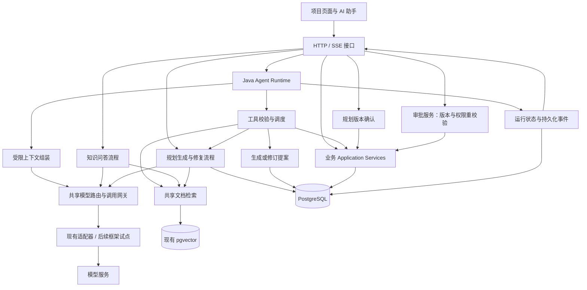
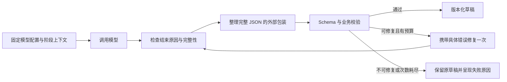

# AI Collab：以 Java 后端承载核心 AI 能力的重构设计

日期：2026-10-03。状态：已按全项目 AI 审查及模型切换问题修订，目标设计待分阶段实现与验证。

本文依据当前工作区的模型接入、文档与 RAG、任务规划、Agent、MCP 和前端链路审查修订。相关测试结果、已确认问题及未验证范围见 [AI 能力审查报告](ai-capability-review.md)。工具调用、异常决策、取消恢复与具体实施包见 [Agent 执行设计](agent-runtime-design.md)。测试通过不代表本文目标已全部实现。工作区已有多处进行中的修改，本文以当前文件为基线，不覆盖这些修改。现有架构说明见 [architecture.md](architecture.md)。

## 0. 全局定案

本方案保持 **Java 单语言后端、模块化单体、三条 AI 业务流程、共享模型和检索能力、业务服务控制写入**。用户最终确认：本轮保持现有 Java 编排与模型网关，不引入 Python、Spring AI、LangChain4j 或新的 Agent 框架。文中框架适配讨论仅为未来参考，不在本次开发范围内。

产品主线是：项目资料成为有来源的知识，知识和约束形成可编辑的计划，确认后的计划成为真实任务，任务进展再支持风险分析、周报和后续协作。文档、知识、规划、Agent、看板和报告因此形成一条业务闭环；后端工程保证每一环的身份、版本、状态和写入正确。

### 0.1 三条流程，共享能力

| 入口 | 主责 | 执行方式 | 与其他模块的关系 |
|---|---|---|---|
| 知识问答 | 根据项目资料回答、引用、追问 | 检索与证据约束的回答流程 | 使用共享检索与模型网关；不强制经过 Agent 循环 |
| 任务规划 | 生成和修复可执行的批量方案 | 骨架、详情、校验、局部修复、版本确认 | 可由页面或 Agent 发起；共用同一规划服务与确认规则 |
| 协作 Agent | 理解连续目标，选择工具，澄清并组织操作 | 有预算的 Java 工具调用循环 | 调用知识检索、规划和业务查询；业务变更以提案提交 |
| 周报、健康度、交付检查等场景 | 汇总业务事实、说明风险与建议 | 现有 Skill + 查询/统计工具 + 必要的模型表达 | 确定性指标来自业务服务；模型推断与已发生事实分别呈现 |

这里的共享表示复用配置、传输、检索、工具契约和观测，不把不同业务流程合成一个巨型通用 Agent。页面直接操作和 Agent 操作均调用业务应用服务；规划确认保留批量事务，单任务提案保留独立审批，二者不叠加重复确认。

### 0.2 已确定的取舍

| 事项 | 本轮决定 |
|---|---|
| Java 与 Python | 全部编排、输出处理、检索和业务执行留在 Java；spec-agent 作为设计参考，不复制服务部署形态 |
| Spring AI / LangChain4j | 本轮均不引入，不安排框架试点；先完善现有网关，未来有明确维护收益时另行评估 |
| 模型输出 | 规划以提示词 JSON 为兼容基线，原生模式按实测支持启用；Java 最终校验一致；工具调用能力单独判断 |
| 数据存储 | 保留现有 PostgreSQL/pgvector、MinIO 和已有 Redis 用途；不增加向量库、消息队列或记忆数据库 |
| Agent 执行权 | 保留一个 Runtime 循环；模型选择候选动作，服务端注入身份、校验权限并执行 |
| 业务写入 | AI 生成草稿/提案，用户确认对应版本后由应用服务执行；不把“提案生成成功”显示为“任务创建成功” |
| 既有功能 | 保留文档、规划版本、任务可视化、通知、报告和六种 Skill；逐步修复共享基础与行为，不做全盘重写 |
| 模型兼容承诺 | 明确每个用途的能力要求和实测结果；不承诺任意模型都能完成原生工具调用或复杂规划 |

### 0.3 从 spec-agent 借鉴的范围

借鉴输出契约与传输模式分离、宿主受控工具、运行时身份上下文、成功观察复用、有限修复、事件与来源展示、配置测试和故障分类。索引代际采用相同的隔离原则，但依据本项目 pgvector 和文档处理状态实现。checkpoint 的目标通过现有数据库状态、步骤、租约和版本落实，不直接搬入另一个框架的存储格式。

保留本项目个人模型按用途路由与管理员 Embedding 管理的边界。MCP 继续作为受控外部能力入口；联网搜索、网页抽取并非当前重构的前置依赖，后续有产品需求时再接入并验证来源链路。

## 1. 项目定位与决策

AI Collab 定位为“以 Java 后端工程承载知识问答、智能规划与受控 Agent 的 AI 项目协作平台”。AI 是核心产品能力和本次重构重点；后端定位决定实现方式与技术深度，不降低 AI 的投入优先级。

三条核心 AI 业务线分别是：项目文档知识问答、可校验且可局部修复的任务规划、具备上下文和受控执行能力的 Agent。模型路由、Embedding、工具契约、可观测性和故障恢复是共享底座。项目成员、任务、依赖、文档与审计为 AI 提供真实业务对象及执行边界。

即使模型服务不可用，登录、项目管理、任务编辑、文档原件管理和已有业务数据查询仍应可用。需要模型的生成、向量化和语义检索明确提示能力暂不可用，不伪造结果。

确定采用以下路线：

- 保持 Java 21、Spring Boot 模块化单体；复用 PostgreSQL/pgvector、Redis 和 MinIO。
- 保留 Java Agent 运行层和业务执行权，首轮保留现有模型适配器。Spring AI 是后续优先验证的候选，框架试点通过后才固定版本和扩大接入。
- 首个业务改造切片是任务规划的跨模型输出与修复链路，同时优先处理引用、MCP 错误、提案审批与索引状态问题。框架适配在此后单独验证，首个框架替换切片只针对 Agent 模型轮次；整体验收覆盖知识问答、规划和 Agent。
- Agent 运行层拥有唯一的循环、预算和恢复控制权；框架只返回模型响应及工具调用请求。
- 保留提案生成与审批执行解耦的产品语义。
- 同时建设 AI 任务完成质量与后端执行可靠性：既检查引用、约束满足和上下文连续性，也检查权限、幂等、恢复和资源使用。暂不引入 Python 服务、微服务拆分、通用多 Agent 平台或新的工作流引擎。
- 不同时引入 Spring AI 和 LangChain4j。Spring AI 未通过兼容验证时，保留现有适配器并记录具体阻碍，再评估替代方案。

Spring AI 官方当前文档说明 2.0.x 支持 Boot 4.0.x/4.1.x，并支持低层 ChatModel 调用。本文不根据旧教程直接指定具体 API 开关，接入时应针对固定版本验证“只返回工具调用、不自动执行”的行为。[版本兼容](https://docs.spring.io/spring-ai/reference/getting-started.html)、[工具调用与低层接口](https://docs.spring.io/spring-ai/reference/api/tools.html)。

## 2. AI 与后端共同建设主线

| 核心 AI 能力 | 保留的已有价值 | 重构必须达到的结果 |
|---|---|---|
| 项目知识问答 | 分块、项目内检索、来源预算、引用定位、真实模型增量与反馈 | 对证据不足正确处理，支持有界追问上下文，校验引用并区分文档事实与推断 |
| 智能任务规划 | 骨架/详情两阶段、业务校验、版本化草稿、局部 patch、人工确认 | 当前约束和成员信息真正进入修复请求；修复目标问题且保留用户锁定字段 |
| 受控 Agent | 工具调用、六种场景 Skill、页面上下文、项目记忆、提案、恢复事件 | 连续补充不丢目标，失败不冒充成功，多工具调用都有明确结果，审批内容与用户所见一致 |
| 模型与 Embedding 底座 | 个人模型按用途路由、多提供商、凭据管理、系统 Embedding | 配置快照一致、能力测试真实、取消与错误语义统一、索引状态可解释 |
| 项目集成 | MCP 发现、管理员白名单、Schema 确认与结果清洗 | 保留外部错误状态，验证真实服务器互通，外部数据不能变成权限指令 |

下面的后端能力是这些 AI 业务线的支撑，与 AI 行为一起验收。

| 主线 | 当前基础 | 下一步设计重点 | 可交付证据 |
|---|---|---|---|
| 身份与项目权限 | auth/user/project、项目成员角色与 AccessGuard | 所有 HTTP、后台任务、工具和审批入口使用同一业务授权语义；执行时重新校验权限 | 跨项目、成员移除、审批人权限变化的集成测试 |
| 任务与方案一致性 | work/planning、依赖关系、规划版本和确认流程 | 并发更新冲突、确认幂等、任务与依赖原子落库；先核查已有实现再补缺口 | 并发确认、回滚、过期版本测试 |
| 文档异步处理 | document、解析与 Embedding、pgvector | 重试与恢复、索引配置快照、原件与处理状态一致性 | 中断恢复、配置切换期间检索测试 |
| 受控业务执行 | Agent 工具、提案、审批、事件 | 草稿修订、审批版本绑定、执行结果和审计一致性 | 重复审批、旧提案审批、取消与提交竞争测试 |
| 可部署与可诊断 | Actuator、日志、部署配置与现有测试 | 明确依赖故障、关联请求与运行、记录耗时和错误分类 | 可复现部署步骤、故障记录、实测报告 |

不为了简历增加中间件。只有数据库任务领取、现有限流或事件投递无法满足已测量的需求时，再讨论队列、缓存或服务拆分。

## 3. 源码依据与改造范围

以下路径相对于 `ai-collab-backend/src/main/java/com/shitulelv/aicollab/`。

| 现有组件 | 源码观察 | 处理决定 |
|---|---|---|
| `agent/application/AgentWorker`、`runtime/AgentRuntimeCoordinator` | Worker 委托 Coordinator 推进运行 | 保留一个控制入口，统一预算与失败分类的职责，避免多处规则漂移 |
| `runtime/AgentContextAssembler` | 校验身份、成员关系和页面对象，加载会话提案 | 保留，补充当前目标及观察有效期管理 |
| `runtime/AgentModelMessageComposer` | 最近十条聊天消息、项目记忆、工具步骤恢复 | 从固定消息条数改为有优先级和预算的上下文组装 |
| `runtime/RoutingAgentModelExecutor` | 超时、提供商错误也可能触发 Legacy 只读降级 | 区分暂时故障和能力不支持；取消错误驱动的隐式能力切换 |
| `runtime/NativeToolCallingExecutor`、`infrastructure/ai/turn/ModelTurnGateway` | 已有独立模型轮次接口 | 作为框架适配切入点，领域与业务服务不依赖 Spring AI 类型 |
| `runtime/AgentToolCallExecutor` | 参数校验、只读批次、审批提案；提案生成后结束 Run | 保留受控入口；完整处理模型工具批次，明确未执行调用，不静默丢弃尾部调用 |
| `agent/application/AgentApprovalService` | 审批事务、锁、幂等检查与执行前校验；审批后不重新入队 Run | 保留解耦语义，核查审批版本绑定与并发竞争 |
| `agent/infrastructure/repository/AgentRepository` | 数据库领取、租约、`FOR UPDATE SKIP LOCKED` | 保留；验证租约失效后旧 Worker 不能提交迟到结果 |
| `document/application/service/DocumentSearchService` | 复用存储并过滤模型、维度与活动指纹 | 保留，核查查询向量和过滤指纹是否来自同一配置快照 |
| `planning/application/TaskPlanConfirmationService` | 已有规划版本、确认幂等和事务落库 | 继续承担批量方案确认，不在 Agent 内复制一套批量任务规划引擎 |

这里列出的待核查事项不全部等同于已复现缺陷。尤其已有指纹、审批和恢复代码，应先验证现有行为，不按功能名称重新实现。

## 4. 目标架构

业务服务拥有授权、规则、事务和审计。工具是这些服务的受控适配入口，不拥有另一套业务规则。模型响应、网页或文档内容均不能改变认证身份、项目归属、工具白名单或审批策略。

图中模型网关是共享职责，不要求把已有 ChatModelGateway、ModelTurnGateway、EmbeddingGateway 合并为一个接口。文本生成、工具轮次和向量生成仍保留各自清晰的输入输出。文档解析和索引作为异步流程支撑共享检索，复用 MinIO 原件与 PostgreSQL 状态。运行记录和事件同样覆盖规划及知识问答的诊断，但不强行统一三者的业务状态枚举。

HTTP 请求与工具调用应遵守同样的领域约束。现有专用批量确认服务可以继续组织事务，但应复用相同的校验规则，不要求为统一代码形式而改坏原子性。

## 5. Runtime 与模型适配

### 5.1 单轮控制流程

一次 Worker 推进执行：领取有效租约 → 加载运行快照 → 校验取消、身份和预算 → 组装上下文 → 调用一次模型 → 校验返回值与工具请求 → 记录结果或执行受控工具 → 持久化下一状态与事件。

模型调用在数据库长事务之外。工具结果、运行状态与相关事件使用短事务提交。框架不得在 Runtime 不知情的情况下额外调用模型或执行工具。

保留 `ModelTurnCommand/ModelTurnResult` 作为适配边界。适配器负责消息角色、Schema、toolCallId、finish reason、usage 和错误映射。暂不为了接框架重命名整个包结构。

### 5.2 接入验证

首个适配器只服务 Agent 的一个已配置提供商。通过相同请求集对比旧适配器和新适配器：普通回复、多工具请求、参数无效、工具错误回传、缺失 usage、超时与限流。若涉及流式调用，再验证增量合并、取消和最终结果一致性。

保留用户级模型归属、用途选择、自定义 endpoint、凭据解密和请求追踪。不能把当前按用户解析的模型配置替换成一个全局静态客户端。客户端缓存如有必要，键必须包含配置身份及版本，配置更新或凭据轮换后失效。

使用服务端配置选择适配器，运行开始时固定路由选择。同一 Run 不在故障后切到另一种工具语义；凭据撤销仍即时生效，不能因快照继续使用失效授权。旧适配器作为发布回退手段保留，稳定后再删除重复实现。

### 5.3 错误规则

| 情况 | 处理 |
|---|---|
| 超时、限流、临时服务错误 | 有上限的重试与退避，记录尝试和预算；不据此禁用工具能力 |
| 明确不支持工具调用 | 配置测试或运行前检查提示能力不满足；只读模式须显式选择 |
| 模型输出格式错误 | 最多一次针对性修正，仍错误则结束并给出原因 |
| 工具参数无效、业务前置条件不满足 | 返回结构化失败观察，允许有限修正；无效结果不进入已验证事实 |
| 无权限、凭据失效 | 停止相关操作；不通过其他提供商或工具绕过 |
| 取消、预算耗尽 | 停止发起新调用，保存已完成结果与准确状态 |

重试只由明确的一层管理，防止 HTTP 客户端、框架和 Runtime 重试次数相乘。模型请求重试可能重复产生费用，不声称模型请求恰好执行一次。

### 5.4 规划结构化输出：应用契约与传输模式分开

当前审查已证明：仅取消提供商的 response_format 参数不够。Zen 预设已经使用提示词 JSON，但网关的提前校验会阻止规划解析器和修复流程接收候选输出；自定义配置又存在只有 CHAT 却被要求 STRUCTURED_OUTPUT 的能力冲突。

目标分成四个职责，先复用现有类，职责无法清楚表达时再拆类：

| 职责 | 主要承载位置 | 边界 |
|---|---|---|
| 业务输出契约 | TaskPlanOutputParser、阶段 Schema、TaskPlanDraftValidator | 定义骨架、详情、patch 的结构及业务不变量，与提供商无关 |
| 本次模型配置 | 用户用途路由与配置快照 | 明确实际模型、凭据引用、传输模式、预算、配置版本；阶段内保持一致 |
| 提供商传输 | 现有模型适配器，后续可替换框架 | 翻译消息和可支持参数；保留正文、完成原因、usage 与调用元数据；不在这里执行规划业务修复 |
| 生成与修复流程 | TaskPlanGenerationOrchestrator、TaskPlanPartialRepairService | 按阶段解析、校验、决定一次修复、检查取消与预算、提交版本；只有这一层决定再次调用模型 |

模型的 `PROMPT_JSON`、`JSON_MODE`、`JSON_SCHEMA` 是传输选择，不是三个强弱不同的业务校验等级。三种模式共用最终 Schema 和领域约束；提示词模式不要求提供商具备原生结构化输出能力。默认以提示词 JSON 作为兼容基线，只有在配置测试确认支持后才启用原生模式，不根据模型名称猜测支持程度，也不在 429/认证失败时换模式盲重试。

生成流程固定为：

图中修复回路受计数器限制最多一次，不能依靠模型自行结束。截断输出另归类处理，不能用补括号把缺失任务伪装成完整方案。外部包装整理只接受无歧义、完整的 JSON，不从任意解释中贪婪截取第一个大括号。

修复输入应包含：原任务目标、当前约束、基准版本、骨架身份、允许成员与来源、目标对象、允许/锁定字段、候选输出和精确校验错误。数据与指令明确分区；Base64 编码不构成权限或提示注入防护，不能代替业务校验，也不应要求模型为了读取普通草稿额外解码。

对身份越权、未知来源、锁定字段修改等结果继续拒绝。仅在明确可修复且不扩大权限的范围内重新生成；不可静默丢字段、虚构负责人或把失败输出写入成功观察。

### 5.5 首个改造切片与验收

第一批改动只调整规划调用边界、输出处理和错误诊断，保留已有草稿版本、确认事务和 Agent Runtime。对知识问答与普通聊天的输出契约保持各自语义，不通过删除全局校验让所有场景接受任意文本。

1. **契约与能力。** 分开应用要求与提供商模式，补用途级配置检查；普通连通性、规划结构返回、流式和工具能力分别测试。能力测试按用户选择执行，避免保存配置就自动发起多轮模型调用。
2. **输出与修复。** 让规划层取得候选正文，统一骨架/详情的格式错误分类，修复提示收到完整必要上下文；修复次数、取消、generationSeq/attemptId 和版本检查保持有效。
3. **预算与诊断。** 明确规划预算与用户配置的优先级；提供商不支持预算参数时如实记录。错误日志使用实际选中模型、阶段、模式、结束原因和错误类别，界面区别限流、认证、截断、格式及业务问题。

验收先使用确定性模拟响应：纯 JSON、完整代码围栏、额外解释、缺失/未知字段、空正文、输出截断、一次修复成功/再次失败、429、401/403、超时、取消及过期版本提交。另验证用户锁定字段和成员/来源不可被修复越权修改。

随后用相同小项目和较长项目，在可用的 Qwen 与 OpenCode 模型上比较骨架成功率、详情成功率、约束满足、修复次数和耗时，记录具体模型与日期。暂缺可用配置时明确标记真实验证未完成，不以本地测试代替。单次成功也不能证明普遍跨模型兼容。

### 5.6 模型配置、预算和外部故障

保留个人配置按用途选择模型的产品方式，避免更换聊天模型意外改变所有用途。输出模式、原生工具、流式和 usage 是不同能力；普通聊天通过只能证明那次普通请求成功。能力状态应区分未知、声明支持、实测通过和明确不支持；未知能力用有界测试确认，不能直接当成支持，也不能把限流当成不支持。

预算采用明确优先级：用途级显式值优先，否则使用个人配置值，缺失时使用该用途默认值；已知模型上限作为约束。界面和调用日志显示最终有效值，不再保留“配置了但未生效”的规划参数。输入上下文也预留输出预算；若提供商不支持客户端限制，记录为未强制执行而非宣称限制生效。

模型请求设置总时限、并发上限与有界排队；运行层预算覆盖首次调用和修复调用。失败分类至少区分访问认证、限流、服务不可用、能力不支持、截断、结构错误和业务错误。限流采用服务端提示与有上限的退避；交互超时后给出可恢复状态，不能无限等待。内容修复只处理候选输出，不承担网络重试。

配置和凭据隔离不因共享客户端而改变；诊断只记录配置身份和必要元数据。原始模型正文如需保存为失败样本，应脱敏、限长、限保留期并受访问控制。

## 6. 提案、审批与恢复语义

### 6.1 两套独立生命周期

Run 表示一次助手处理过程；Proposal 表示待确认的业务变更。保留当前“提案生成后 Run 成功结束，审批独立执行”的语义。

- Run：`QUEUED → RUNNING → SUCCEEDED / WAITING_FOR_USER_INPUT / FAILED_RETRYABLE / FAILED / CANCELED / BUDGET_EXCEEDED`，保留已有合法重入队路径。
- Proposal：沿用已有 `PENDING → APPROVED / REJECTED`；过期按已有期限判断，是否需要物化其他状态在实现前核对约束。
- Run 成功且存在 PENDING 提案，界面显示“方案已生成，待确认”；仅在审批事务提交且返回资源 ID 后显示“已创建/已修改”。
- 旧 `WAITING_FOR_APPROVAL` 数据保留兼容读取，不在第一阶段删除枚举或历史记录。
- 用户对 PENDING 提案的补充创建新一轮处理并修订原提案；已经执行的对象只能通过新修改提案更新。

取消正在运行的 Run 表示停止后续处理。Run 已结束后，用户“不要这份方案”应走提案撤回/拒绝语义，不伪装成取消已完成的 Run。自动将自然语言映射为具体提案处置前，必须唯一确定对象并走正式授权入口。

### 6.2 审批并发与幂等

审批命令需要绑定 `approvalId + expectedRevision + idempotencyKey`，身份从认证上下文取得。若当前接口未携带 revision，增量扩展接口和 UI。旧版本客户端不能在未感知修订的情况下批准新内容。

事务内按统一顺序锁定相关记录，重新检查权限、提案状态、过期时间、预期修订号与目标资源版本；执行业务写入；记录资源 ID、审批结果、幂等结果和审计。对当前纯数据库写操作，这些应在同一业务事务内完成。

同一幂等键、同一请求返回先前结果；同键不同请求拒绝。相同提案不同键并发审批也不能重复落库，依赖数据库锁、状态条件和必要唯一约束，而非内存标记。修订使用预期版本条件，审批旧版本返回明确冲突。

LLM、Embedding 和外部 HTTP 请求不进入审批事务。未来如增加外部写工具，需要独立设计外部幂等与补偿；本阶段不纳入。

### 6.3 Worker 与事件恢复

复用现有数据库租约。在提交结果前验证租约所有者及领取代次，或等价的 fencing/version 条件；不能仅因“拿到了旧 Run 对象”就允许更新。租约长度、模型超时和续租行为要统一设计，避免正常慢请求被第二个 Worker 抢占。

恢复以已持久化步骤和业务结果为依据。已完成的工具调用按调用身份复用；未完成的只读调用可重试。提案创建也是写操作，需要持久化调用身份去重，不能只保护最终审批。旧 Worker 的迟到结果必须被拒绝。

状态变化及对应可回放事件应原子落库；SSE 在提交后推送，连接失败依靠事件游标补读。事件传递按可能重复设计，前端按事件 ID 去重；取消终态不能被迟到的模型结果覆盖。

## 7. 上下文与工具设计

上下文按以下顺序保留：系统边界与可信身份 → 当前目标及最新补充 → 当前页面对象和相关提案 → 有效工具观察 → 检索证据 → 必要历史与摘要。超过预算先裁剪低优先级内容，工具请求与结果作为完整单元保留。

最小工作状态包含：当前目标、目标版本、用户约束、已确认对象引用、待澄清项、活动提案引用。优先扩展现有 Session/Run 上的版本化 JSON 或现有持久化结构，不先引入多个记忆存储。摘要是派生信息，不能替代数据库事实。

工具观察记录状态、来源、项目范围、读取时间和资源版本。读取成功只代表当时成功；权限变化、资源修改或配置切换后必须失效或重查。失败观察可用于纠错，但不得提炼为业务事实。

用户说“负责人改成小王”“简洁一点”“补上验收条件”通常继续原目标；明确提出独立任务或取消时才切换。多个对象无法确定时问一个针对性问题，已由受信任上下文确认的信息不重复询问。

工具契约沿用现有定义并收敛到：名称、用途、输入 Schema、只读/提案类别、返回数据、错误码、引用、可重试标志。服务端注入项目与用户身份；模型不能提供权限。提案结果必须返回 proposalId、revision 和 PENDING 状态，便于继续修订。

第一批重点暴露：项目概览、成员列表、任务查询、文档检索和单任务创建/修改提案。保留已有其他 Skill，但不扩大首批改造面。MCP 维持现有只读范围，第一阶段不增加第三方写工具。

上下文按来源区分：服务端核验的身份与页面对象、当前用户目标和约束、可追溯的工具观察、历史摘要、失败尝试。不把整个历史每轮原样塞入提示词。用户修改负责人时保留目标；项目或权限变化时重新核验引用；摘要与旧工具结果冲突时，以最新核验结果为准。

Skill 继续表达场景目标、工具范围、必要上下文和完成条件，保留显式场景选择并逐步改进隐式匹配。周报、项目健康和交付就绪共享查询与指标，不各自实现一套模型调用、记忆和业务规则。新增模型语义路由前，应证明它比现有选择方式减少误选且没有明显增加延迟。

## 8. 检索与规划复用

Agent 和知识问答共用 `DocumentSearchService` 与现有 pgvector，保留项目隔离、READY 状态限制和引用定位。不引入另一套向量库，也不为接框架重写已有数据表。

一次检索固定 Embedding 配置快照，生成查询向量与检索过滤使用相同的 provider、model、dimension、fingerprint。当前代码先调用 embed 再读取 activeFingerprint，需要核查配置并发切换；若无法保证一致，应由一次调用返回向量及配置身份。

第一阶段验证现有配置指纹与重建行为。若后续需要旧索引持续服务、新索引后台构建，再增加显式 generation/build/activation 流程；语义指纹不能替代同一模型下的索引构建代次。

检索无证据时明确说明不足，不生成虚假引用。召回改写、混合检索和重排须在有标注的小型问题集上证明收益后再加入。

知识问答加入有界追问上下文，当前问题含指代时先结合历史确定检索意图；用于检索的改写保留用户原意，不能把前次模型猜测当成文档事实。回答区分资料支持的结论、显式推断和资料不足；引用校验检查来源身份与访问范围，离线评测另检查引用是否真的支持相邻结论。

索引重建先修准确进度和查询配置一致性；随后实现候选代际构建、完成校验、显式激活、旧代际保留和回收。旧索引在切换前继续提供服务，但已删除或撤销权限的文档必须立即不可检索。双代际会增加短期存储开销，应设保留上限。上传、解析、向量化、就绪和失败分别展示，不能发布事件后就标记全部完成。

批量“下周任务安排”复用 planning 模块的草稿、版本校验和确认落库能力。Agent 可以辅助收集材料或发起规划草稿，不能绕过规划确认，也不逐个调用创建工具模拟一套缺乏批量一致性的计划执行。

### 8.1 Ollama 本地 Embedding

**当前不能仅填写本地 base URL 就启用。** `SystemEmbeddingService.validateEndpoint` 与 `ProjectEmbeddingGateway` 均调用 `requirePublicHttps`，拒绝本地 HTTP/回环/私网目标；保存强制要求 API Key，运行时无条件解密；数据库 provider 约束也没有 OLLAMA。旧环境变量网关不能证明当前系统配置入口支持本地模型。

Ollama 官方支持 OpenAI 兼容的 `/v1/embeddings`；本地 API 默认无需认证。因此首批用 **OLLAMA 本地配置预设 + 现有 OpenAI 兼容向量传输**，统一返回现有 EmbeddingBatch，并补上配置指纹快照。不需要引入 Python，也不必首批同时维护两套传输。[兼容接口](https://docs.ollama.com/api/openai-compatibility)、[本地认证](https://docs.ollama.com/api/authentication)。

| 配置项 | 目标行为 |
|---|---|
| 提供商 | 系统管理员选择 OpenAI 兼容 / Ollama 本地；其他 provider 只有真实实现后才声明可用 |
| Base URL | 后端与 Ollama 同机且非容器时预填 `http://127.0.0.1:11434` |
| API Path | 预设 `/v1/embeddings`，避免 base URL 再附 `/v1` 导致重复 |
| 模型 | 使用已安装且支持向量生成的模型名，不固定千问或某个 Embedding 模型 |
| API Key | 本地直连可留空，不发送 Authorization；受认证代理保护的部署可显式配置 |
| 维度 | 测试请求先探测自然维度，检查本项目数据库和索引可支持范围，再作为候选配置确认；不沿用页面默认 1536 |
| 批量与时限 | 有界小批量起步，可配置；区分首次加载耗时、连接失败和推理超时 |
| 测试按钮 | 测试当前表单候选配置，返回模型、实际维度和耗时；不保存、不切换活动索引、不自动下载模型 |

Docker 内的 localhost 指容器自身。Docker Desktop 中可根据部署使用 `host.docker.internal:11434` 访问宿主机；同网络容器使用服务名，远程部署使用后端可达地址。实际地址依网络和 Ollama 监听配置验证，界面明确请求由后端发起。

本地访问策略单独限定到系统级 Embedding 的已授权目标：默认允许明确的回环 Ollama 地址，容器/内网部署由运维配置精确主机和端口允许项；保存、测试和运行使用同一策略。公有模型与 MCP 的公网 HTTPS 规则保持原有语义，不能通过删除全局校验实现本地支持。拒绝重定向与带 userinfo 的地址；域名解析目标按部署允许范围核验，不能把整个私网一概开放。

切换云端到本地时，清空或显式重新设置凭据，不能因“留空保留”把旧云端密钥发给新地址。只有相同配置及可信目标内的普通编辑才允许留空保留密钥。新增 provider 通过新 Flyway 迁移兼容加入，不修改历史脚本；现有历史 provider 数据保留，但协议能力要如实说明。

Ollama 原生 `/api/embed` 返回 `embeddings` 数组，与当前兼容适配器读取的 `data[].embedding` 不同，不能只改 API Path。若后续需要原生 `truncate=false` 或 keep_alive，新增明确协议分支并验证；首批兼容模式对超长文本限制在分块与输入预算内，并测试服务端截断行为，不能宣称天然不截断。[原生接口](https://docs.ollama.com/api/embed)。

模型名相同、维度相同也未必是同一向量空间。本地标签可能指向不同模型内容：可取得时记录模型摘要/版本，以及影响向量的预处理配置；无法证明新 endpoint 等价时保守要求重建。向量空间身份与索引构建代次分别管理。无论云端还是本地，都通过候选测试、索引构建和激活流程切换，查询与文档向量使用同一配置快照。

验收包括：无密钥本地请求、当前表单测试、容器部署连通、允许目标限制、切换地址不继承云密钥、模型不存在、非向量模型、维度不一致、批量结果数量/顺序、NaN/Infinity、超时、输入超长，以及配置切换期间不混用索引。真实 Ollama 测试在用户已有服务和模型上执行，不自动安装或下载。

## 9. 三条核心 AI 验收链路

三条链路均为最终验收要求。首个小切片用于降低改造风险，不代表其他 AI 能力次要。

### 9.1 文档到可信回答

文档上传与解析 → 索引完成 → 项目内检索 → 有引用的回答 → 用户追问 → 证据不足时说明缺口。评估召回、引用有效性、答案依据和追问连续性；包含无关资料、过期文档、配置切换及流式中断。

### 9.2 需求到可执行计划

用户目标、项目成员和参考资料 → 骨架 → 详情 → 结构及业务校验 → 用户修改与锁定字段 → AI 局部修复 → 新版本确认 → 任务/依赖原子落库。评估约束满足率、未锁定范围内的修复成功率、来源有效性以及重复确认的幂等性。

### 9.3 Agent 连续操作

选择“依据需求文档，为当前项目新增一项登录功能任务”，控制为一个可完整验证的业务对象。

1. 用户在项目内提出需求，服务端校验身份和选中文档。
2. Agent 查询文档、成员和相关任务，缺少必要信息时只问具体缺口。
3. 生成有引用的任务提案，返回提案 ID 与修订号，数据库尚无正式任务。
4. 用户说“负责人换成小王，截止日期改到下周五”。唯一确定成员与日期后修订原提案；日期按产品时区解析并在预览中显示具体日期。
5. 页面展示变更前后差异；用户审批当前修订号。
6. 后端重校验权限与版本，事务创建任务、审批结果与审计，返回正式任务 ID。
7. 刷新、重复点击和 SSE 重连均展示同一结果；重复审批不增加任务。

该链路通过后，验证会议转任务、规划草稿衔接、项目研究与周报等已有场景。多任务规划复用 planning 模块；不能因收敛 Runtime 而裁掉已有 AI 产品能力。

## 10. 实施阶段与退出条件

| 阶段 | 交付物 | 退出条件 |
|---|---|---|
| P0 能力基线与关键缺陷 | 先改规划跨模型输出、校验/修复和日志；并修复 MCP 错误传播、引用策略、审批版本和工具批次遗漏 | 已复现问题有行为回归用例；规划兼容性矩阵通过，失败可诊断，副作用正确 |
| P1 共享底座与检索一致性 | 用途级能力与预算、错误分类、有界请求、Ollama 本地预设、Embedding 查询快照与准确重建进度 | 本地/云端向量配置可实测；配置切换一致；失败可诊断且请求资源有界 |
| P2 RAG 与规划质量 | 证据策略、追问上下文、检索评测、完整修复上下文、长项目预算、候选索引代际 | 无证据场景正确；修复满足最新约束且不改锁定字段；新索引未完成不挤掉旧索引 |
| P3 Agent 连续任务与受控执行 | 工作状态、观察复用与失效、场景工具选择、规划草稿接入、取消与恢复 | 完整处理多步任务和后续补充；已执行与待审批严格区分；恢复无重复副作用 |
| P4 全链路交付 | 三条真实 AI 链路、MCP 互通、代表性模型验证、部署和质量报告 | 实测 AI 质量与后端可靠性，保留失败样本，简历与实现一致 |

P0 先处理已确认的 AI 语义与执行问题，不必等待框架接入。框架替换无法自动修复错误的引用判定、丢失的工具错误或不完整的修复上下文。每个阶段独立可回退；不以“替换了依赖”作为阶段完成标准。

按用户最终决定，本轮不实施 Spring AI 或其他框架试点。未来仅当现有适配层维护成本形成明确问题时另行评估，不占用本轮开发范围。真实模型小样本验收随每个阶段执行，P4 才做完整产品链路交付，不将所有真实验证拖到最后。

每一批同时完成相应前端状态和错误呈现。规划显示生成阶段、保留可用版本及具体失败原因；Agent 显示真实工具事件和待确认变更；知识问答显示来源和证据不足。正文增量是回答生成，工具事件是执行记录，不展示或编造“模型真实思考”。断连恢复从已持久化状态对齐，停止展示与上游取消的完成状态分别处理。

历史迁移脚本不修改；新增字段采用兼容式 Flyway 迁移。旧字段与状态先保留读取，回退应用时不能因新枚举值或新 JSON 结构无法启动。退役适配器和清理兼容代码放在回归通过之后。

## 11. 验证矩阵与观测

优先扩展现有 Agent、审批、规划及仓储测试，只为真实行为边界补测试，不按新增类逐个复制实现。

| 场景 | 必须观察到的结果 |
|---|---|
| 两个用户使用不同模型配置 | 无凭据或配置串用，配置更新可生效 |
| 模型超时/限流 | 有界重试，能力与工具集合不被静默切换 |
| 不存在或参数错误的工具 | 明确失败观察，无副作用，不报告成功 |
| 跨项目对象与项目成员移除 | 读取及执行入口拒绝，结果不泄露其他项目内容 |
| 提案后补充负责人和日期 | 同一提案产生新修订，其他已确认字段保持 |
| 审批期间提案修订或资源修改 | 旧 revision/资源版本冲突，不能批准未看过的变更 |
| 同键重试、同键不同请求、不同键并发 | 重放或冲突准确，最多产生一次业务效果 |
| 业务事务中途异常 | 正式资源、审批成功状态和审计不出现部分提交 |
| Worker 崩溃及租约转移 | 恢复可继续，旧 Worker 迟到提交被拒绝，提案不重复 |
| 取消与完成/审批竞争 | 由事务锁和条件更新确定顺序，已提交结果不被假称撤销 |
| SSE 断线及重复投递 | 补读事件后状态一致，无重复卡片 |
| 文档检索无结果 | 说明证据不足，无虚构来源 |
| 查询期间切换 Embedding 配置 | 同一查询使用同一配置身份，不混用向量空间 |
| 超长对话与重复提问 | 当前目标保留，预算生效，关键工具消息成对保留 |
| 模型不可用 | 普通项目、任务、原件管理仍正常，AI 故障独立呈现 |

确定性边界用自动化测试验证；模型效果用固定真实任务集人工核验，记录模型、配置和运行日期。先复用可用测试，不重复编写已有用例；真实提供商测试需要有效配置，未执行就明确标记未验证。

记录 task completion、无效工具调用、重复写入、澄清次数、模型调用次数、输入输出 token、端到端延迟和审批冲突。费用仅在有可信价格数据时计算。高基数 sessionId/runId 放追踪日志，不作为监控指标标签；日志不记录凭据和完整敏感工具输出。

## 12. 简历与演示设计

建议名称：**AI Collab — AI 项目协作与知识管理平台**。求职后端开发时，可以从任一核心 AI 场景讲起，再解释其背后的模型路由、检索、状态管理、事务和权限设计。AI 场景与后端工程共同构成亮点，不把 AI 压缩成最后一项附加功能。

以下为完成并验证后的表述方向，不可提前当作已实现成果：

- 基于 Spring Boot 构建模块化协作后端，围绕项目角色实现任务、文档和审批入口的一致授权与审计。
- 设计任务规划确认与 AI 变更审批流程，通过版本校验、事务和数据库幂等约束控制重复提交及并发冲突。
- 实现文档解析、向量化与项目范围检索，处理异步失败恢复和 Embedding 配置一致性。
- 集成 Java AI 适配层与受控工具运行机制，提供提案修订、失败恢复和可回放事件，复用现有业务服务执行变更。

如果 Spring AI 尚未接入，就写实际使用的模型网关，不写 Spring AI。性能、成功率和效率提升只使用实测数字，不编写“高并发”“生产级”“提升百分之多少”等未验证结论。

建议演示三段：文档问答与连续追问；规划生成、锁定字段与局部修复；Agent 查询、提案修订与审批执行。在各段插入无证据、版本冲突和重复提交等失败场景，同时体现 AI 能力和后端约束。

与 spec-agent 的区分以问题为中心：本项目重点展示协作业务中的授权、一致性和受控执行；另一个项目按其实际实现展示跨语言编排与检索组织。不能仅靠换框架包装出两个不同项目。
