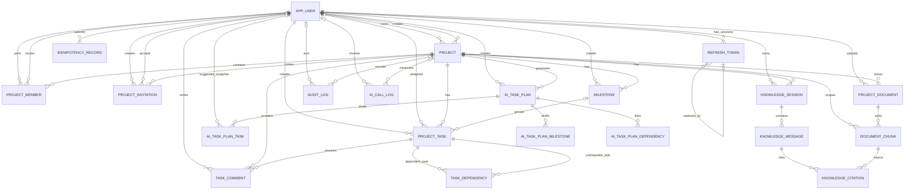

# 数据库设计

本文档描述数据库设计原则、逻辑结构和约束。数据库可执行结构的唯一事实来源是：

```text
ai-collab-backend/src/main/resources/db/migration/
```

本文档不复制任何 Flyway SQL；迁移目录中的版本化脚本决定实际可执行结构。

## 1. 设计原则

- 主键统一使用 UUID。
- 业务时间统一使用 `timestamptz`。
- 用户可见日期使用 `date`。
- 需要直接项目隔离或检索的核心表保存 `project_id`；消息、引用、AI 草案子表和依赖表等通过非空父级外键链继承项目作用域，查询时仍必须从父表显式约束项目。`idempotency_record` 按 user、endpoint 和幂等键隔离，不属于项目表。
- 重要更新表增加 `version` 用于乐观锁。
- 第一版使用物理删除，删除前写入审计日志。
- 向量列使用不固定维度的 `vector`，以兼容不同 Embedding 维度；第一版数据量小，使用精确检索。

## 2. 核心表

| 表 | 说明 |
|---|---|
| app_user | 用户账号 |
| refresh_token | Refresh Token 摘要、设备会话、轮换链与撤销状态 |
| project | 项目 |
| project_member | 项目成员与角色 |
| project_invitation | 邀请码 |
| milestone | 里程碑 |
| project_task | 任务 |
| task_dependency | 前置依赖 |
| task_comment | 任务评论 |
| project_document | 原始文档元数据 |
| document_chunk | 文档块、元数据和向量 |
| knowledge_session | 问答会话 |
| knowledge_message | 问答消息 |
| knowledge_citation | 回答引用 |
| ai_task_plan | AI 规划主表 |
| ai_task_plan_milestone | 草案里程碑 |
| ai_task_plan_task | 草案任务 |
| ai_task_plan_dependency | 草案依赖 |
| idempotency_record | 幂等请求与响应记录 |
| audit_log | 审计日志 |
| ai_call_log | 模型调用指标 |

## 3. 表关系



V1 中的全部 `CREATE TABLE` 已与上表逐项核对：`app_user`、`refresh_token`、`project`、`project_member`、`project_invitation`、`milestone`、`project_task`、`task_dependency`、`task_comment`、`project_document`、`document_chunk`、`knowledge_session`、`knowledge_message`、`knowledge_citation`、`ai_task_plan`、`ai_task_plan_milestone`、`ai_task_plan_task`、`ai_task_plan_dependency`、`idempotency_record`、`audit_log`、`ai_call_log`，共 21 张表，无遗漏。

## 4. 关键约束

### 4.1 Refresh Token 会话约束

V1 创建 `refresh_token`，V2 在不复制或替代迁移 SQL 的前提下扩展为多设备会话模型：

- `user_id` 引用 `app_user(id)` 并在用户删除时级联删除；`token_hash` 为唯一的 64 字符 SHA-256 摘要，数据库不保存凭据原文。
- `session_id` 非空。每次成功登录创建新的 session，同一轮换链沿用同一 session，因此不同设备或不同登录的撤销范围相互隔离。
- `session_expires_at` 非空，表示会话绝对期限；V2 对历史记录回填为原 `expires_at`。当前配置限制单个凭据最多 14 天、会话最多 30 天。
- `revoke_reason` 可空，但非空时只能为 `ROTATED`、`LOGOUT`、`REUSE_DETECTED`、`EXPIRED`、`USER_UNAVAILABLE`。
- `replaced_by_token_id` 可空，自引用 `refresh_token(id)`，记录严格轮换后的替代凭据；替代记录删除时使用 `ON DELETE SET NULL`。
- `revoked_at` 与 `revoke_reason` 记录撤销状态。已轮换旧凭据再次出现时，应用服务撤销同一 `session_id` 下仍有效的凭据，不影响其他 session。
- V2 增加 `refresh_token(session_id)` 和 `refresh_token(session_id, revoked_at)` 索引，用于会话锁定、轮换和按会话撤销。

### 4.2 项目成员约束

- `(project_id, user_id)` 唯一。
- V3 新增 PostgreSQL 局部唯一索引 `uq_project_member_single_owner`：
  `UNIQUE (project_id) WHERE role = 'OWNER'`。数据库保证同一项目**至多一个** OWNER。
- 创建项目的应用服务在同一事务中插入 `project` 与 OWNER `project_member`，任一步失败都整体回滚，
  从而保证新项目**至少一个** OWNER。事务保证“至少一个”与局部唯一索引保证“至多一个”结合，
  满足每个项目必须且只能有一个 OWNER。
- OWNER 不能被移除，也不能直接降级；必须先执行所有权转移用例。

### 4.3 邀请码摘要约束

- V1 已将 `project_invitation.invite_code_hash` 定义为 `char(64) NOT NULL UNIQUE`，可直接保存
  SHA-256 的 64 字符小写十六进制摘要，因此 V3 不修改邀请表。
- 服务端使用至少 32 字节 `SecureRandom` 生成原始邀请码，再编码为无填充 URL-safe Base64。
  原文只在创建响应中返回一次；预览和接受接口先对路径参数执行相同 SHA-256，再按
  `invite_code_hash` 查询。
- `ProjectInvitationEntity.codeHash` 通过 `@TableField("invite_code_hash")` 显式映射数据库列，
  避免业务代码将持久化值误认为邀请码原文。
- 日志、审计与异常响应不记录原始邀请码或完整摘要。接受时对邀请行使用 `SELECT ... FOR UPDATE`，
  并发请求最多一个能够把状态从 `PENDING` 改为 `ACCEPTED`。

### 4.4 任务依赖约束

- `(task_id, depends_on_task_id)` 唯一。
- `task_id <> depends_on_task_id`。
- 两个任务必须属于同一项目。
- 当前 `TaskApplicationService` 在一个事务中读取项目全部任务和依赖边，构造替换后的完整图，
  通过 `TaskDependencyPolicy` 的 Kahn 拓扑排序验证无环后才删除旧边并写入新边；任一校验或写入失败会整体回滚。
- 读取完整依赖图前先执行以下项目作用域行锁 SQL：

  ```sql
  SELECT id
  FROM project_task
  WHERE project_id = #{projectId}
  ORDER BY id
  FOR UPDATE
  ```

  SQL 返回当前项目全部任务 ID，并以固定顺序加锁。锁定结果是后续校验的完整节点集；同一项目的
  `replaceDependencies` 因共享这组锁而串行执行，不同项目锁定不同任务行。依赖边必须在加锁后重新读取，
  Kahn 校验、删除旧边和写入新边均处于同一事务，锁随提交或回滚释放。
- 里程碑、任务和评论的 Mapper 查询均显式携带 `project_id`，评论还携带 `task_id`；
  不能先按全局子资源 ID 查询再补权限判断。

### 4.5 文档块约束

- `(document_id, chunk_no)` 唯一。
- `metadata` 至少包含 `projectId`、`documentId`、`chunkNo`、`filename`。
- `metadata` 使用 Jackson 序列化后作为参数传给 `CAST(... AS jsonb)`，文件名不参与 SQL 或 JSON 字符串拼接。
- 实际外键 `knowledge_citation.chunk_id ON DELETE CASCADE` 会在删除 `document_chunk` 时级联清理引用；应用仍以 `project_id + document_id` 约束块删除，并在删除数据库行前先把文档 CAS 标记为 `DELETING`。
- V4 增加可空 `processing_token uuid` 与 `processing_heartbeat_at timestamptz`。PARSING、INDEXING 的正常 worker 同时持有 token 和心跳；READY、FAILED、DELETING、UPLOADED 清空二者。迁移会把升级时遗留的 PARSING/INDEXING 安全转为 FAILED，避免无 token 的旧尝试无法恢复。
- 异步索引最终写入前对 `project_document` 行执行 `FOR UPDATE` 并确认状态仍为 `INDEXING` 且 token 匹配，防止删除、retry 或恢复后的旧 worker 覆盖新尝试。
- 恢复使用 `processing_heartbeat_at` 而非 `updated_at`；超时更新再次匹配 projectId、documentId、status、processingToken 和陈旧心跳，成功后清空 token。
- 项目删除和文档注册都先锁定同一 `project` 行。删除事务统计全部 `project_document`，非零即拒绝；注册事务只锁 ACTIVE 项目并在锁内检查 100 个有效文档上限。

### 4.6 AI 规划约束

- `temp_key` 在同一 plan 内唯一。
- 草案依赖只引用同一 plan 的 task temp key。
- CONFIRMED 状态不可再次修改或确认。

### 4.7 其他迁移约束

- `app_user.username` 唯一，`email` 可空但非空时唯一；`status` 只能为 ACTIVE 或 DISABLED。
  修改密码会递增 `token_version` 并撤销全部 Refresh 会话，但当前 Access Token 验证尚未在线比较该字段，
  因此旧 Access Token 仍可能存活到过期。
- 项目、任务、里程碑、文档、知识消息、AI 规划和 AI 调用状态均由 V1 的 CHECK 约束限制在对应枚举值内。
- `project`、`project_task` 和 AI 规划中的起止日期不能倒置；任务与草案任务预计工时只能为 0.5～80。
- `project_document.size_bytes` 必须大于 0 且不超过 20 MB。
- `idempotency_record(user_id, endpoint, idempotency_key)` 唯一。
- `knowledge_citation(message_id, rank)` 唯一；`ai_task_plan_dependency` 禁止任务依赖自身。

## 5. pgvector 检索 SQL

```sql
SELECT
    id,
    document_id,
    heading,
    content,
    1 - (embedding <=> CAST(:queryEmbedding AS vector)) AS similarity
FROM document_chunk
WHERE project_id = :projectId
  AND embedding IS NOT NULL
  AND embedding_provider = :provider
  AND embedding_model = :model
  AND embedding_dimension = :dimension
ORDER BY embedding <=> CAST(:queryEmbedding AS vector)
LIMIT :topK;
```

应用层只接收相似度不低于 `0.55` 的结果，并按文档块内容哈希去重。

## 6. 索引策略

- `project_member(user_id, project_id)`：查询用户项目列表。
- `uq_project_member_single_owner(project_id) WHERE role = 'OWNER'`：V3 局部唯一索引，
  防止同一项目出现多个 OWNER。
- `refresh_token(user_id, expires_at)`：用户 Token 清理。
- `refresh_token(session_id)`、`refresh_token(session_id, revoked_at)`：会话轮换与撤销。
- `project_invitation(project_id, status)`：邀请查询。
- `milestone(project_id, sort_order)`：里程碑排序。
- `project_task(project_id, status)`：看板与统计。
- `project_task(project_id, assignee_id)`：个人任务。
- `project_task(project_id, due_date)`：逾期统计。
- `task_comment(task_id, created_at)`：评论时间线。
- `project_document(project_id, status)`：知识库列表。
- `document_chunk(project_id, document_id)`：项目过滤与删除。
- `document_chunk(project_id, content_hash)`：项目内内容去重。
- `knowledge_session(project_id, user_id, updated_at desc)`：个人会话列表。
- `knowledge_message(session_id, created_at)`：消息时间线。
- `ai_task_plan(project_id, created_at desc)`：规划列表。
- `audit_log(project_id, created_at desc)`：最近活动。
- `ai_call_log(project_id, created_at desc)`：AI 调用观测。

第一版不为向量列创建 HNSW/IVFFlat。文档块达到 100,000 以上再评估近似索引。

## 7. 数据保留原则

- Refresh Token 到期后可定时清理。
- AI 原始响应仅保存在 `ai_task_plan.raw_response`，知识问答不保存完整 Prompt。
- `ai_call_log` 不记录文档原文，只记录模型、Token、耗时与状态。

## 8. Phase 06 迁移结论

Phase 06 最终正确性修复新增最小 `V4__document_processing_attempt.sql`，只增加 processing token 与 heartbeat 两列，并把升级时无法安全续跑的旧处理中记录转为 FAILED。V1、V2、V3 保持不变；既有表、向量列、唯一约束和外键仍由 V1 定义。Flyway 脚本仍是唯一执行事实来源。

## 9. Phase 07 问答隔离、查询与短事务

`knowledge_session` 的所有读写条件都同时包含 `project_id + id + user_id`。项目 OWNER 或 ADMIN 不会因为角色而获得其他成员私人问答会话的读取或删除能力。会话列表固定按 `updated_at DESC, id DESC` 排序；消息固定按 `created_at ASC, id ASC` 排序；引用固定按 `rank ASC` 排序。

详情引用查询显式经过 `knowledge_session → knowledge_message → knowledge_citation → document_chunk → project_document`，并在 session、chunk 和 document 三处约束项目归属，避免跨项目引用。引用插入也通过相同项目链路执行 `INSERT ... SELECT`，影响行数不是 1 时整个问答短事务回滚。

Embedding 和 Chat 网络调用不进入数据库事务。得到最终回答后才锁定个人 `knowledge_session` 行，重新确认会话未被删除，然后按至少 1 微秒间隔生成 USER 与 ASSISTANT 的 `created_at`，原子写入两条消息、实际使用的 citations，并把 session `updated_at` 更新为 Assistant 时间。V1 已有表、外键、唯一约束和级联删除足以实现该流程，因此 Phase 07 不新增迁移，也不修改 V1–V4。

## 10. Phase 08 V5 迁移

`V5__create_ai_task_planning.sql` 替换了 V1 中从未接入应用的预留规划草案表组；V1–V4 文件和 checksum 不变。新模型包含 `ai_task_plan`、不可变 `ai_task_plan_version`、逐次模型请求 `ai_task_plan_attempt` 与数据库幂等事实 `ai_task_plan_confirmation`。

核心约束包括 `(plan_id, version_no)`、`(project_id, idempotency_key)`、confirmation 的 `plan_id` 唯一，以及正式数据的 `(source_plan_version_id, source_plan_*_key)` 局部唯一索引。正式 `milestone` 和 `project_task` 来源外键使用 RESTRICT，规划删除不会级联正式数据；数据库触发器拒绝删除 CONFIRMED 规划。未确认规划删除时版本与 attempt 随规划级联清理。

## 11. Phase 08 V6 修复迁移

`V6__repair_phase_08_ai_task_planning.sql` 修复 confirmation 外键语义：将 `ai_task_plan_confirmation.plan_id` 外键从 `ON DELETE RESTRICT` 改为 `ON DELETE CASCADE`，确保删除未确认规划时 confirmation 记录随规划级联清理，而不是被 RESTRICT 阻止。V5 保持不可变，checksum 不变。
