# 数据库设计与迁移事实

数据库可执行事实的唯一来源是：

```text
ai-collab-backend/src/main/resources/db/migration/
```

本文档解释当前最终结构和约束，不复制完整 SQL。当前最新迁移为 V30，业务结构为 40 张表（不含 `flyway_schema_history`）。

## 1. 设计规则

- 主键使用 UUID。
- 业务时间使用 `timestamptz`，用户计划日期使用 `date`。
- 项目核心表直接保存 `project_id`；子表通过非空外键链继承范围，查询仍从父表显式约束项目。
- 项目、任务、里程碑等可编辑聚合使用 `version` 乐观锁。
- 第一版使用物理删除；受保护数据在删除前检查，重要操作写 Audit。
- 向量使用 pgvector `vector`，并记录 provider、model、dimension。
- 已提交迁移不可编辑，任何结构变更使用新版本。

## 2. 当前 40 张表

### 身份与项目

| 表 | 作用 |
|---|---|
| `app_user` | 用户、密码摘要、状态、token version |
| `refresh_token` | Refresh Token 摘要、会话、轮换与撤销 |
| `project` | 项目基本信息、类型、四态状态和版本 |
| `project_member` | 项目角色 |
| `project_invitation` | 邀请摘要、角色、状态和有效期 |

### 协作

| 表 | 作用 |
|---|---|
| `milestone` | 里程碑、目标日期、状态、版本 |
| `project_task` | 任务、负责人、里程碑、状态、日期、工时、版本 |
| `task_dependency` | 任务 DAG 边 |
| `task_comment` | 单层任务评论 |
| `notification` | 站内通知、类型、已读状态 |

### 文档与知识

| 表 | 作用 |
|---|---|
| `project_document` | 原文件元数据、处理状态、模型和 worker token |
| `document_chunk` | 项目文档块、内容哈希、metadata、向量 |
| `knowledge_session` | 用户私有问答会话 |
| `knowledge_message` | USER/ASSISTANT 消息 |
| `knowledge_citation` | 回答实际引用 |
| `knowledge_feedback` | 用户对回答的有用/无用反馈 |
| `knowledge_eval_run` | 知识检索评测运行 |
| `knowledge_eval_result` | 单条评测问题和结果 |

### AI 规划

| 表 | 作用 |
|---|---|
| `ai_task_plan` | 规划目标、状态和当前版本 |
| `ai_task_plan_version` | 不可变结构化草案快照 |
| `ai_task_plan_attempt` | 每次模型阶段与指标 |
| `ai_task_plan_confirmation` | 幂等确认事实 |
| `ai_task_plan_validation_issue` | 结构化校验问题 |
| `ai_task_plan_event` | 版本、修复和确认事件 |

### Agent 与模型

| 表 | 作用 |
|---|---|
| `agent_session` | 项目 Agent 会话 |
| `agent_message` | 会话消息 |
| `agent_run` | 一次 Agent 运行及预算状态 |
| `agent_run_event` | 可重放的 Run 事件序列，供 SSE 断线续传 |
| `agent_step` | 模型、工具、审批和结果步骤 |
| `agent_approval` | 待审批写操作、nonce 和期限 |
| `agent_schedule` | 定时运行配置 |
| `agent_schedule_fire` | 定时触发幂等事实 |
| `agent_mcp_connection` | 系统级 MCP 连接、加密凭据、发现快照与 Schema Hash |
| `agent_project_mcp_binding` | 项目级 MCP 工具/资源白名单与仓库配置 |
| `agent_memory` | 项目隔离、可停用的轻量决策/偏好/约束/经验记忆 |
| `model_configuration` | 加密模型配置 |
| `model_purpose_assignment` | 知识问答、规划和 Agent 的模型用途分配 |

### 通用

| 表 | 作用 |
|---|---|
| `idempotency_record` | 用户 + 端点 + 幂等键响应事实 |
| `audit_log` | 项目重要操作与脱敏 detail |
| `ai_call_log` | 模型调用元数据和指标 |

V5 删除了 V1 的旧预留规划表组 `ai_task_plan_milestone/task/dependency`，重建为版本快照模型；V7 又增加 validation issue 和 event，因此不能用“V1 创建 21 张表”描述当前结构。

## 3. 核心关系

```mermaid
erDiagram
    APP_USER ||--o{ REFRESH_TOKEN : has
    APP_USER ||--o{ PROJECT_MEMBER : joins
    PROJECT ||--o{ PROJECT_MEMBER : contains
    PROJECT ||--o{ PROJECT_INVITATION : invites
    PROJECT ||--o{ MILESTONE : has
    PROJECT ||--o{ PROJECT_TASK : has
    MILESTONE o|--o{ PROJECT_TASK : groups
    PROJECT_TASK ||--o{ TASK_COMMENT : receives
    PROJECT_TASK ||--o{ TASK_DEPENDENCY : dependent
    PROJECT_TASK ||--o{ TASK_DEPENDENCY : prerequisite
    PROJECT ||--o{ PROJECT_DOCUMENT : stores
    PROJECT_DOCUMENT ||--o{ DOCUMENT_CHUNK : splits
    PROJECT ||--o{ DOCUMENT_CHUNK : scopes
    PROJECT ||--o{ KNOWLEDGE_SESSION : has
    KNOWLEDGE_SESSION ||--o{ KNOWLEDGE_MESSAGE : contains
    KNOWLEDGE_MESSAGE ||--o{ KNOWLEDGE_CITATION : cites
    DOCUMENT_CHUNK ||--o{ KNOWLEDGE_CITATION : source
    PROJECT ||--o{ AI_TASK_PLAN : plans
    AI_TASK_PLAN ||--o{ AI_TASK_PLAN_VERSION : versions
    AI_TASK_PLAN ||--o{ AI_TASK_PLAN_ATTEMPT : attempts
    AI_TASK_PLAN ||--o{ AI_TASK_PLAN_VALIDATION_ISSUE : issues
    AI_TASK_PLAN ||--o{ AI_TASK_PLAN_EVENT : events
    AI_TASK_PLAN ||--o| AI_TASK_PLAN_CONFIRMATION : confirms
    PROJECT ||--o{ AGENT_SESSION : has
    AGENT_SESSION ||--o{ AGENT_MESSAGE : contains
    AGENT_SESSION ||--o{ AGENT_RUN : starts
    AGENT_RUN ||--o{ AGENT_STEP : records
    AGENT_RUN ||--o{ AGENT_RUN_EVENT : emits
    AGENT_RUN ||--o{ AGENT_APPROVAL : requests
    PROJECT ||--o{ AGENT_SCHEDULE : schedules
    AGENT_SCHEDULE ||--o{ AGENT_SCHEDULE_FIRE : fires
    PROJECT ||--o{ AGENT_MEMORY : remembers
    PROJECT ||--o{ AGENT_PROJECT_MCP_BINDING : authorizes
    AGENT_MCP_CONNECTION ||--o{ AGENT_PROJECT_MCP_BINDING : binds
    PROJECT o|--o{ AUDIT_LOG : audits
    PROJECT o|--o{ AI_CALL_LOG : measures
```



## 4. 关键约束

### 用户和 Refresh Token

- `username` 唯一；非空 email 唯一。
- 数据库只保存 Refresh Token 的 SHA-256 摘要。
- `session_id` 标识设备会话；轮换链通过 `replaced_by_token_id` 连接。
- 重复使用已轮换 Token 时撤销同一 session，不影响其他设备。
- 修改密码增加 token version 并撤销 Refresh 会话；已签发 Access Token 最长仍存活到过期。

### 项目和成员

- `(project_id, user_id)` 唯一。
- V3 局部唯一索引保证一个项目至多一个 `OWNER`。
- 创建项目和 OWNER 成员在同一事务中保证至少一个 OWNER。
- 所有权转移在一个事务中锁定项目和当前 OWNER，校验操作者与目标成员后同步更新 `project.owner_id`；先将旧 OWNER 降级为 MEMBER，再将新 OWNER 升级以满足单 OWNER 唯一索引。每条更新都检查影响行数，任一步失败时整体回滚并返回稳定业务错误。

### 任务和依赖

- `(task_id, depends_on_task_id)` 唯一，且不能自依赖。
- 两端任务必须属于同一项目。
- 依赖替换先按固定顺序锁定当前项目任务行，再读取完整图、执行 Kahn 环检测并原子替换。
- 任务、里程碑和项目日期不能倒置；预计工时为 0.5–80。

### 文档

- 每个项目最多 100 个有效文档；单文件大于 0 且不超过 20MB。
- `(document_id, chunk_no)` 唯一；块同时保存 `project_id`。
- worker 通过 `processing_token` 和 `processing_heartbeat_at` 证明当前处理尝试。
- READY/FAILED/DELETING/UPLOADED 清空 token；旧 worker 的最终 CAS 不匹配时不能覆盖新状态。
- 删除 chunk 会级联清理 citation；业务查询仍同时约束项目、文档和块。

### 知识问答

- 会话查询使用 `project_id + session_id + creator_user_id`。
- 消息按 `created_at, id` 稳定排序；引用按 rank 排序且 `(message_id, rank)` 唯一。
- 最终两条消息、实际引用和 session 时间在一个短事务中写入。

### AI 规划

- `(plan_id, version_no)` 唯一，版本快照不可变。
- attempt 记录阶段、模型、耗时、Token 和安全错误摘要。
- validation issue/event 记录修复依据和版本变化。
- 确认按项目与幂等键唯一，正式里程碑/任务保存来源版本与 temp key。
- 已确认规划受 RESTRICT/触发器和项目删除前置检查保护。
- 模型网络调用发生在事务外；确认只处理已经验证的结构化版本。

### Audit 与幂等

- `audit_log` 以 `project_id, created_at, id` 查询，项目删除日志可保留空 projectId 和原 entityId。
- detail 是有限、脱敏 JSONB。
- `idempotency_record(user_id, endpoint, idempotency_key)` 唯一。

## 5. 项目隔离查询

子资源 SQL 使用复合作用域：

```sql
SELECT *
FROM project_task
WHERE project_id = #{projectId}
  AND id = #{taskId};
```

引用详情等深层查询必须沿 `knowledge_session → message → citation → chunk → document` 连接，并在 session、chunk 和 document 处约束项目。禁止按全局 UUID 读取后再在 Java 判断。

## 6. 向量检索

查询只使用当前项目、当前 provider/model/dimension 且 embedding 非空的块：

```sql
SELECT id,
       document_id,
       heading,
       content,
       1 - (embedding <=> CAST(#{queryEmbedding} AS vector)) AS similarity
FROM document_chunk
WHERE project_id = #{projectId}
  AND embedding IS NOT NULL
  AND embedding_provider = #{provider}
  AND embedding_model = #{model}
  AND embedding_dimension = #{dimension}
ORDER BY embedding <=> CAST(#{queryEmbedding} AS vector)
LIMIT #{topK};
```

第一版精确检索，不建 HNSW/IVFFlat；数据规模达到明确阈值后再用基准测试决定。

## 7. 迁移历史

| 版本 | 内容 |
|---|---|
| V1 | 初始 21 表和基础约束 |
| V2 | Refresh Token 多设备会话 |
| V3 | 单 OWNER 局部唯一索引 |
| V4 | 文档 worker token 与 heartbeat |
| V5 | 重建 AI 规划为版本/attempt/confirmation 模型 |
| V6 | 修正规划 confirmation 外键 |
| V7 | 规划 validation issue 与 event |
| V8 | 修复规划状态 CHECK |
| V9 | 增加 partial repair 来源类型 |
| V10 | 增加 AI partial 来源类型 |
| V11 | event changed targets |
| V12 | event comment |
| V13 | 添加项目类型字段（COMPETITION/COURSE_DESIGN/SOFTWARE_TRAINING/OTHER） |
| V14 | 扩展项目状态为四态（PREPARING/ACTIVE/COMPLETED/ARCHIVED） |
| V15 | 里程碑添加开始日期和截止日期字段 |
| V16 | 添加知识问答反馈表 |
| V17 | 添加文档版本和重新索引字段 |
| V18 | 添加知识检索评测运行和结果表 |
| V19 | 添加站内通知表 |
| V20 | 添加系统管理员标记 |
| V21 | 添加通知幂等键 |
| V22 | 添加 Agent 会话、运行、步骤、审批、定时运行和初始评估结构 |
| V23 | 完成 Agent 运行时约束和通知类型 |
| V24 | 添加加密模型配置和用途分配 |
| V25 | 移除无用户价值的 Agent 固定样例评估表 |
| V26 | 允许管理员配置自定义任务规划数量上限 |
| V27 | 添加 Agent 执行计划、页面上下文、Skill 和模型轮次字段 |
| V28 | 添加持久化 Agent 运行事件、SSE 游标和取消请求时间 |
| V29 | 添加系统 MCP 连接与项目级 MCP 绑定 |
| V30 | 添加项目 Agent 记忆和定时任务 Skill |

新迁移要求：

1. 使用下一连续版本；
2. PostgreSQL 语法和约束可在真实 PostgreSQL 测试；
3. 兼容已有数据并说明回填；
4. 不包含密钥或环境专属数据；
5. 更新本文档、OpenAPI/类型和集成测试；
6. 不编辑历史文件以避免 Flyway checksum 变化。

## 8. 索引与保留

关键索引覆盖用户项目、项目任务状态/负责人/截止日期、文档状态、块项目范围、知识会话时间、规划时间和 Audit 时间。列表必须匹配稳定排序。

Refresh Token 到期后可清理；AI 调用日志不保存正文或 Prompt；知识问答保存用户问题、回答和实际引用，但不保存完整模型 Prompt。删除和保留策略扩展前必须先确定审计与隐私要求。
