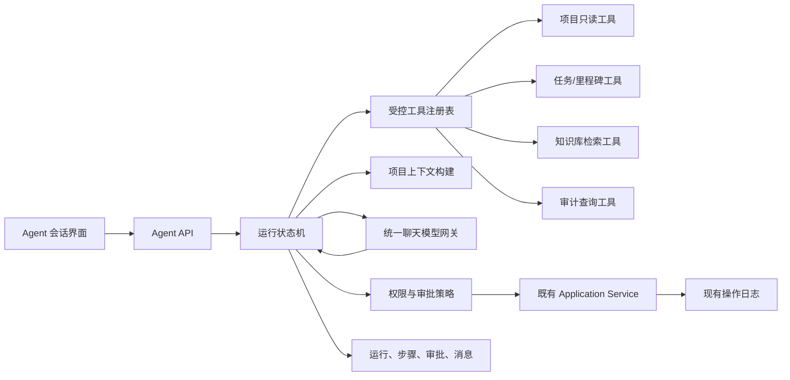

# Agent 功能设计

## 1. 结论：当前 AI 功能不是完整 Agent

当前系统有两个高质量、受控的 AI 工作流：

- RAG 问答：检索项目文档后生成带引用回答；
- AI 任务规划：按固定的“检索 → 两阶段生成 → 校验 → 人工编辑 → 幂等确认”流程执行。

它们具备工具化、结构化输出和人机确认的部分 Agent 特征，但流程由业务代码预先固定。系统尚不具备通用 Agent 所需的目标循环、动态工具选择、可持久化运行状态、暂停恢复、步数/成本预算和统一审批。因此功能矩阵将其标记为“AI 工作流完整，通用 Agent 运行时未实现”。

## 2. 第一版 Agent 的定位

建议实现“项目协作 Agent”，而不是开放式通用智能体。它只在当前项目内工作，帮助成员查询事实、分析进度、提出变更建议，并在审批后调用既有业务能力。

第一版目标示例：

- “根据需求文档找出本周最紧急的三个任务，并说明依据。”
- “检查里程碑是否有逾期风险，给出调整建议。”
- “把这份需求变更转换成任务调整草案。”
- “总结最近一周的任务、文档和重要操作。”

第一版不允许 Agent 自主删除项目、移除成员、修改角色、确认 AI 规划、删除文档或执行任意 SQL/HTTP 请求。

## 3. 架构



核心原则：

- Agent 只编排，不能绕过既有 Application Service、权限和事务。
- 每个工具是窄 DTO，不提供任意 URL、SQL、类名或方法名参数。
- 工具执行前后都校验 `projectId + userId`。
- 模型提出写操作，系统决定是否允许、是否需要审批；模型自己不能批准。
- 每次运行有最大步骤、超时、Token/费用和工具调用预算。
- 所有工具输入、脱敏输出、审批和最终结果可审计。

## 4. 模块建议

后端新增 `agent` 功能包：

```text
agent/
├── api/                会话、运行、审批 Controller/DTO
├── application/        AgentRunService、AgentApprovalService
├── domain/             状态机、预算、ToolDefinition、ApprovalPolicy
└── infrastructure/     状态 Mapper、模型适配、工具注册
```

Agent 工具不能直接放进模型网关。网关只负责模型协议；工具注册、参数校验、权限和执行属于 Agent 模块。

## 5. 运行状态机

建议状态：

```text
CREATED
  → RUNNING
  → WAITING_FOR_APPROVAL
  → RUNNING
  → SUCCEEDED

任意可运行状态 → FAILED / CANCELED / BUDGET_EXCEEDED
```

一次 step 只能是以下之一：

- `MODEL_REQUEST`
- `TOOL_CALL_PROPOSED`
- `TOOL_CALL_COMPLETED`
- `APPROVAL_REQUESTED`
- `APPROVAL_RESOLVED`
- `FINAL_ANSWER`
- `ERROR`

恢复运行时从数据库读取最后一个已提交 step，禁止依赖 JVM 内存中的隐式上下文。

## 6. 工具分级

| 级别 | 示例 | 默认策略 |
|---|---|---|
| 只读 | 项目详情、任务列表、里程碑、文档检索、Dashboard、审计摘要 | 成员权限通过后可自动执行 |
| 低风险草案 | 生成任务变更草案、生成周报草案 | 自动生成，但不写正式业务表 |
| 需审批写入 | 新建/编辑任务、调整负责人、更新里程碑 | OWNER/ADMIN 明确审批；成员只能处理自己任务且仍需审批 |
| 禁止 | 删除项目/文档、成员与角色管理、确认规划、密钥配置、任意 SQL/HTTP | 第一版 Agent 不注册这些工具 |

审批记录必须绑定：run、step、工具名、规范化参数摘要、请求人、审批人、过期时间和一次性 nonce。审批后执行前再次检查权限和资源版本。

## 7. 首批工具

只读阶段：

- `get_project_overview(projectId)`
- `list_tasks(projectId, status?, assigneeId?, milestoneId?)`
- `get_task(projectId, taskId)`
- `list_milestones(projectId)`
- `search_project_knowledge(projectId, query, documentIds?)`
- `list_recent_audit_summaries(projectId, limit)`

写入阶段再增加：

- `create_task_draft(...)`
- `update_task_after_approval(projectId, taskId, version, patch)`
- `create_milestone_after_approval(...)`

工具响应只返回完成推理所需字段，限制条数和文本长度。知识检索继续返回来源，最终回答必须标明哪些结论来自文档、哪些是根据任务状态作出的推断。

## 8. 数据模型草案

建议后续迁移新增：

- `agent_session`：项目、创建者、标题、状态；
- `agent_run`：目标、模型、状态、预算、开始/结束时间；
- `agent_step`：序号、类型、工具名、脱敏输入/输出、错误；
- `agent_approval`：待审批动作、状态、审批人、版本和过期时间；
- `agent_message`：用户与最终回答。

不要复用 `knowledge_session`：知识问答会话是私人 RAG 历史，Agent 运行包含工具步骤和审批，生命周期与权限不同。

## 9. 安全与可靠性

- 所有读取限定当前项目；私人知识问答历史不作为 Agent 上下文。
- Prompt、文档、任务描述和工具输出均视为不可信，防止文档中的指令覆盖系统策略。
- 模型看不到 API Key、JWT、Cookie、邀请码、完整审计 detail 和内部异常栈。
- 工具参数使用 JSON Schema，拒绝未知字段、超长文本和跨项目 ID。
- 写工具携带 `version`；冲突后返回新事实，由模型重新提案，不静默覆盖。
- 每个运行默认最多 12 steps、8 次工具调用、单次可配置 Token 预算；达到限制稳定结束。
- 模型不可用时运行进入可重试失败状态，不能留下半完成业务写入。

## 10. 分阶段实施

### A. 设计与只读 Agent

先实现表、状态机、预算、会话界面和只读工具。验收重点是权限隔离、恢复运行、引用、预算和审计。此阶段没有业务写入工具。

### B. 审批式任务工具

只开放创建/编辑任务和里程碑，复用现有 Service。前端展示参数 diff，用户审批后执行；补幂等与版本冲突测试。

### C. 项目执行助手

基于 Dashboard、依赖和审计生成周报、风险清单和调整草案。先确定统计算法，再允许模型解释；不能让模型凭空计算业务指标。

### D. 扩展能力

评估通知、定时运行、模板和多 Agent。只有单 Agent 的恢复、审批、权限和预算经过验证后，才考虑多 Agent 协作。

每一阶段都必须先更新 `feature-matrix.md` 和 OpenAPI 设计状态，不能在一个任务中同时引入运行时、全部工具、通知和多 Agent。
