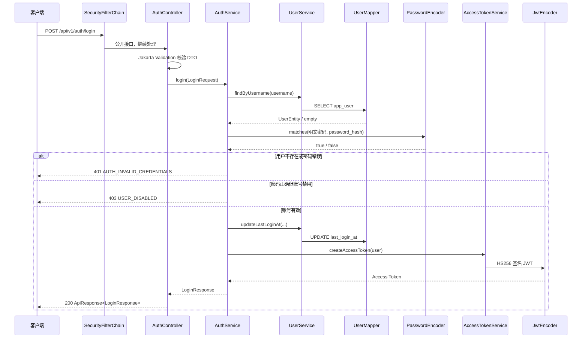
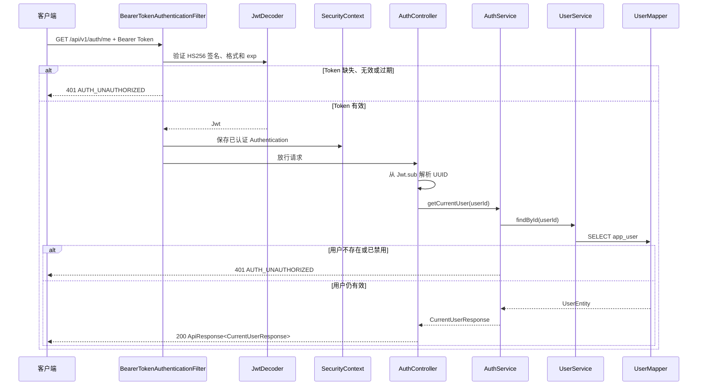

# 第一阶段：Access Token 认证闭环

## 1. 本阶段解决了什么问题

本阶段为平台建立最小身份入口：用户可以用用户名和密码登录，获得一个短期 JWT Access Token；之后携带 Token 查询自己的最新账号信息。健康检查保持匿名可访问，其他接口默认要求认证。

本阶段故意不实现 Refresh Token、注销、注册、项目权限和 Redis 黑名单。这样可以先把“密码校验 → 身份签发 → 请求验签 → 数据库复核”这一条后端闭环学清楚。

## 2. 为什么系统需要认证

认证回答“请求者是谁”。没有认证，后端无法可靠区分不同团队成员，也无法在后续阶段执行项目数据隔离和权限判断。认证不等于授权：认证确认身份，授权才判断这个身份能否执行某项操作。

## 3. 包结构

```text
com.shitulelv.aicollab
├── auth
│   ├── controller      HTTP 入口
│   ├── dto             登录输入和安全输出
│   └── service         登录、当前用户查询、Token 签发
├── user
│   ├── config          local 演示账号初始化
│   ├── entity          app_user 数据库映射
│   ├── mapper          MyBatis-Plus 数据访问
│   ├── model           UserStatus
│   └── service         用户查询与更新门面
└── common
    ├── api             统一响应
    ├── exception       错误码与异常转换
    ├── persistence     PostgreSQL UUID 类型适配
    └── security        JWT、SecurityFilterChain、401/403 处理器
```

## 4. 登录完整流程



Controller 不直接查询数据库，因为查询条件、事务边界和认证规则属于应用服务。用户名不存在与密码错误使用相同提示，并在用户不存在时执行一次 dummy BCrypt 比较，减少攻击者通过响应内容或明显耗时差异枚举账号的机会。

## 5. `/auth/me` 完整流程



JWT 验证成功后仍查询 `app_user`，因为 Token 只描述签发时的状态。用户可能在 Token 有效期内被禁用或删除，数据库才是当前账号状态的事实来源。

## 6. 核心类分别是什么

| 类型 | 核心类 | 作用 |
|---|---|---|
| HTTP | `AuthController` | 接收请求、触发校验、读取 Jwt、调用应用服务 |
| 业务 | `AuthService` | 编排登录和当前用户查询，定义事务边界 |
| Token | `AccessTokenService` | 组装 `sub`、`username`、`iat`、`exp` 并调用编码器 |
| 用户服务 | `UserService` | 封装按用户名/ID 查询和登录时间更新 |
| 数据访问 | `UserMapper` | 继承 MyBatis-Plus `BaseMapper` 执行 SQL |
| 持久化 | `UserEntity` | 映射 `app_user` 全部必要字段，包含敏感哈希 |
| API 模型 | `LoginRequest`、`LoginResponse`、`CurrentUserResponse` | 定义稳定且不泄密的接口契约 |
| 安全配置 | `SecurityConfig` | 配置公开路径、无状态策略及 Resource Server |
| JWT 配置 | `JwtConfiguration`、`JwtProperties` | 集中创建 HS256 编解码器并读取环境配置 |
| 安全错误 | `RestAuthenticationEntryPoint`、`RestAccessDeniedHandler` | 在过滤器层输出统一 401/403 JSON |
| 通用错误 | `ErrorCode`、`BusinessException`、`GlobalExceptionHandler` | 将业务失败映射为合理 HTTP 状态和响应体 |
| 本地数据 | `LocalDemoUserInitializer` | local 启动时幂等创建 BCrypt 演示用户 |

## 7. Controller、Service、Mapper、Entity、DTO 的区别

- Controller 是 HTTP 适配层，不应该出现 SQL 或密码算法细节。
- Service 表达用例和业务顺序，例如“先校验密码，再检查禁用状态，再更新登录时间”。
- Mapper 是数据库适配层，只关心如何读写表。
- Entity 是数据库行在 Java 中的映射，字段会随表结构变化，且可能含敏感数据。
- DTO 是外部 API 的输入输出契约，只包含客户端应该看到的字段。

Entity 不直接返回给前端，最重要的原因是防止 `passwordHash` 或未来新增的内部字段被 JSON 序列化泄露；同时 DTO 可以独立演进，不让数据库结构绑死 API。

## 8. BCrypt 是什么

BCrypt 是专门用于密码保存的慢哈希算法。它会为每个密码生成随机盐，并通过 cost 参数提高计算成本。即使两个用户密码相同，保存的哈希通常也不同。登录时不是“解密”哈希，而是让 BCrypt 用哈希中携带的盐和参数重新计算并比较。

本项目 cost 为 12。local 初始化器只把 `passwordEncoder.encode(...)` 的结果写入 `password_hash`，不会记录明文密码。

## 9. 密码哈希和加密的区别

- 加密是可逆的：持有密钥可以还原原文，适合必须恢复的数据。
- 密码哈希是单向的：系统无需知道原密码，只需验证候选密码是否匹配。

密码若采用可逆加密，一旦解密密钥泄露，所有用户密码都会同时暴露。密码哈希让数据库泄露后的攻击成本显著提高，但仍应配合强密码、限流和安全日志。

## 10. JWT 是什么

JWT 是一种带签名的紧凑令牌，常用于在无状态 API 中携带身份声明。它通常由三段 Base64URL 文本组成：

1. Header：算法和令牌类型，例如 `HS256`、`JWT`。
2. Payload：声明。本项目包含 `sub`（用户 UUID）、`username`、`iat`、`exp`。
3. Signature：对前两段的签名，用于发现篡改。

Payload 只是编码，不是加密。任何拿到 Token 的人都可能读到 Payload，所以不能放密码、密码哈希、数据库密码或 JWT Secret。

## 11. Access Token 为什么会过期

Bearer Token 一旦泄露，持有者在有效期内就能代表用户请求。短有效期限制泄露后的可利用窗口。本阶段默认 30 分钟，通过 `JWT_ACCESS_TOKEN_MINUTES` 调整；配置限制为 1～1440 分钟，避免零、负数或溢出。过期后 `JwtDecoder` 会拒绝请求并返回 401。

## 12. Resource Server 如何验证 Token

`SecurityConfig` 启用 Spring Security OAuth2 Resource Server。`BearerTokenAuthenticationFilter` 从 `Authorization` 头提取 Token，`JwtDecoder` 使用 `JWT_SECRET` 对 HS256 签名进行验证，并执行时间声明验证。验证成功后，Spring 创建已认证对象并放入 `SecurityContext`；失败则调用 `RestAuthenticationEntryPoint`。

本项目没有自行实现完整 JWT 过滤器，因为官方过滤器已经正确处理 Bearer 语法、异常传播和 SecurityContext 生命周期。

## 13. SecurityContext 是什么

`SecurityContext` 是 Spring Security 在当前请求中保存认证结果的容器。它通常包含 `Authentication`、主体和权限。无状态配置意味着它只在本次请求中使用，请求结束后不会写入服务端 Session。下次请求必须再次携带 Token。

## 14. 401 和 403 的区别

- 401 Unauthorized：无法确认有效身份，例如未带 Token、Token 无效、Token 用户已失效。客户端通常应重新登录。
- 403 Forbidden：身份已确认，但不允许执行该操作；登录时密码正确但账号明确为 DISABLED 也按本阶段契约返回 403。

Spring Security 的认证入口处理 401，权限拒绝处理器处理 403。不能把两者都返回 200，否则代理、监控和客户端无法理解真实结果。

## 15. local 初始化器为什么必须幂等

开发时应用会频繁重启。若每次都插入演示用户，会触发用户名唯一约束或产生重复数据。初始化器先按 `DEMO_OWNER_USERNAME` 查询，存在则直接结束；不存在才生成 UUID、BCrypt 哈希并插入。它受 `@Profile("local")` 限制，其他环境不会自动创建账号。

数据库唯一约束是最后防线，应用层查询则让普通重复启动保持平稳。

## 16. PostgreSQL UUID 类型适配

`app_user.id` 是 PostgreSQL 原生 `uuid`，Java 使用 `UUID`。当前依赖中的 MyBatis 没有内置 UUID TypeHandler，因此 `PostgresUuidTypeHandler` 使用 JDBC `setObject/getObject` 做集中转换。这样业务层无需把 UUID 变成字符串，类型错误能更早暴露。

## 17. 常见错误与排查

| 现象 | 优先检查 |
|---|---|
| 启动提示 JWT Secret 太短 | `JWT_SECRET` 是否至少 32 个 UTF-8 字节，且 `.env` 路径正确 |
| 数据库连接失败 | Docker PostgreSQL 是否 healthy，端口、库名、用户、密码是否匹配 |
| Flyway 创建 vector 失败 | 镜像是否为 `pgvector/pgvector:pg17` |
| Redis health DOWN | Redis 容器状态和 `REDIS_PASSWORD` 是否一致 |
| 登录总是 401 | 用户名是否存在、BCrypt 哈希是否由当前明文生成，不要把明文直接写入 `password_hash` |
| 登录返回 403 | `app_user.status` 是否为 `DISABLED` |
| `/auth/me` 401 | Header 是否严格为 `Bearer <token>`，Token 是否过期，数据库用户是否仍为 ACTIVE |
| UUID 映射错误 | `mybatis-plus.type-handlers-package` 是否扫描到 `PostgresUuidTypeHandler` |
| 参数错误 | 查看 `VALIDATION_ERROR` message 中的字段名和规则，不要在日志打印密码值 |

## 18. 推荐代码阅读顺序

1. `LoginRequest`、`LoginResponse`、`CurrentUserResponse`
2. `AuthController`
3. `AuthService`
4. `UserService`、`UserMapper`、`UserEntity`
5. `AccessTokenService`
6. `JwtProperties`、`JwtConfiguration`
7. `SecurityConfig`
8. 两个 Security 错误处理器
9. `ApiResponse`、`ErrorCode`、`GlobalExceptionHandler`
10. `LocalDemoUserInitializer`
11. 对应测试类，观察每条业务约束如何被证明

## 19. 推荐断点调试顺序

登录链路可依次在以下位置打断点：

1. `AuthController.login`
2. `AuthService.login`
3. `UserService.findByUsername`
4. `PasswordEncoder.matches` 调用后一行
5. `UserService.updateLastLoginAt`
6. `AccessTokenService.createAccessToken`

`/auth/me` 可依次观察：

1. `RestAuthenticationEntryPoint.commence`（故意不带 Token 时）
2. `AuthController.me`
3. `jwt.getSubject()` 的值
4. `AuthService.getCurrentUser`
5. `UserService.findById`

启动初始化可在 `LocalDemoUserInitializer.run` 的存在性判断和 `passwordEncoder.encode` 后打断点。不要在调试器截图、日志或分享材料中暴露真实密码、Token 和密钥。

## 20. 本阶段尚未实现什么

- Refresh Token 与 `refresh_token` 表业务
- Logout、注册、找回或修改密码、邮箱验证
- `tokenVersion` 失效策略
- 登录限流和 Redis Token 黑名单
- 项目角色、RBAC、项目与任务接口
- MinIO、文档、RAG 和 AI 能力
- 前端登录状态管理

这些内容应在后续阶段按独立闭环实现，不应提前塞进当前认证基础。
