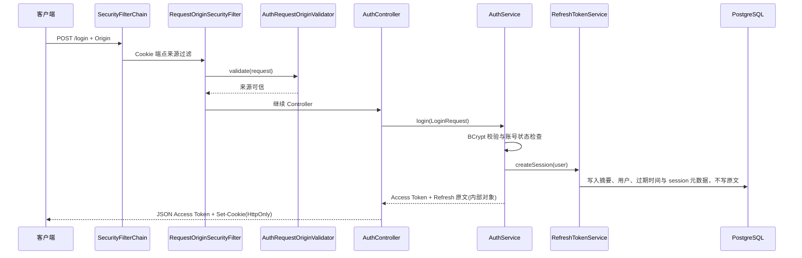
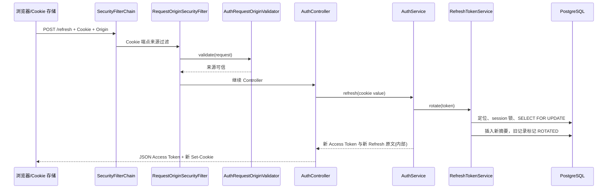
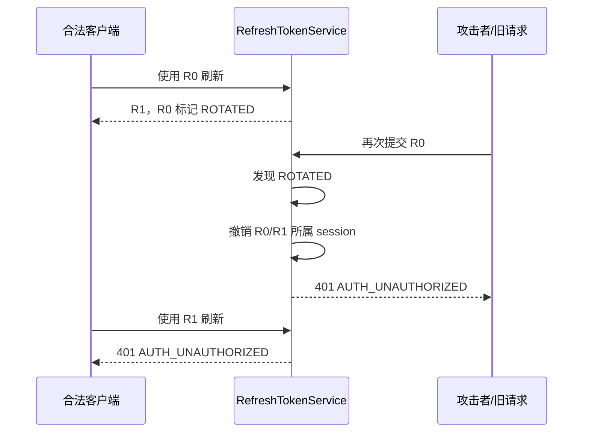
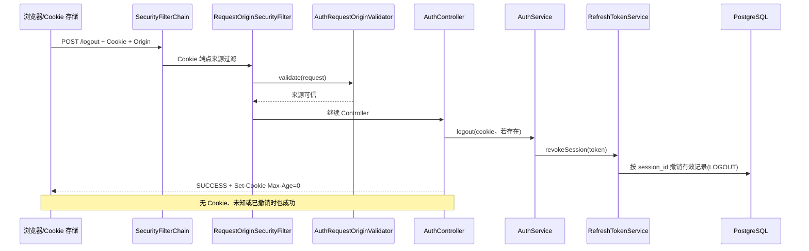
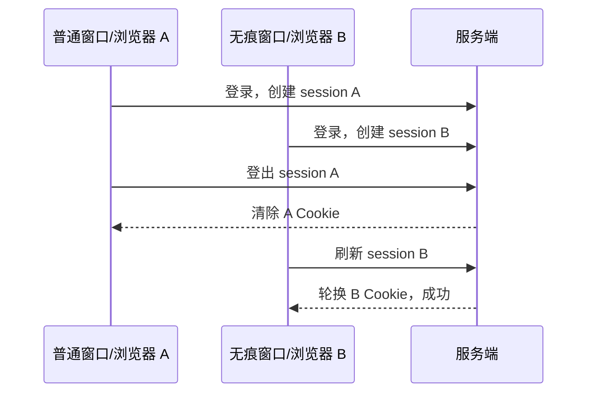

# 第二阶段：Refresh Token 多设备会话

本文结合当前代码、浏览器验证流程和后续 Vue 认证测试页解释已经实现的认证闭环。它描述的是仓库现状，而不是通用模板；未实现能力在文末单列，不能据此假定系统已有全局登出、权限或完整前端页面。

## 1. 本阶段解决的问题

第一阶段只有短生命周期 Access Token。第二阶段增加 Refresh Token 会话：登录创建会话、刷新时严格轮换、旧凭据被重用时只撤销该会话、登出只影响当前设备。

## 2. 认证与授权的区别

认证回答“你是谁”，本阶段由用户名/密码、JWT 与 Refresh Cookie 完成。授权回答“你能做什么”，RBAC 和项目权限不属于当前范围。

## 3. 两类 Token 的职责

Access Token 是短期 HS256 JWT，经 JSON 返回，业务请求放在 `Authorization: Bearer`。Refresh Token 是长随机凭据，只进 HttpOnly Cookie，只能调用刷新或登出端点。

## 4. 为什么不把 Refresh Token 放进 JSON

JSON 会被前端 JavaScript 读取，也较易被日志、调试工具或错误处理链路暴露。HttpOnly Cookie 让浏览器自动携带凭据，同时阻止页面脚本读取原文。

## 5. 入口接口与统一响应

- `POST /api/v1/auth/login`：登录、返回 Access Token、设置 Refresh Cookie。
- `POST /api/v1/auth/refresh`：仅凭 Cookie 轮换并返回新 Access Token。
- `POST /api/v1/auth/logout`：仅撤销当前 Cookie 所属会话，并清除 Cookie。
- `GET /api/v1/auth/me`：必须带 Bearer Access Token。

除健康检查外，业务响应统一为 `code`、`message`、`data` 三段。Refresh 的 JSON `data` 只有 `accessToken`、`tokenType`、`expiresInSeconds`。

## 6. 登录调用链



实际顺序中，`SecurityFilterChain` 的 `RequestOriginSecurityFilter` 位于 Controller 之前；登录是 Cookie 端点，过滤器先调用 `AuthRequestOriginValidator.validate`，来源不可信即由统一 403 处理器返回，不会进入 `AuthController`。

## 7. 登录输入与校验

`LoginRequest` 要求用户名和密码都非空，用户名最长 40 个字符。格式错误返回 `400 VALIDATION_ERROR`，不会把被拒绝的密码回显。

## 8. 密码失败的安全语义

不存在的账号和密码错误都返回 `401 AUTH_INVALID_CREDENTIALS`；服务端对不存在账号仍执行一次 BCrypt 比较，降低通过耗时或响应差异枚举用户名的机会。

## 9. Access Token 的使用

浏览器端或后续 Vue 认证测试页只把登录、刷新响应中的 `data.accessToken` 保存在内存。调用 `/me` 时附加 `Authorization: Bearer <accessToken>`；Cookie 不能替代该 Header。

## 10. Refresh Token 的生成与保存

Refresh Token 由至少 32 字节的 `SecureRandom` 生成，再以无填充 URL-safe Base64 表示。数据库只保存其 SHA-256 小写十六进制摘要，实体与响应 DTO 均无原文属性。

## 11. Cookie 的安全属性

Cookie 名为 `ai_collab_refresh_token`，路径为 `/api/v1/auth`，带 `HttpOnly` 与 `SameSite=Strict`。本地 `Secure=false` 便于 HTTP 调试，生产环境必须启用 `Secure=true`；没有设置 Domain，避免扩大可发送范围。

## 12. Cookie 的浏览器验证

浏览器会自动处理 `Set-Cookie` 并在匹配路径的后续请求中携带 Cookie。页面脚本不可读取 HttpOnly Token，也不应尝试打印、复制或持久化其值。可以通过浏览器开发者工具观察 Cookie 的名称、Path、HttpOnly、SameSite、Secure 和过期信息，并确认刷新后同名 Cookie 被替换；后续 Vue 认证测试页只负责触发登录、刷新、登出和 `/me` 请求，不读取 Refresh Token 原文。

## 13. 刷新调用链



刷新也先经过同一条 `SecurityFilterChain → RequestOriginSecurityFilter → AuthRequestOriginValidator` 链路；只有来源校验通过后，Controller 才从 HttpOnly Cookie 读取提交值，并调用业务层轮换。

## 14. 严格一次性轮换

每次有效刷新都会创建新的 Token 记录，把旧记录标为 `ROTATED` 并关联替代记录。旧值没有宽限窗口，客户端必须使用响应的最新 Cookie。

## 15. 会话与多设备

每次成功登录生成新的 `session_id`。同一设备的轮换链共享这个 ID；不同登录即使是同一用户也不共享撤销范围，因此可独立登录、刷新和登出。

## 16. 滑动与绝对过期

每个 Token 最多存活 14 天；每次轮换可得到新的最多 14 天有效期，但永远不超过该会话从登录起的 30 天绝对期限。服务端以 `min(now + tokenLifetime, sessionExpiresAt)` 计算。

## 17. 重用检测

如果一个已经 `ROTATED` 的旧 Refresh Token 再次出现，系统判定它可能泄露，撤销同一 `session_id` 下仍有效的凭据，并对外统一返回 401。未知、过期、禁用用户等情况也不暴露内部差异。

## 18. 重用时序



## 19. 刷新并发控制

刷新事务先按会话拿 PostgreSQL 锁，再对 Token 行执行 `SELECT ... FOR UPDATE`。两个并发请求提交同一旧 Token 时，最多一个轮换成功；后到者看到旧记录已轮换，触发重用处理。

## 20. CORS 不是 CSRF 防护

CORS 仅限制浏览器能否读取跨域响应，不能阻止请求抵达服务端。因此 Cookie 端点还使用 `SameSite`、生产 `Secure`、精确来源校验与 allowlist；默认 CSRF 功能被关闭并不等于取消这些补偿措施。

## 21. Origin/Referer 校验

`login`、`refresh`、`logout` 必须有单一可信的 `Origin`；若没有 Origin，才解析单一 Referer 的 origin。来源不在 `AUTH_ALLOWED_ORIGINS`、多值、空值或格式不可信时返回 `403 AUTH_FORBIDDEN`，且不泄露 allowlist。

## 22. 登出调用链与幂等性



登出与登录、刷新一样先校验来源；校验通过后才执行幂等撤销与清除 Cookie。无 Cookie 的登出仍会进入 Controller 并成功清除 Cookie，但缺失 Origin/Referer 不是“无 Cookie”的替代条件，仍会在过滤器阶段被拒绝。

## 23. 当前设备而非全局登出

登出依据提交的 Cookie 找到 `session_id`，撤销该会话下的有效链，不会撤销同一用户其他设备的会话。Access Token 不进黑名单，登出后它会在自身短期到期前仍可能有效，这是当前设计的明确取舍。

## 24. 错误码与客户端处理

密码错误是 `401 AUTH_INVALID_CREDENTIALS`；Refresh 缺失、未知、过期、被撤销、重用或用户不可用都是 `401 AUTH_UNAUTHORIZED`，客户端应清理本地 Access Token 并引导登录；来源错误是 `403 AUTH_FORBIDDEN`；输入错误是 `400 VALIDATION_ERROR`。

## 25. 服务端类职责与断点

调试时可依次在 `AuthController.login/refresh/logout`（HTTP 与 Cookie）、`AuthService.login/refresh/logout`（用例编排）、`RefreshTokenService.createSession/rotate/revokeSession`（会话规则）、`RefreshTokenRepositoryService.findByTokenHashForUpdate`（锁与 SQL）设置断点。切勿在断点观察窗口、日志或表达式求值中输出 Refresh Token 原文或完整 hash。

## 26. 安全的数据库观察查询

排查会话请只查询元数据，明确排除 `token_hash`：

```sql
SELECT id, user_id, session_id, expires_at, session_expires_at,
       revoked_at, revoke_reason, replaced_by_token_id, created_at
FROM refresh_token
ORDER BY created_at DESC;
```

可据此看到轮换后的旧记录为 `ROTATED`、登出为 `LOGOUT`、旧凭据重用为 `REUSE_DETECTED`，但不能由该查询恢复凭据。

## 27. 双设备验证流程

使用普通浏览器窗口与无痕窗口，或两个独立浏览器，分别登录同一账号。两个隔离的浏览器 Cookie 存储会创建不同 `session_id`。窗口 A 登出后，窗口 B 仍应能够刷新；A 会话发生旧凭据重用时也只撤销 A 的轮换链，绝不应误伤 B。严格重用检测可继续由认证集成测试验证，浏览器流程重点验证多设备会话隔离、轮换和当前设备登出。



## 28. 未实现范围与下一步

当前没有注册、找回密码、全局登出、Access Token 黑名单、RBAC、项目成员权限、前端自动刷新拦截器、设备列表、异常登录通知或生产密钥托管。后续功能应在不泄露 Refresh 原文/摘要、不过度扩大 Cookie 域、且保持会话隔离的前提下设计。
