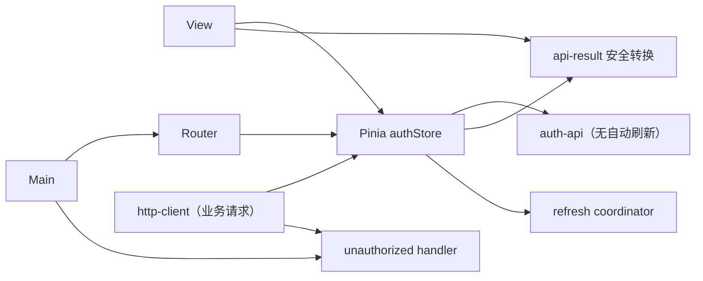
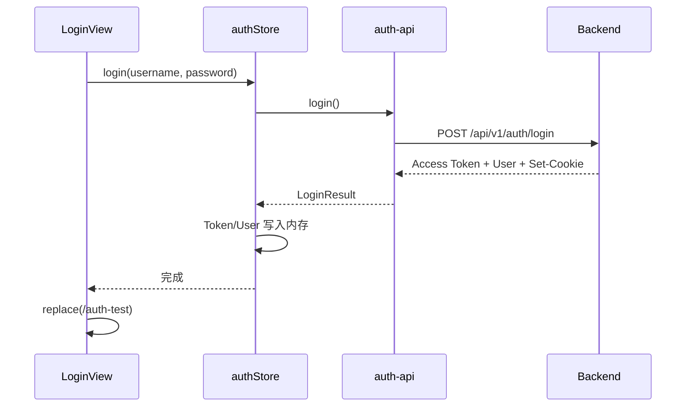
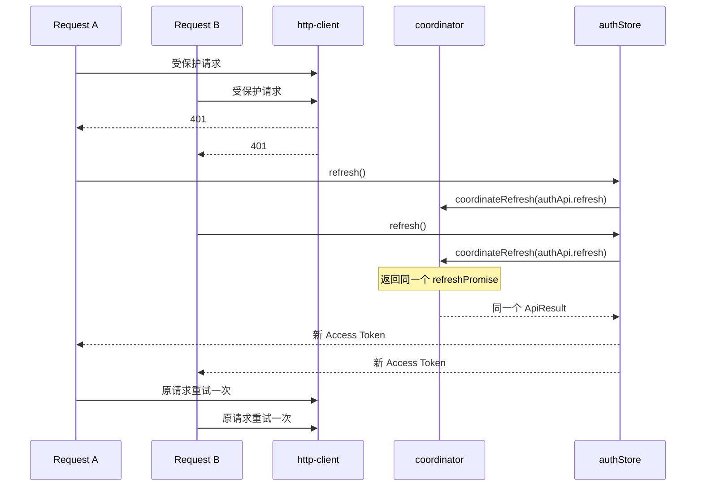
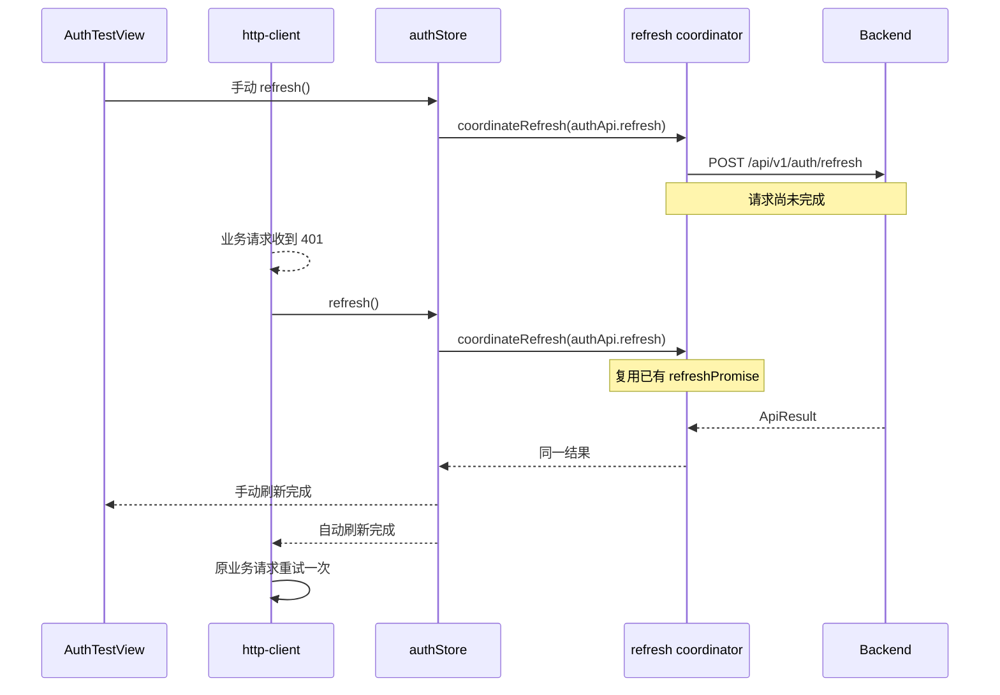

# Phase 03：Vue 认证壳与单飞刷新

> **自动化测试历史记录提示**
>
> 当前仓库后续已移除自动化测试。正文中的测试类、测试命令和测试证明内容属于对应阶段的历史实现记录，
> 不代表当前仓库仍保留这些测试文件。
>
> **认证调试页历史记录提示：**正文中的 `AuthTestView` 和 `/auth-test` 同样只描述 Phase 03
> 当时的学习用调试入口。Phase 05 已删除该组件和正式路由；当前用户通过项目页和账号设置页完成认证操作。

## 1. 系统架构位置

这一阶段增加 `ai-collab-frontend/`。浏览器访问 `http://localhost:5173`，Vite 将 `/api`
代理到 `http://localhost:8080`。前端只调用相对地址 `/api/v1`，因此开发和部署代码不需要写死后端主机。

认证凭据被刻意分成两类：

- Access Token：短期、由 JSON 返回，只保存在 Pinia 运行时内存中，通过 `Authorization: Bearer ...` 使用。
- Refresh Token：长期、由浏览器保存为 HttpOnly Cookie；Axios 设置 `withCredentials: true`，但 JavaScript
  不能读取它。

刷新页面会丢失内存 Access Token。`initialize()` 用 HttpOnly Cookie 请求 `/auth/refresh`，成功后再请求
`/auth/me` 恢复用户。刷新返回 401 表示没有可恢复会话；500 或网络错误同样维持未登录，但会保存经过安全转换的
`initializationError`，便于界面给出准确提示。

## 2. 目录结构与真实关联

```text
ai-collab-frontend/
├─ src/
│  ├─ api/
│  │  ├─ api-result.ts        ApiResult、安全数据过滤与 Axios 错误转换
│  │  ├─ auth-api.ts          login/refresh/logout/me 的无拦截客户端
│  │  ├─ http-client.ts       其他受保护 API 的 Bearer 与 401 拦截器
│  │  └─ types.ts             ApiResponse、ApiResult、Token、CurrentUser 契约
│  ├─ auth/
│  │  ├─ auth-refresh-coordinator.ts  单飞 Promise
│  │  └─ unauthorized-handler.ts      解耦 HTTP 层与 Router
│  ├─ stores/auth-store.ts    唯一认证状态与认证用例
│  ├─ views/LoginView.vue
│  ├─ views/AuthTestView.vue
│  ├─ router.ts               路由和登录保护
│  └─ main.ts                 Vue、Pinia、Router、Element Plus 组装
└─ tests/
   ├─ api-result.test.ts
   ├─ auth-store.test.ts
   ├─ auth-test-view.test.ts
   ├─ http-client.test.ts
   ├─ login-view.test.ts
   └─ router.test.ts
```

依赖方向是：



`auth-store` 不导入 `http-client`，`router` 也不被 `http-client` 直接导入。否则很容易形成
`http-client → store → http-client` 或 `router → store → http-client → router` 的循环依赖。

## 3. authStore 的状态和方法

状态：

- `accessToken`：只在内存中存在。
- `currentUser`：`/login` 或 `/me` 返回的安全用户视图。
- `initialized`：是否已完成一次 Cookie 恢复尝试。
- `authenticating`：登录按钮的并发保护和 loading 状态。
- `refreshing`：刷新按钮和调试状态。
- `initializationError`：仅保存初始化阶段非 401 错误的安全视图，不保存 Axios 原始错误对象。

方法：

- `login(username, password)`：调用登录，保存 Access Token 与用户；密码只是函数局部变量。
- `refresh()`：通过 `auth-refresh-coordinator` 进入全局单飞边界，只更新 Access Token；失败时清理认证状态。
- `loadCurrentUser()`：用当前 Access Token 调用 `/me`。
- `logout()`：无论网络调用成功与否，都在 `finally` 中清空内存。
- `initialize()`：首次启动时按 `refresh → me` 恢复登录；401 被视为正常未登录，其他 HTTP/网络错误保存到
  `initializationError`。

### 3.1 ApiResult 与安全错误模型

`ApiResult<T>` 是页面可消费的最小状态模型：

```ts
interface ApiResult<T> {
  httpStatus: number | null
  code: string
  message: string
  data: T
}
```

`auth-api.ts` 把成功响应转换为这个模型；`normalizeApiError(error: unknown)` 使用
`axios.isAxiosError` 和对象类型守卫，只提取 HTTP 状态、业务 code、message 和经过过滤的 data。
消息优先级依次为后端 `ApiResponse.message`、HTTP 状态描述、网络连接失败提示和通用未知错误。

Axios 原始错误对象还包含 request config、请求头、响应头和运行时内部信息。直接将其放入响应式状态或
`JSON.stringify` 到页面，可能连带暴露认证头、Cookie，并可能遇到循环引用。因此页面永远不保存或渲染
原始 AxiosError，只保存 `normalizeApiError` 的结果；data 还会递归移除 token、authorization、
cookie、password 和 secret 类字段。

## 4. 调用链与时序

### 4.1 登录



### 4.2 多个 401 的单飞刷新



### 4.3 手动刷新与 401 自动刷新重叠



## 5. 关键算法

全局单飞边界由 `authStore.refresh()` 与 `auth-refresh-coordinator.ts` 共同组成。`initialize()`、
`AuthTestView` 的主动刷新和 `http-client` 的 401 拦截器都只调用 `authStore.refresh()`；Store 再把真实
`authApi.refresh()` 交给 coordinator。这样三类入口共享同一个模块级 `refreshPromise`：

1. 没有进行中的刷新时，调用传入的 `refresh()` 并保存 Promise。
2. 已有 Promise 时直接返回它，不创建第二个请求。
3. Promise 完成或失败后在 `finally` 清空引用，允许以后再次刷新。

如果只在 `http-client` 拦截器中做单飞，多个 401 可以互相共享，但启动恢复或用户主动刷新仍会绕过它。
严格 Refresh Token 轮换后端可能把两个并发提交的旧 Cookie 视为凭据重用，并撤销整个设备会话。因此单飞
必须位于所有刷新入口都经过的 Store 层，而不能只覆盖某一种调用来源。

`refreshing` 在每个调用进入 Store 时设置为 `true`，并在共享 Promise 最终成功或失败后恢复为 `false`；
等待者不会创建第二个真实请求。

`http-client.ts` 在原请求配置上设置 `_authRetried=true`。因此重试后的第二个 401 不会再次刷新，
从结构上阻断无限循环。登录、刷新、登出使用独立的 `auth-api` 客户端，不安装这一拦截器；
尤其 `/refresh` 自己的 401 不会递归触发 `/refresh`。

## 6. 安全边界

- 没有任何 `localStorage.setItem`、`sessionStorage.setItem`、IndexedDB 或自定义 Cookie 写入。
- URL、日志和错误提示不包含 Token。
- 页面只显示 Access Token 是否存在，不渲染任何 Token 原文片段。
- `AuthTestView` 的最近操作结果只保留操作名称、HTTP 状态、业务 code、message 和安全格式化 JSON data。
- `LoginView` 读取并安全展示非 401 的 `initializationError`；开始新登录时 Store 先清除此旧错误。
- 认证测试页展示用户 id、username、displayName、email 和账号状态；空 email 显示“未设置”，登录标签由
  `auth.isAuthenticated` 动态决定。
- Refresh Cookie 的读取和安全属性完全由后端与浏览器负责。
- logout 网络失败不等于继续保留本地身份，内存状态始终清空。

## 7. 推荐阅读顺序与断点

推荐顺序：

1. `api/types.ts`
2. `api/api-result.ts`
3. `api/auth-api.ts`
4. `auth/auth-refresh-coordinator.ts`
5. `stores/auth-store.ts`，重点跟踪 `refresh()` 如何调用 coordinator
6. `views/LoginView.vue` 与 `views/AuthTestView.vue`
7. `api/http-client.ts`
8. `router.ts`
9. 浏览器 Network、路由跳转与安全存储检查

推荐断点：

- `auth-store.ts` 的 `login`、`refresh`、`initialize`。
- `auth-store.ts` 的 `refreshing=true`、`coordinateRefresh` 调用及 `finally`，观察多个入口的完整生命周期。
- `api-result.ts` 的 `normalizeApiError`：分别观察 401、500、无 response 的网络错误。
- `AuthTestView.vue` 的 `runOperation`：观察 ApiResult 如何进入页面局部状态及 data 如何过滤。
- `LoginView.vue` 的 `displayedResult` 和登录 `catch`：观察初始化错误与本次登录错误如何切换。
- `http-client.ts` 响应拦截器判断 401 和 `_authRetried` 的位置。
- `auth-refresh-coordinator.ts` 创建与复用 Promise 的位置。
- `router.ts` 的 `beforeEach`。

断点或浏览器控制台不要展开、复制或输出完整 Token。

## 8. 手工验收重点

- 登录成功只更新 Pinia 内存，并保存安全用户视图。
- 密码不进入 store，Access Token 不写 localStorage/sessionStorage。
- logout 请求失败仍会清空内存。
- initialize 收到 401 后完成初始化但保持未登录。
- initialize 收到 500 或网络错误时保存安全错误，且只尝试一次 refresh。
- 认证测试页不渲染 Access Token 的任何原文片段，只显示“已存在/不存在”。
- 成功与失败操作都展示统一 ApiResult，data 中的敏感字段会被递归删除。
- 登录失败优先显示后端 message，网络错误显示明确的网络提示。
- 两个并发 401 只调用一次 refresh，每个原请求只重试一次。
- 两个并发 `authStore.refresh()` 只产生一次真实刷新，两个等待者取得同一结果。
- 手动刷新与 401 自动刷新重叠时复用同一 Promise，不触发未认证跳转。
- 共享刷新失败会清理认证状态和旧 Promise，下一次正常刷新仍可发起。
- refresh 失败不会递归，并会清空认证状态。
- LoginView 能显示 500 与网络初始化错误，过滤敏感 data；开始登录后旧初始化错误被清除。
- 认证页显示用户 id、email 和动态登录状态，空 email 显示“未设置”。
- 当前生产路由不再包含认证调试页；未登录用户访问受保护业务页会被重定向到 `/login`。

当前验证命令：

```powershell
cd E:\ai-collab\ai-collab-frontend
pnpm typecheck
pnpm build
```

随后在浏览器中验证登录、刷新恢复、退出和并发 401 操作，检查 Network 请求与安全存储。上述并发边界
只能按选定场景手工观察，不能视为稳定的自动回归证明。

## 9. 故障排查

- **刷新 Cookie 没有发送**：检查 Axios `withCredentials`、后端 Cookie Path 和浏览器 SameSite/Secure。
- **本地 HTTP 登录成功但 Cookie 消失**：确认本地配置的 `Secure=false`；生产必须恢复 `true`。
- **一直跳登录页**：依次检查 refresh 是否 200、Access Token 是否写入 store、`/me` 是否 200。
- **出现刷新风暴**：检查业务请求是否都使用集中 `http-client`，组件里不要复制 401 逻辑。
- **出现无限 401**：检查 `_authRetried` 是否随原配置进入重试，以及 refresh 是否误用了带拦截器的客户端。

## 10. 重要注释详解

Vue/TypeScript 本身不使用 Java 注解。本阶段最重要的“声明式标记”是：

- `defineStore('auth', ...)`：由 Pinia 读取，首次调用 `useAuthStore()` 时创建状态容器；删除后组件无法共享认证状态。
- `router.beforeEach(...)`：由 Vue Router 在每次导航前读取；返回登录路由会改变导航目标。误在组件中做保护会造成闪屏和重复逻辑。
- `<script setup lang="ts">`：由 `@vitejs/plugin-vue` 编译；顶层变量自动暴露给模板。删除 `setup` 后代码需要改写为普通组件选项。

Java 注解的完整来源、读取者、生命周期、删除影响和误用集中在
[`phase-04-project-member-module.md`](phase-04-project-member-module.md)。
