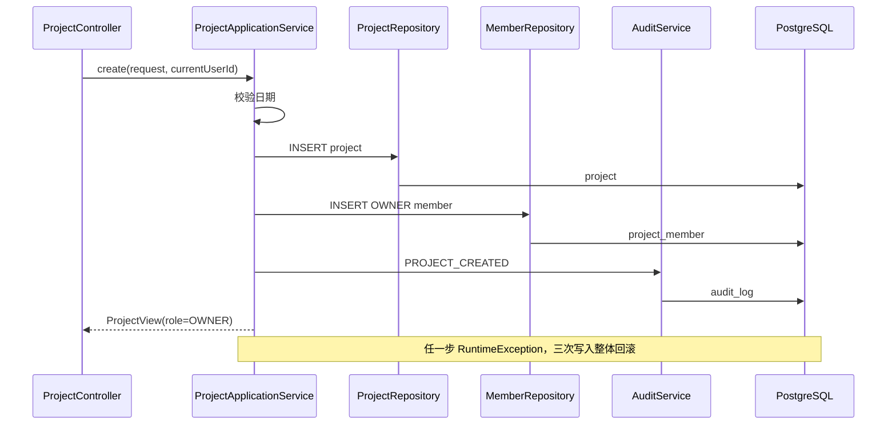
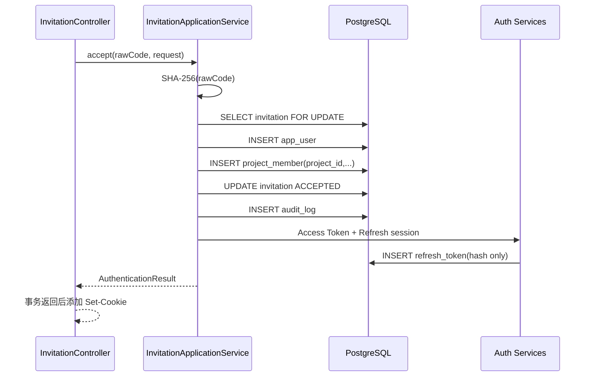

# Phase 04：项目、成员与邀请模块

> **自动化测试历史记录提示**
>
> 当前仓库后续已移除自动化测试。正文中的测试类、测试命令和测试证明内容属于对应阶段的历史实现记录，
> 不代表当前仓库仍保留这些测试文件。

## 1. 系统架构位置

本阶段在 Spring Boot 模块化单体中增加 `com.shitulelv.aicollab.project`，继续采用 package-by-feature：

```text
project/
├─ api/
│  ├─ controller/   ProjectController、InvitationController
│  └─ dto/          HTTP 请求 DTO
├─ application/
│  ├─ service/      项目、成员、邀请、审计与邀请码用例
│  └─ view/         返回给 Controller 的安全视图
├─ domain/
│  ├─ model/        ProjectRole、ProjectStatus、InvitationStatus
│  └─ policy/       ProjectAccessGuard 与数据库实现
└─ infrastructure/
   ├─ entity/       数据库表映射
   ├─ mapper/       MyBatis SQL
   └─ repository/   对应用层隐藏 Mapper
```

Controller 只处理路径、DTO、当前 JWT 身份、状态码和 Cookie；Application Service 编排业务与事务；
Policy 每次从数据库读取最新成员角色；Repository/Mapper 承担持久化；Entity 不作为 JSON 返回。

## 2. Java 文件职责与真实关联

| 文件组 | 职责 | 主要调用关系 |
|---|---|---|
| `ProjectController` | 项目、成员、邀请创建 HTTP 入口 | Controller → 三个 Application Service |
| `InvitationController` | 匿名预览/接受，事务完成后设置 Cookie | Controller → Invitation Service → Cookie Service |
| `ProjectApplicationService` | CRUD、日期校验、OWNER 成员与审计事务 | Service → Guard/Repository/Audit |
| `ProjectMemberApplicationService` | 列表、角色变更、移除、OWNER 保护 | Service → Guard/MemberRepository/Audit |
| `InvitationApplicationService` | 生成摘要、预览、接受、账号与 Token 编排 | Service → Guard/Invitation/User/Auth/Audit |
| `InvitationInsertService` | 以 NESTED 保存点隔离邀请码唯一冲突 | Invitation Service → Insert Service → Repository |
| `DatabaseProjectAccessGuard` | `requireMember/Admin/Owner` | Guard → project_member 数据库查询 |
| `InvitationCodeService` | 32 字节 SecureRandom、Base64URL、SHA-256 | Invitation Service → Code Service |
| `*Repository` | 稳定的持久化接口 | Service/Policy → Repository → Mapper |
| `*Mapper` | 项目作用域 SQL、行锁和 CAS 更新 | Repository → PostgreSQL |
| `*Entity` | 表字段映射，包含内部持久化状态 | Mapper ↔ Entity |
| `*View` | 无密码、Token、摘要、Cookie 的响应模型 | Service → Controller |

## 3. Controller、Service、Policy、Repository、Mapper、Entity、DTO

- **Controller**：读取 `@PathVariable`、`@RequestBody`、`@AuthenticationPrincipal Jwt`，选择 201/204，
  不调用 Mapper。
- **Application Service**：公开 `public` 用例方法并声明事务；任何写操作与审计处在同一事务。
- **Policy/Guard**：只决定角色是否满足规则；JWT 不包含项目角色，角色必须查询 `project_member`。
- **Repository**：对业务暴露 `findForMember`、`changeNonOwnerRole` 等意图明确的方法。
- **Mapper**：包含 SQL。子资源 SQL始终带 `project_id`；项目详情使用项目与成员联查防 IDOR。
- **Entity**：映射数据库列。`ProjectInvitationEntity.codeHash` 映射 `invite_code_hash`，强调数据库是摘要。
- **DTO/View**：Request DTO 负责格式校验；View 负责安全输出，禁止 Entity 直接越过边界。

## 4. 关键调用链

### 4.1 创建项目



### 4.2 接受邀请



## 5. 事务边界

以下公开方法是数据库事务边界：

- `ProjectApplicationService.create/update/delete`
- `ProjectMemberApplicationService.changeRole/remove`
- `InvitationApplicationService.create/accept`
- `InvitationInsertService.insertWithSavepoint`

只读列表、详情和预览使用 `@Transactional(readOnly = true)`。Cookie 不属于数据库事务：
接受服务先返回 `AuthenticationResult`，Controller 才将内部 Refresh Token 原文写入响应头。

项目删除有一个既有数据库约束：`audit_log.project_id` 对项目使用 `ON DELETE CASCADE`。为了让
`PROJECT_DELETED` 在物理删除后仍保留，该条审计使用 `project_id=null`，同时用 `entity_id` 保存被删项目 ID；
详情仍为空 JSON，不含敏感字段。

## 6. 关键算法与约束

### 6.1 OWNER 恰好一个

- V3 局部唯一索引保证同一 `project_id` 至多一条 `role='OWNER'`。
- 创建项目事务同时写 `project` 与 OWNER 成员，保证新项目至少一个 OWNER。
- 成员更新和删除 SQL 带 `role <> 'OWNER'`，Service 也先检查角色，形成双层保护。

### 6.2 IDOR 防护

详情 SQL 同时约束 `p.id = projectId`、`pm.project_id = projectId` 和 `pm.user_id = currentUserId`。
不存在与无成员关系都返回 `PROJECT_NOT_FOUND`，外部无法依据 403/404 差异探测项目 ID。

### 6.3 乐观锁

更新 SQL 是单条 compare-and-swap：

```sql
UPDATE project
SET ..., version = version + 1
WHERE id = :projectId AND version = :submittedVersion;
```

影响行数为 0 时返回 `409 VERSION_CONFLICT`。本实现使用显式 SQL，而不是 MyBatis-Plus
`@Version` 插件，避免误以为自定义 SQL 会自动获得版本条件。

### 6.4 邀请码

1. `SecureRandom` 生成 32 字节随机数。
2. 无填充 URL-safe Base64 得到 43 字符原文。
3. SHA-256 后转 64 字符小写十六进制。
4. 数据库只保存摘要；原文只在创建响应返回一次。
5. 唯一冲突在 NESTED 保存点回滚，然后生成新随机码，最多尝试三次。
6. 接受时按摘要 `SELECT ... FOR UPDATE`；并发请求串行观察最新状态，最多一次成功。

## 7. 推荐阅读顺序与断点

推荐顺序：

1. 三个 domain enum 和 `ProjectAccessGuard`
2. Request DTO 与 View
3. Entity
4. Mapper SQL
5. Repository
6. `DatabaseProjectAccessGuard`
7. 三个 Application Service
8. Controller
9. V3
10. 浏览器 Network、服务端日志与数据库安全元数据

推荐断点：

- `ProjectApplicationService.create` 三次写操作前后。
- `DatabaseProjectAccessGuard.requireMember` 查看实时角色。
- `ProjectMapper.updateWithVersion` 返回影响行数的位置。
- `InvitationApplicationService.findValid`，但不要观察或复制完整 code/hash。
- `ProjectInvitationMapper.findByCodeHashForUpdate` 前后。
- `InvitationController.accept` 设置 Cookie 前。

## 8. 手工验收重点

- 项目和 OWNER 成员同事务创建；审计失败会使两者整体回滚。
- V3 拒绝同一项目第二个 OWNER，但允许多个 ADMIN/MEMBER。
- 列表只返回当前用户所属项目，跨项目详情返回统一 404。
- OWNER 才能更新/删除，旧版本更新返回 409。
- 任意成员可看成员列表；ADMIN 可邀请，MEMBER 不可邀请。
- OWNER 不能降级或移除；移除普通成员不删除 `app_user`。
- 数据库只保存 64 字符摘要，响应只在创建时返回原始邀请码。
- 缺少可信 Origin 的接受请求返回 403；过期邀请返回 410。
- 两个并发接受事务最多一个成功。
- 接受成功创建用户、成员、Access Token、Refresh Cookie 和审计，响应没有敏感字段。

## 9. 故障排查

- **项目列表出现越权或 N+1**：检查 `ProjectMapper.listForUser` 是否仍是一条 membership join。
- **跨项目返回 403**：检查是否先按任意 ID 查资源再补权限；应使用项目作用域查询并返回统一 404。
- **版本一直冲突**：确认客户端提交最新 `version`，更新成功后使用响应中的新值。
- **并发接受两次成功**：确认查询使用 `FOR UPDATE`，接受方法由 Spring 代理调用且是独立事务。
- **唯一冲突后事务报 aborted**：确认单次邀请码插入经过 `InvitationInsertService` 的 NESTED 保存点。
- **Cookie 未设置**：确认事务已成功返回，以及 Controller 使用现有 `RefreshTokenCookieService`。
- **审计随项目删除**：`PROJECT_DELETED` 必须用 null `project_id`，被删 ID 放 `entity_id`。

## 10. 重要注释详解

### 10.1 Web 与校验注解

| 注解（完整来源） | 谁读取、何时生效 | 删除后的行为 / 常见误用 | 本项目位置与相近注解区别 |
|---|---|---|---|
| `@RestController` (`org.springframework.web.bind.annotation`) | Spring MVC 启动扫描；把返回值写为 JSON | 删除后类不注册为 Controller；不要返回 Entity | 两个 project Controller；等价于 `@Controller + @ResponseBody` |
| `@RequestMapping` | MVC 启动时组合类/方法路径 | 删除会改变或丢失统一前缀 | Controller 类上的 `/api/v1/...`；比具体 Method Mapping 更通用 |
| `@GetMapping` / `@PostMapping` / `@PatchMapping` / `@DeleteMapping` | MVC 建立 HTTP 方法路由 | 删除后端点不存在；不要用 GET 修改状态 | Controller 方法；是限定 method 的 `@RequestMapping` 快捷形式 |
| `@RequestBody` | 调用 Controller 前由 Jackson 解析 JSON | 删除后不会从 JSON 绑定；不要接收 Entity | 所有写接口 Request DTO |
| `@PathVariable` | MVC 匹配路径后注入变量 | 删除后参数无法从路径获得 | `projectId`、`memberId`、`code`；不同于 query 的 `@RequestParam` |
| `@Valid` (`jakarta.validation`) | MVC 参数解析后触发 Bean Validation | 删除后字段注解不会自动校验 | Request DTO 参数；不同于 `@Validated` 的类/分组用途 |
| `@NotBlank` / `@Size` / `@Email` | Hibernate Validator 在 `@Valid` 时读取 | 删除会接受空白、超长或非法邮箱；`@Email` 不代表非空 | DTO record 字段；非空邮箱需与 `@NotBlank` 组合 |
| `@CookieValue` | MVC 从 Cookie 注入参数 | 本阶段**未使用**；认证模块由 Cookie Service 统一读取 | 不应为了方便绕开 `RefreshTokenCookieService` |
| `@AuthenticationPrincipal` (`org.springframework.security.core.annotation`) | SecurityContext 已认证后解析 principal | 删除后需手工读取 SecurityContext | `ProjectController` 的 `Jwt`；它注入身份，不注入项目角色 |

### 10.2 Spring、MyBatis 与配置注解

| 注解 | 读取者与效果 | 删除/误用 | 实际位置 |
|---|---|---|---|
| `@Service` (`org.springframework.stereotype`) | Spring 扫描为 Bean，使事务代理和构造注入可用 | 删除后无法注入；同类 `this.method()` 不经过代理 | Application Service、Code/Audit Service |
| `@Transactional` (`org.springframework.transaction.annotation`) | Spring AOP 在 public 方法外建立事务 | 详见下一节 | Application Service 公共方法 |
| `@Mapper` (`org.apache.ibatis.annotations`) | MyBatis 创建接口代理 | 删除后 Mapper 无法注入 | `ProjectMapper` 等 |
| `@TableName` (`com.baomidou.mybatisplus.annotation`) | MyBatis-Plus 决定表名 | 删除后按类名推断，可能查错表 | 三个 Entity |
| `@TableId` | MyBatis-Plus 识别主键及输入策略 | 删除后 insert/updateById 语义不完整 | Project、Invitation Entity 的 UUID |
| `@TableField` | 显式绑定不同名列 | 删除 `codeHash` 会被推断为 `code_hash` 而不是实际列 | `codeHash → invite_code_hash` |
| `@Version` | MyBatis-Plus 乐观锁插件读取 | 本阶段**未使用**；只加注解但不装插件或使用自定义 SQL是常见误用 | 本实现采用显式 CAS SQL |
| `@ConfigurationProperties` | Spring Boot 启动时绑定配置并校验 | 删除后安全配置不会按环境加载 | 既有 JWT/Refresh/CORS properties |
| `@Bean` | Spring 调用配置方法注册对象 | 删除后 SecurityFilterChain、Encoder 等基础设施缺失 | 既有 security configuration |

## 11. `@Transactional` 特别详解

`@Transactional` 来自 Spring Framework，不是 Jakarta 注解。Spring 在 Bean 外包一层 AOP 代理；
调用方进入被标注的 **public** 方法时，代理从事务管理器取得连接、关闭自动提交，并在返回时提交。

关键规则：

1. **public 与代理调用**：private 方法或同类 `this.otherMethod()` 不经过代理，方法上的新传播规则不会生效。
   `InvitationInsertService` 被拆为独立 Bean，正是为了让 NESTED 保存点经过代理。
2. **回滚类型**：默认对 `RuntimeException` 和 `Error` 回滚，checked exception 默认提交。
   需要 checked exception 回滚时必须显式 `rollbackFor`；不要靠猜测。
3. **Cookie 边界**：数据库能回滚表记录，不能“回滚已经发送的 HTTP Header”。
   因此接受事务返回后才由 Controller 设置 Cookie。
4. **行锁**：`SELECT ... FOR UPDATE` 只有在事务中才持续到提交；无事务时锁会立即释放。
5. **乐观锁**：版本 CAS 不阻塞并发请求；影响行数 0 表示其他事务先提交，映射为 409。
6. **保存点**：PostgreSQL 唯一冲突会让当前事务进入失败状态。NESTED 方法建立 savepoint，
   冲突时回滚到保存点，外层事务才可安全重试邀请码。
7. **验证限制**：源码审查与浏览器操作不能稳定证明并发事务、保存点和中途失败回滚，必须在验收报告中
   明确列为未被自动回归保护的风险。

## 12. 运行验证

```powershell
cd E:\ai-collab\ai-collab-backend
.\mvnw.cmd clean package -DskipTests
```

实际启动后通过项目创建、成员邀请、角色修改、跨项目拒绝和版本冲突场景进行抽样验收；事务回滚、行锁和
并发邀请码接受当前依赖源码审查与有限手工观察，没有自动回归保护。
