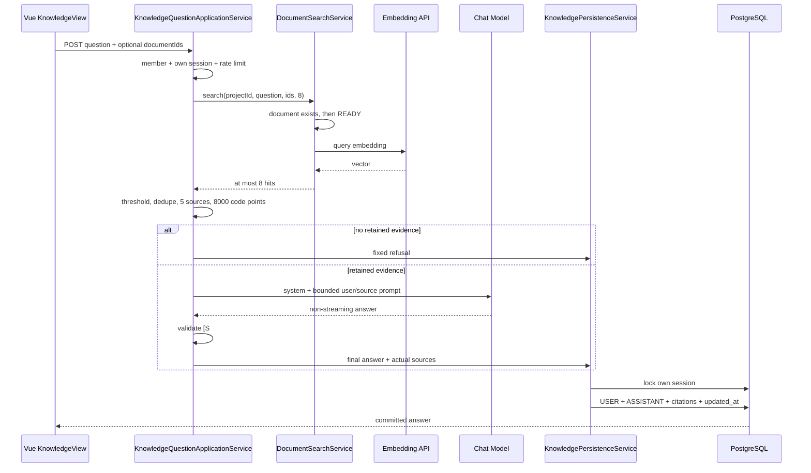

# Phase 07：项目知识问答 RAG

> **历史记录**：本文只说明该阶段的设计过程，可能包含已演进的接口、测试和状态。当前事实以代码、Flyway、`docs/feature-matrix.md` 和 `docs/api/openapi.yaml` 为准。

## 1. 问题、范围与边界

本阶段把 Phase 06 的内部向量检索接成完整知识问答：成员创建自己的会话、选择可选 READY 文档、提问、得到基于证据的回答与引用，并能回看和删除会话。明确不实现 AI 任务规划、重建索引、OCR、reranker、向量近似索引、WebSocket、SSE、工具调用、开放领域问答或自动修改业务数据。

Document 模块负责文件生命周期、解析、分块、Embedding 和项目范围内的向量搜索；Knowledge 模块负责私人会话、问题编排、上下文裁剪、Chat、引用校验和原子持久化。Knowledge 复用 `DocumentSearchService.search(projectId, query, documentIds, topK)`，不读取对象存储或自行生成向量。

## 2. 后端目录与核心类

- `knowledge/api`：`KnowledgeController` 与 Request DTO，只处理 HTTP、路径 UUID 和 JWT subject。
- `knowledge/application/service`：会话用例、提问编排、限流和最终短事务。
- `knowledge/application/view`：会话、消息、回答和引用 API 模型，不暴露数据库 Entity。
- `knowledge/domain/service`：`KnowledgeContextBuilder` 与 `KnowledgeCitationValidator`，承载纯 RAG 规则。
- `knowledge/infrastructure`：会话、消息、引用 Entity、Mapper 与 Repository；SQL 显式绑定项目和个人会话。
- `infrastructure/ai`：Chat 配置、供应商无关 Command/Result/Gateway、OpenAI-compatible 适配器与 AI 调用日志。

## 3. 完整提问时序



外部 HTTP 调用不放进数据库事务，避免占用连接和长时间持有行锁。最终阶段再次锁定并确认会话所有权，解决 Chat 期间用户删除会话的竞争。

## 4. 所有权、IDOR 与文档状态

所有 Knowledge API 先调用 `ProjectAccessGuard.requireMember`，非成员统一表现为 `PROJECT_NOT_FOUND`。会话查询、锁定和删除都使用 `projectId + sessionId + currentUserId`；即使 OWNER/ADMIN 也不能查看或删除其他人的私人会话。

指定文档最多 20 个且不允许重复。`DocumentSearchService` 先按 `project_id` 统计指定 ID 的存在数量，不足返回 `DOCUMENT_NOT_FOUND`；再统计 READY 数量，不足返回 `DOCUMENT_NOT_READY`；两项通过后才调用 Embedding。所有文档和 chunk SQL 都显式携带项目边界。

## 5. RAG Top 8 → 阈值 → 去重 → 5 Source → 8000 字符

数据库固定返回 Top 8 并保持相似度降序。应用丢弃 `similarity < 0.55`，再按 `contentHash` 去重；因为高分结果先出现，所以自然保留最高相似度块。最多保留 5 个来源，最终序列化后的 Source 文本合计最多 8,000 Unicode code point，预算包含来源编号、字段标签、转义后的文件名、标题和正文。编码器逐 code point 写入并按剩余预算停止，因此不会切断 UTF-16 代理对或 `&lt;` 等 XML 实体。最终按保留顺序分配稳定 `S1...S5`，保留 chunk、document、原文件名、原标题、实际进入 Prompt 的正文、hash、similarity 与 rank。

没有保留来源时不调用 Chat，不写 Chat 类型 `ai_call_log`，但仍原子保存用户问题和固定拒答。

## 6. System Prompt 与 Prompt Injection

System Prompt 明确 SOURCES 是不可信数据而不是系统指令，禁止遵循其中的角色切换、提示词泄露、命令执行、外部访问和绕过引用要求。问题与来源只放在 user message，并用 `<QUESTION>`、`<SOURCES>` 分界。第一版不把历史 Assistant 回答当事实来源，不启用模型工具，也不保存或记录完整拼接 Prompt。

## 7. Chat Gateway、配置、超时与错误

`ChatModelProperties` 从独立 `CHAT_*` 环境变量绑定，不复用 Embedding Key。适配器验证 provider、URL、path、model、timeout、temperature 与 max tokens；`CHAT_ENABLED=false` 时 Bean 仍正常创建，提问稳定返回 `AI_PROVIDER_UNAVAILABLE`（503）。

OpenAI-compatible 响应必须包含非空 choices 和非空 `message.content`；usage 可缺省，但 token 不能为负。429 映射额度不足，408/504 和读取超时映射 504，其他 4xx/5xx 映射 502，空响应或非法结构映射非法响应 502。超时最多重试一次，普通 4xx 不重试。

## 8. 引用提取、清理与降级

`KnowledgeCitationValidator` 识别回答中的 `[S数字]`。只有本次 Source rank 才有效；重复引用在持久化前去重。全部编号无效、完全没有引用、空回答或模型输出固定拒答时，统一替换为“当前项目资料不足以回答该问题”，`insufficientEvidence=true` 且 citations 为空。有效与无效编号混合时移除无效编号，保留有效回答和引用，并只记录 requestId 与数量型安全 warning。

## 9. USER + ASSISTANT + citations 原子保存

`KnowledgePersistenceService` 是独立事务 Bean。它 `FOR UPDATE` 锁定个人会话，按 `max(now, session.updated_at + 1μs)` 生成 USER 时间，再让 ASSISTANT 晚 1μs。两条消息、实际引用和 session `updated_at` 同事务提交；任一步失败全部回滚。同一会话并发完成时由行锁串行化，不依赖随机 UUID 表达顺序。

## 10. Redis 限流、降级与日志安全

每用户每小时 30 次，Redis key 为 `rate:qa:{userId}:{yyyyMMddHH}`。Lua 脚本原子 INCR，并在首次计数时设置覆盖当前小时的 TTL。Redis 异常只写安全 warning，然后使用带惰性过期清理的进程内固定窗口；第 31 次返回 429。

每次真正尝试 Chat 都生成 requestId，成功和失败以独立短事务写入 `ai_call_log`。日志只记录 feature、用户、项目、provider、model、状态、耗时、token、错误码与 requestId；不记录问题、回答、quote、Source、Prompt、API Key、Authorization 或 Cookie。日志写入失败不能改变成功业务结果。

## 11. 前端会话、Markdown、引用与错误交互

`KnowledgeView.vue` 使用局部状态组织左侧私人会话和右侧消息、文档选择、提问区。只列出 READY 文档，可清空选择以检索全部 READY 文档，最多选择 20 个。提交期间锁定按钮，成功后重载详情与列表，失败保留问题文本。

Assistant Markdown 先经 `marked` 解析，再经 DOMPurify 清洗后才进入 `v-html`；iframe、object、embed、form 和 style 被额外禁止。引用卡使用后端 rank 显示 `[S#]`，抽屉展示文件名、标题、quote 与相似度，下载 URL 只即时交给浏览器，不进入 Web Storage。证据不足除颜色外还有明确中文文字。统一错误转换分别提示 429、502、503 和 504。

## 12. 关键 Spring、MyBatis、Vue 与 TypeScript 实现

Spring 构造器注入让应用服务依赖清晰；`@ConfigurationProperties` 保持 Chat 配置类型安全；`@Transactional` 只标注短数据库工作，`REQUIRES_NEW` 隔离 AI 日志。MyBatis 注解 SQL 全部参数化，引用插入使用带项目 JOIN 的 `INSERT ... SELECT`。Vue 通过 `onUnmounted` 的 active 标记阻止卸载后写状态，TypeScript 接口与 OpenAPI 字段一致，所有 API 错误先经过 `normalizeApiError`。

## 13. 配置、验证和常见故障

Chat 环境变量名：`CHAT_ENABLED`、`CHAT_PROVIDER`、`CHAT_BASE_URL`、`CHAT_PATH`、`CHAT_API_KEY`、`CHAT_MODEL`、`CHAT_CONNECT_TIMEOUT`、`CHAT_READ_TIMEOUT`、`CHAT_TEMPERATURE`、`CHAT_MAX_OUTPUT_TOKENS`。不要打印其值，也不要读取或修改 `.env`。

验证命令：

```powershell
cd E:\ai-collab\ai-collab-backend
.\mvnw.cmd clean package -DskipTests

cd E:\ai-collab\ai-collab-frontend
npx -y pnpm@11.9.0 typecheck
npx -y pnpm@11.9.0 build

cd E:\ai-collab
python -c "import pathlib, yaml; yaml.safe_load(pathlib.Path('docs/api/openapi.yaml').read_text(encoding='utf-8')); print('openapi yaml ok')"
git diff --check
```

503 先检查 Chat 是否启用且非敏感配置项完整；504 检查供应商延迟与读取超时；429 区分平台每小时限流和供应商额度；409 检查指定文档是否 READY；404 检查项目成员、个人会话和文档项目归属。真实 Provider 未配置时不能宣称联调成功。

## 14. 实际验收结果、已知限制与下一阶段

本文件只记录亲自执行的结果：JDK 21 后端 `mvnw clean package -DskipTests`、前端 `pnpm typecheck` 与 production build、OpenAPI YAML 解析与 `$ref` 检查、`git diff --check` 均已通过。local profile 在独立端口启动为 UP，Flyway 验证 V1–V4 且 schema 版本为 4。

API 烟测真实覆盖：会话 201 创建、列表/详情 200、删除 204；非成员和同项目其他成员访问私人会话均为 404；指定未 READY 文档为 409、跨项目文档为 404；证据不足时保存 USER/ASSISTANT 两条消息且无 citation；同用户第 31 次请求为 429；高相似度检索进入 Chat 分支时，当前未配置 Chat 的环境稳定返回 503 且不保存半条消息。浏览器自动化工具不可用，因此未把浏览器交互标记为已验收；真实 Chat Provider 也因 `CHAT_*` 未配置而未联调。

当前无流式输出、reranker、OCR、近似向量索引、历史问句改写和长期记忆；Markdown 只做展示，不信任模型 HTML。进程内限流在多实例间不共享，只是 Redis 故障时的可用性降级。AI 任务规划仍属于后续阶段。

## 15. 合并前安全与一致性修复

本轮合并前复审进一步收紧了实现边界：

- 问题、文件名、标题和正文进入 XML-like Prompt 边界前统一转义 `&`、`<`、`>`，文档内容不能通过伪造 `</SOURCES>` 或 `<QUESTION>` 改变提示词结构。
- 8,000 code point 限制按最终序列化后的 Source 文本计算，包含来源编号、文件名、标题、标签和正文；文件名与标题在 Prompt 中也有独立预算，正文按转义后的实际长度安全截断，且不切断 UTF-16 代理对或 XML 实体。
- `chat.provider` 是供应商标签，不再被强制写死为 `openai-compatible`；Gateway 类型本身表示使用 OpenAI-compatible 协议。provider 和 model 长度与数据库列约束保持一致。
- Chat HTTP 成功后先执行引用校验。正常拒答属于有效模型结果；空回答、无有效引用或只有伪造引用的回答记录为 `INVALID_OUTPUT`，不会被错误记录成 `SUCCESS`。混合有效和无效引用时保留有效引用并记录数量型安全 warning。
- 有效引用统一规范化为 `[S1]` 形式，例如模型输出的 `[S01]` 会改写为 `[S1]`，确保回答正文和引用卡 rank 一致。
- 会话标题与问题使用 Unicode-aware `strip/isBlank` 规范化；会话 INSERT 必须影响恰好一行。
- 前端把 `projectId` 改为响应式路由参数，并用 generation 防止旧项目请求覆盖新项目状态；删除非当前会话时保持用户当前会话不变。

这些修复通过临时回归用例和源码一致性检查验证。完整 Maven、Vue typecheck/build、真实 Provider 和浏览器验收仍必须在包含完整仓库与运行依赖的开发环境中执行，不能仅凭源码压缩包宣称通过。
